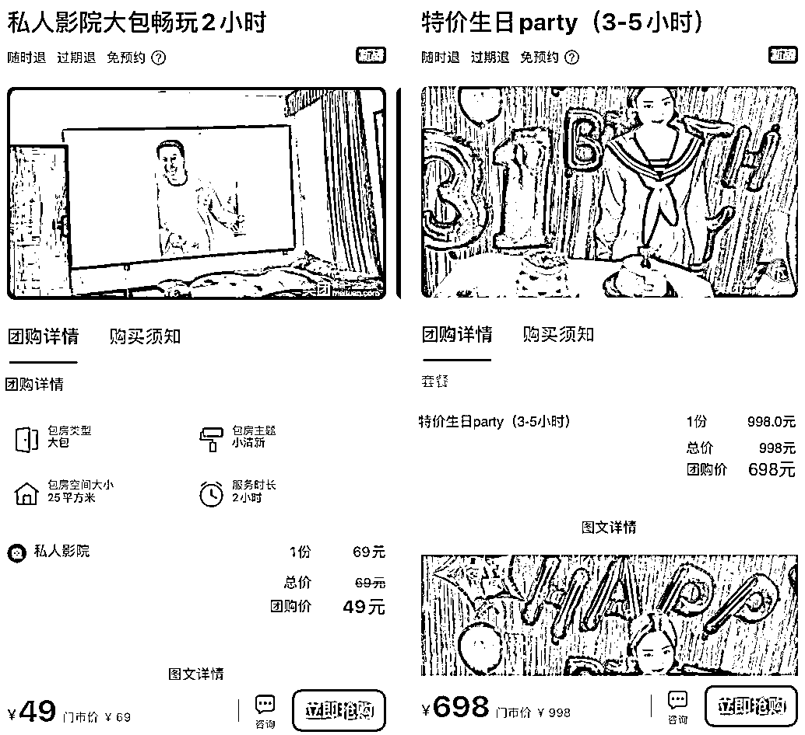

# 2.2 设计产品 @宋威 @Mage

怎么样才能推广引流效果更好？这其实和产品设计有很大关系，我们不仅得想清楚作品为什么能爆？ 还得想清楚用户为什么买？

首先，想清楚作品为什么爆？我们自己是最懂产品的，要找到爆款产品的爆点，像虎头局火全都是因为热卖产品里老虎卷的拉丝，基本上是拉的越长视频越爆，这个点其实和口味没有任何关系，并不是拉丝长就更好吃，只是因为有特色，符合抖音平台的传播特性。

之前上海还有火的一个甜点伊芙朵冰面包，火就是因为它掰开爆浆这个点，还有火的抖臀蛋糕，是因为松软一大块可以抖动。所以在抖音推广的时候一定得提前先找到和设计好爆点，然后围绕这个点一起去推效果才会更好。

其次，理解用户为什么会买？刚才说的爆点可能主打的是新奇特，足以种草让用户产生好奇和购买的冲动，那么想要进一步提高转化，产品不管是高性价比、好评价、好味道、好环境、好服务等等，总要占一样并且比较突出。

不一定是所有套餐都高性价比，可以有引流品有主推品，这样推广来的流量才能最大化利用。一般来说，产品体系内可以有：引流品、粘性品、利润品、赠品、超高客单价品，根据不同的门店情况进行灵活的自由组合。

以轰趴别墅在团购平台开通的引流套餐为例：

原先只有两个套餐，并且没什么吸引力，就加了几个引流套餐。•49 / 2 小时私人影院•中包 KTV 199 套餐（不含酒水饮料）•4 人麻将 3 小时 58 套餐 •698 生日聚会套餐 3-5 小时 （赠送拍摄制作视频）
部分图片展示如下：

因为房租是固定的，平时生意主要在周五至周日，周一到周四别墅基于处于闲置浪费状态，设置这几个套餐的目的是为了在平台上引流。
来的客户转发朋友圈可以享受 6 折，基本上来的客户都会愿意发朋友圈，这样就逐渐积累了一批比较精准的客户。发一次朋友圈，少的有几个人，多的有十几个人添加，会添加的大部分都是有意向的客户，当然以上这些套餐基本是不挣钱的，纯属为了引流，不让别墅闲置。

内容来源：《虎头局抖音本地生活从 0 到 1 半年做到 3000 万 GMV 实操分享》、《从亏损 8000 到盈收 3W+，轰趴别墅通过精细化运营实现转介绍率 70%》

