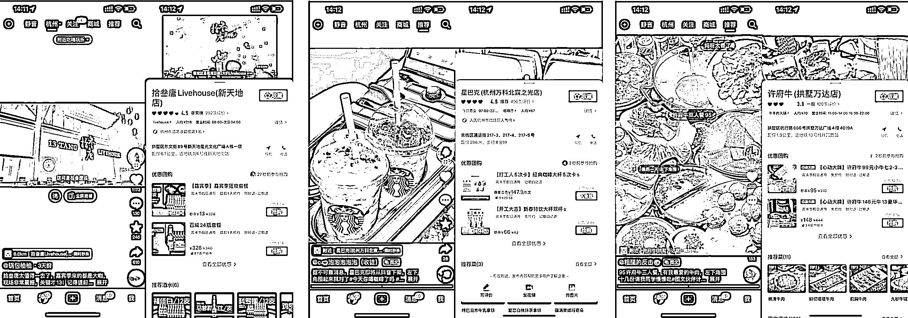

# 3.2.1.1 抖音本地生活是什么？@曹聪 ᴄᴏʟɪɴ。ᴄʜᴀᴏ

抖音本地生活，里面一共包含 3 个词语，即“抖音”、“本地”、“生活”。

“抖音”代表平台，当然也可以替换为小红书、快手、视频号等。“本地”代表区域，与之对应的是“异地”、“海外”等。“生活”代表类目，与之相对的可以有“职场”、“教育”等其他方向。

因而，抖音本地生活可以理解为“用户在抖音平台下单生活消费类产品或服务，并在本地实体商家方的协同下完成核销”的一种商业活动。更直白的去理解抖音本地生活，就是短视频版本的美团点评，将本地吃喝玩乐商家的产品或服务，以团购和代金券的方式在抖音上售卖，利用兴趣推荐算法信息流实现销售。

本地生活的发展路径是伴随互联网平台的进化完成的，早期的信息平台代表 58 同城，到美团点评的图文推荐类，再到抖音、快手、小红书等短视频兴趣推荐类，到现阶段甚至支付宝、地图等 App 都不愿放过这块生意。

本地生活是互联网人口红利见顶后各平台最确定、想象空间最大的增量可能，同时也是持续具备高频旺盛活力的黄金赛道，美团、抖音、快手、小红书、京东、支付宝都在发力。那么，兵家必争之地，平台必争之地，作为店铺主，自然要作为我们的必答题，且要争取拿高分。

2022 年开始起势的这一轮抖音本地生活相较上一轮主要有以下几个改变，决定了本地生活必须做、值得做、且要下大力气做：

（1）上线了基于 poi 地址的原生团购，实质意义上将兴趣成交的全流程进行闭环，从短视频种草到产品线上购买再到线下核验拔草，在原有广告投放思路的曝光量数据之上提供了成交层面的清晰数据，在此基础上便可直观衡量和改良投放 roi 。在有意识做系统性优化的前提下，前置入局的玩家是必然能享受到流量红利的。

（2）团购达人在若干城市内测了 0 粉开通，其他城市也只需要 1000 粉即可开通，门槛极低。成为团购达人便可在任务广场获取本地生活带货链接赚取带货佣金，并可以在同城达人群或商单群接收相关任务获取剪辑发布佣金。

本地生活的本质是“品带人”，电商带货的本质是“人带品”，一个好的品，即使视频质量一般，也同样能带来极好的销售分佣，极大的促进了素人 up 主的带货热情。

内容来源：《为什么说抖音本地生活是道必须拿高分的必答题？》

