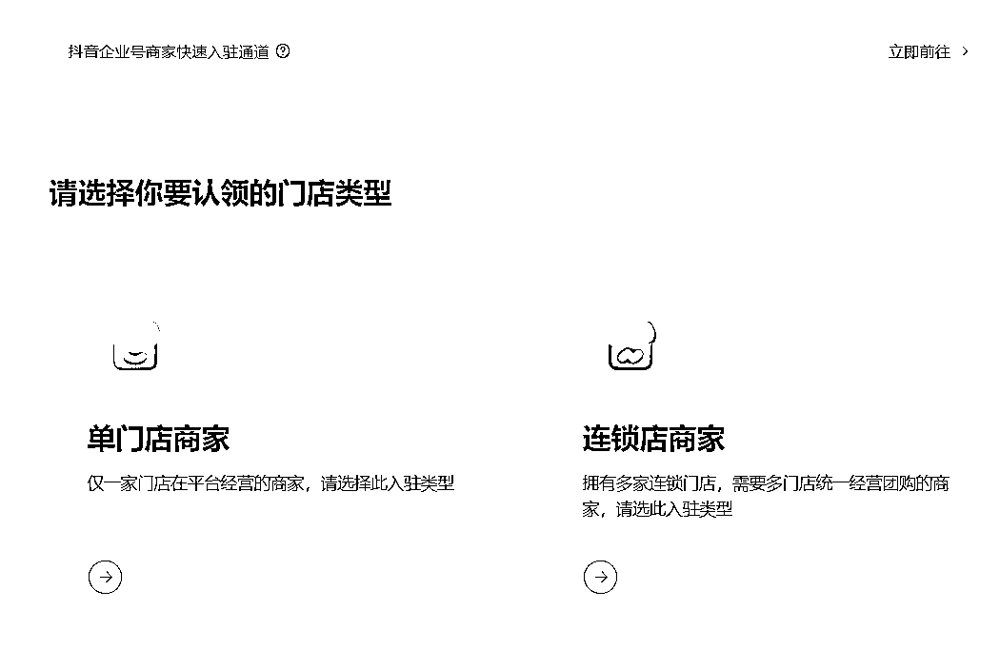
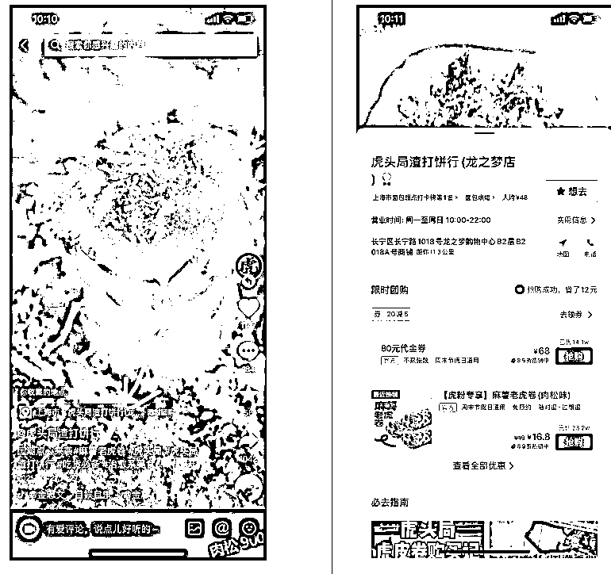
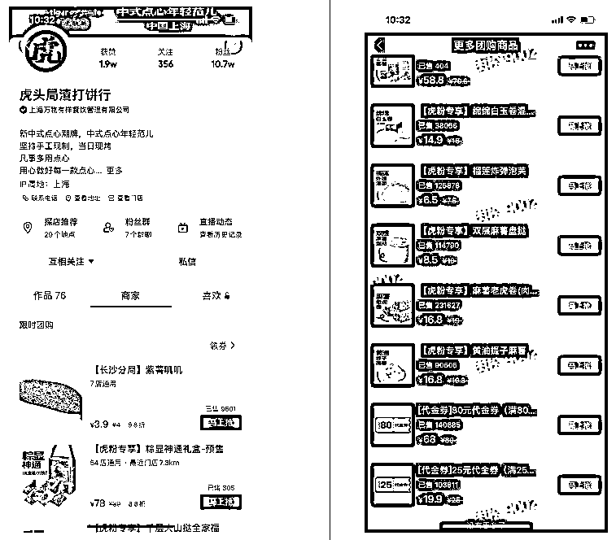
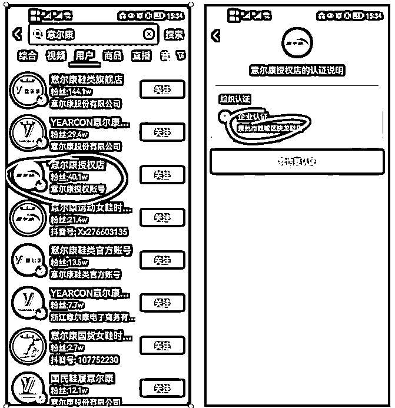
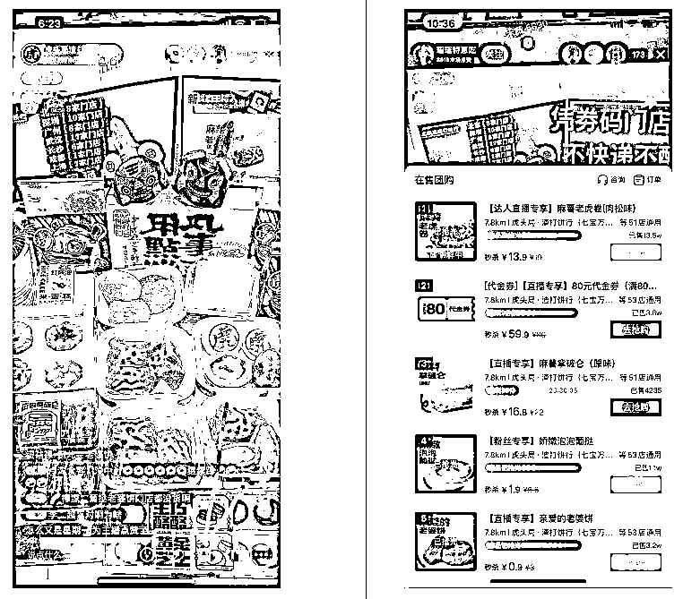

# 3.2.1.2 抖音本地生活怎么给线下引流？ @宋威

首先，要进行抖音门店认领。入驻抖音平台前，先关注自身门店是否是可认领的门店行业类型。一般包括以下：美食，住宿，游玩，休闲娱乐等，但具体还是看平台的审核为准。

第一步：在本地经营生活服务的单点实体商家，并且公司或者门店主体没有在抖音企业号开通团购功能，就在抖音来客 APP 申请入驻并认领门店。

第二步：认领门店

电脑打开抖音来客官网：[`life.douyin.com/`](https://life.douyin.com/)，或者手机下载抖音来客 APP 。注册之后登录，查看入驻所需材料，准备好材料和信息，点击入驻抖音门店，认领门店，搜索到要认领的门店，确认好门店信息。

选择门店后，进入提交资质的页面，按照页面提示经常资料还有信息的审核上传即可。需要的材料有：企业法人营业执照，《公共场所卫生许可证》、法人身份证照片。

第三步：认领门店之后，绑定收款账户，绑定抖音号，创建团购商品。

商家在抖音认领自己门店后创建团餐链接，这个步骤就和你入驻美团一样，用户在抖音可以直接购买商家设置的团餐，购买后获取一个二维码，和美团点评一样用户凭借购买的券码然后到店核销消费用餐。

而怎么让用户可以看到和购买你上架的团餐呢？ 目前抖音有四个流量入口：

第一个：发作品带门店 POI 定位流量

也就是抖音短视频内容带来的流量，这个流量是需要商家去运营的，不管是商家自己发作品还是找达人发作品，作品会为门店 POI 带来曝光，用户如果被内容种草就会点击 POI 进去看到商家上架的团餐从而产生购买消费行为。

这个是目前百分之九十的商家重点流量来源版块和重点要操作运营的版块，因为上手简单易操作，目目前本地团购达人规模非常大，可以满足市场推广需求。目前来说这个版块占比我总 GMV 的 40% 左右。

第二个：商家主页 + 搜索流量

也就是品牌自身声量和粉丝或者线下门店带来的流量，有人通过抖音主动搜索品牌号或者线下门店引导到主页购买抖音套餐，然后促成的成交，这个目前来说占比不大，加上门店引导的量占比我总 GMV 15% 左右。

所以如果你是加盟商或者特许经营，可以拿到品牌授权书去认证账号，借助官方的影响力或者搜索流量。举例：某品牌抖音排名，一个体户，全国排名第三。

第三个：直播间挂本地团购小房子流量 （小程序是小雪花）

也就是通过本地直播带来的流量，这个包含两个版块，一个是品牌自播，一个是达人直播，也是一个需要商家强运营的版块，直播间的流量通过主播引导成交，转化率远远高于短视频端。

和短视频端相比就是门槛相对较高，对商家能力的要求也高于制作短视频内容，且目前市面上本地直播达人太少太少，官方的头部达人也就不到 5 个，还全部集中在北京地区，其余城市都是刚刚起步。但是这个版块潜力巨大，目前我达人直播和品牌自播都在进行，占比我总 GMV 的 54% 了。

第四个：抖音本地同城页流量

也就是抖音平台同城生态自带的流量，这个页面其实就等同于美团点评了，用户想要吃什么，会习惯去逛美团点评找，抖音如果生态发展起来让用户习惯在抖音同城找美食，还是会有很多流量的，毕竟同城版块本来是抖音三大推荐页面入口之一。

只是流量一直也不大，现在同城页面下又在内测学习商城等子页面，流量更小了，概括来说这个版块等用户养成习惯后会有潜力，但是现在可以忽略不计，总体我 GMV 占比也就 1% 最多了。

内容来源：《虎头局抖音本地生活从 0 到 1 半年做到 3000 万 GMV 实操分享》

