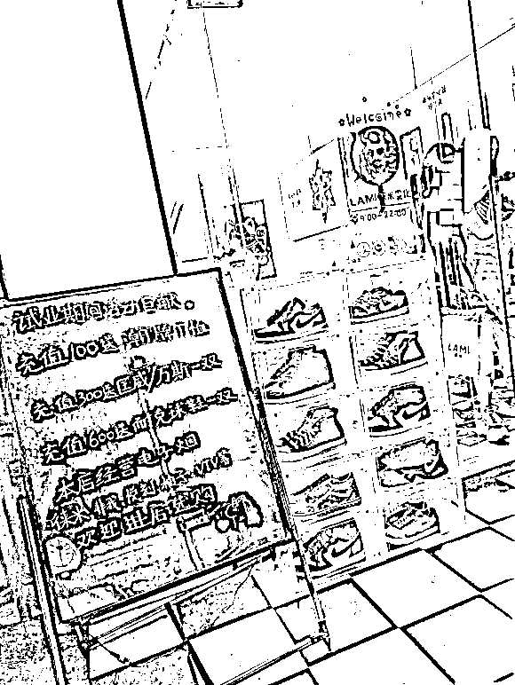
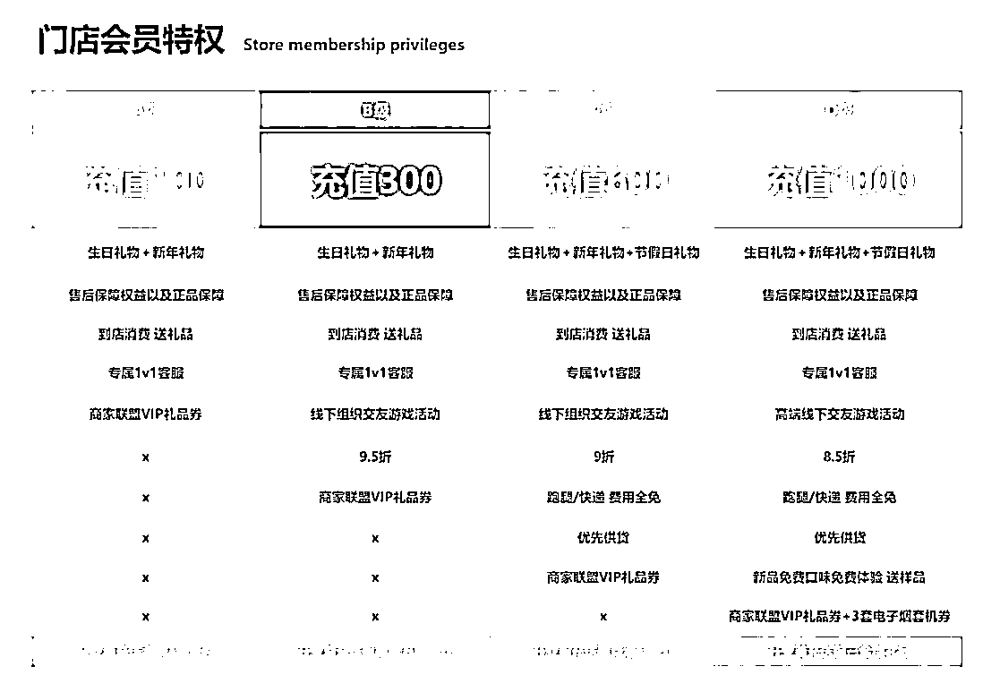
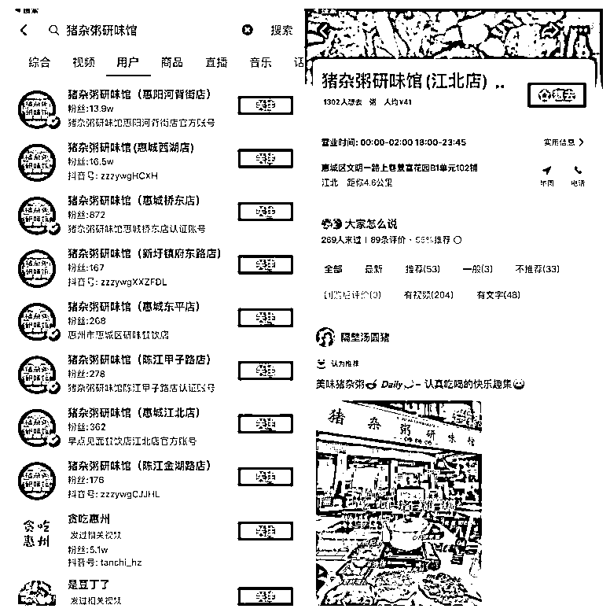
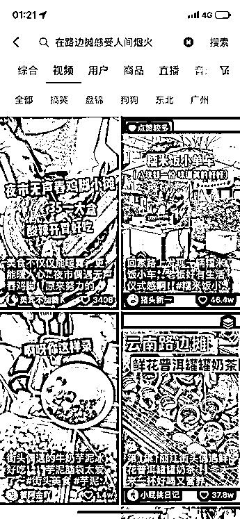

# 3.2.1.3 抖音同城号如何做内容 @西撒、@乔合

1\. 新店的同城号

做抖音账号有一个很重要的点，就是要让大家知道你是做什么的。这个餐饮店账号的规划是一个老板娘的开店日常记录，用一种朋友叙述的语气去描述每天开店的琐碎事，与用户拉近距离，让大家潜移默化的去关注这家店的后续情况。

我们的做法是直接把开店的过程拍下来，将开店的日常记录做成一个系列。这个号从选址就开始拍摄，把门店装修过程一步步的记录下来，搭配轻松诙谐的聊天文案。

在这家店还没开业的时候，就已经做了 20 多万的同城曝光量。这波流量带来的直接效果，就是到装修完毕开始试业的时候，第二天就已经开始排长龙了。而且这个账号到今天为止，也只投了几百块钱的 Dou+ 费用而已。

我们来捋一下底层逻辑。做同城餐饮门店号，用户画像的范围会比较广，并不需要像其他行业账号得做很精细的定位和用户画像分析。同城的好处就在于，我们门店做的是周边几公里的生意，我们追求的是能否在周边几公里内持续的曝光，让周边的人知道有这样一家门店存在，有这么一个老板在开一家这样的门店，然后在这个过程当中去吸引他们到店体验消费。

在内容制作上，我们一开始就没考虑天天拍美食，这种视频找一些素人矩阵探店去打爆就行了。我们希望这个账号是有记忆性的，做成同城的小 IP 。经过测试，确实是可以通过这种开店日常把流量做起来。

做同城流量不需要追求那种全国大热门，能够有小几万的本地播放量，时不时上个小热门破下圈，就足以给整个门店的生意带来极大的帮助。目前这个门店在我们当地，一直是人气榜的第一名。

2\. 「美容院」同城号

我们看了很多同城美容院的账号，然后走了一个差异化的打法。为了节奏不太拖沓，能第一时间抓人眼球，特地让美容院创始人作为事件主人公，突出「男性用户探店美容院」的差异性，吸引用户观看。

这位圈友自身的表现力很不错，也放得开。我们给他的脚本优化后，拍出来的视频跑了 8W 的同城曝光量，因为有上架团购产品，卖出 20 多单。后续又再爆了一条 20W 播放的视频，基本上周边 10 公里的用户都覆盖了，到现在还在持续的为他门店带来优质客源，同时也做到了本地美容美体榜第一。

3\. 电子烟门店同城号

最便宜的流量当然就是短视频，我不需要引到私域去，我只需要店铺在同城的曝光度。让大家知道我有这个店，我这个店在哪里，我这个店卖什么的，我这个店开业有什么活动就足够了。

我就把这个牌子放在店门口，拍个视频直接投豆荚加门店定位就行了，两个视频 500 块钱！总共 1000 块钱投放附近 30 公里的，本地 48 万的曝光率，让本地人对你这个新店有了第一印象：做活动、划算 、什么电子烟都卖的。（抖音号封了现在找不到截图了）

开业活动充 100 块钱送潮牌 T 恤充 300 送匡威万斯充 600 送 AJ ～

懂的都懂成本没多少，T 恤去广州批发 8 - 12 块钱，鞋子找莆田便宜的很，反正又不是卖，单纯送没人会计较你真假。

五月底试业弄的充值活动，开业前两天陆陆续续来了几批人，后面就很多人充值了觉得很划算，互相推荐形成了口碑传播，包括我们后面还陆续拍了几十条视频宣传这个活动，每条都投了 100 块钱流量，人气一下子就起来啦。

4\. 猪杂粥研味馆矩阵同城号

这是一个典型的短视频矩阵打法案例。通过抖音快速打爆单店后做招商加盟，分店也是同样的打法，形成品牌规模化效应，进一步扩大其在抖音及当地的声浪。

在营销上，这家店选择了「排队」的经典打法。短视频的拍摄极其简单，视频画面传递一个关键信息——这家大排档“天天排队爆满”，文案上用创业第 XX 天加一句走心文案做标准化输出。门店开店的时候，邀请所有的亲朋好友到店免费吃，从各个角度拍完视频，经过简单的剪辑后用这些人的抖音号发上去，通投 100 元 DOU+ ，效果后就后面继续追加。

5、小吃摊位同城号

为了能不断优化视频的数据，我也专门对标了一些同城热门的视频。最近地摊比较火，所以我就拆解了烟火气小吃的拍法。

我发布的视频，主要有两种：

1、卡点类型的视频。偏向于特写， 3:4 竖屏。

2、剧情类型视频。拍摄方法为：刚开始移动的镜头 → 然后跟老板的对话 → 再拍摄制作的过程（剧情类的视频是全屏的）

在发布视频的时候，一定要加上定位，标签带上本地城市名，以及“xx（城市名）探店”。用来做同城流量。

标题文案也可以蹭一下热度，比如：偶遇 xx 夜市的 xxx，也太好吃了吧！

对于视频内的文案结构，可以刷小红书爆款，把文案相应的修改一下，或者是有什么直接能套用。所用到的文案尽量是以顾客的角度，来对其他人进行分享的感觉，比如：

文案一：别问了！！！真的在 xx （城市）！！！在隔壁买蛋糕才发现！！！这不是我在 xx （城市）吃的！！xxx（店名）吗 😭之前在 xx（城市）吃过一次 一直心心念念这个 xx（品类）品类很多样 zui 爱 xxx（产品名称）还有 QQ 弹弹的外皮+甜甜的芯超级绝（上面这行介绍产品）手上拿一个吃再打包几个回家幸福感爆棚了真的很爱一切糯唧唧的东西呜呜呜建议晚点去 晚上才开摊人还不多！不过我们只买到几个 😭我后面的都没买到文案二：想安利给全世界的 xx（店名）偶然间在超市看到的觉得颜值很好看就买来尝尝吃到嘴里真的惊艳到了红豆肉松蛋黄的红豆味很浓郁，夹杂着肉松的香味，中间还有整颗蛋黄🥚，吃到嘴里嘎嘎香的，口感非常好（上面这段介绍产品）姐妹们快冲 这味道组合在一起真绝了，期待新的口味哦～

视频发布后，还有一个动作就是：在评论区留言，写上店铺名、地址、营业时间等等

除了拍视频引流外，我还会在抖音开直播。并且在每次出摊前，我会先更新一条视频，和平时一样的卡点或者是剧情类，靠着视频来给直播间带点人气。

内容来源：《如何看待抖音同城流量的红利？以 3 类门槛低，变现空间高的项目展开讲讲》、《00 后实体店创业者：用互联网思维破局疫情影响》、《我做了哪些操作，摆地摊也可以 60 天营收 20w+》

