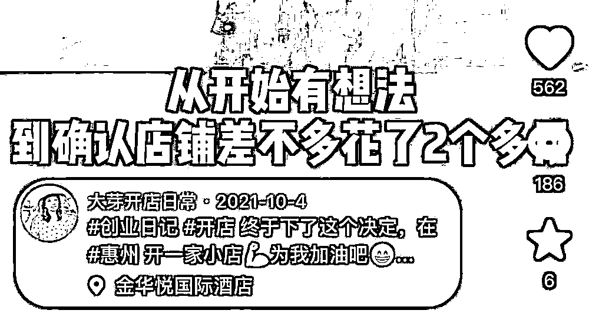
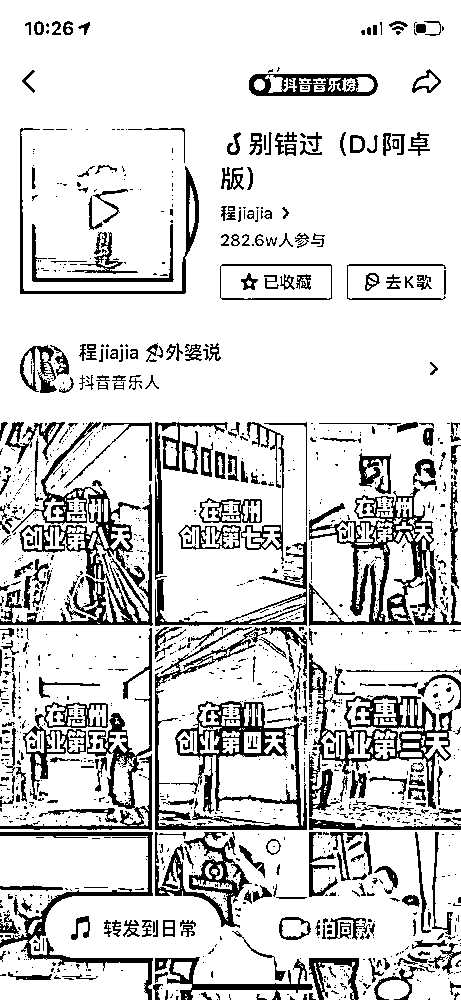
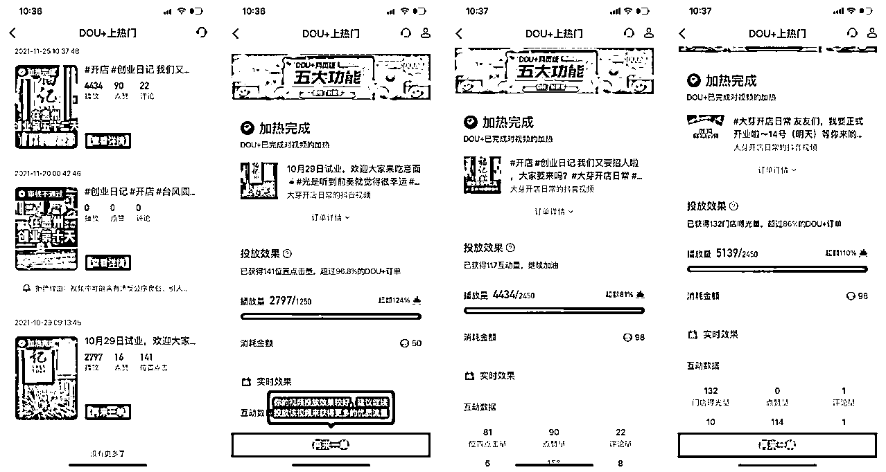

# 3.2.1.4 做同城号的六个注意事项 @大芽

1\. 拍内容时注意抢占用户心智

大家拍视频的时候不要在一条视频里把你的所有亮点都展示出来，一条视频展示一个亮点。另外要用接地气说人话的方式去形容你的产品，形容你视频里边的卖点，不要只说「生而强悍」这样华而不实的词。

注意：只拍一个点，这才能够迅速地抢占用户心智。如果绕来绕去，大家是记不住你的。

2\. 发布前要带 POI 位置信息

一开始做号一定要带地标，如果店铺还没有地址，可以先蹭热点，店铺周边的小区，酒店等都可以挂上。我一开始就是挂上了附近的一个酒店，其实这个酒店离我们店有 500m，但是没有关系。带上地标，才有更精准的本地流量推荐。

3\. 恰当的热门 BGM

跟其他短视频发布一样，音乐跟话题也是比较重要的，这个其实也是之前积累下来的「网感」，比如刷自己的账号视频，标重点音乐。如果某段时间一直刷到同一个 BGM，大概率这个就是当下的热门 BGM，那我一般就会就点进去看看，使用这个 BGM 的人多不多，有几十万人用，我就会尝试一下。

在发第一个视频时，我就是靠这个小技巧，选到了这个在上升期的 BGM，并一直使用着。持续使用某个 BGM，对于用户来说，也可以当成一个记忆点。

4\. 带上当地话题

我们做同城账号，肯定要带上当地的话题，像我在惠州，做的是餐饮，我的视频一般都会带上 #惠州 #惠州美食 这样的相关话题。

5\. 标题可以加入提问

在标题里，我会加入一些提问，例如「能想象出来是什么样的吗？」「大家知道惠州哪里有冻品市场吗」「我们要招人啦，大家要来吗」这样的互动话题。从评论区，是可以明显感受到只要你有提问，用户就会来评论与你互动。而这样，也会让视频的互动数据变好，从而获得更多推荐。

6\. 视频发布后注意互动

前期如果有用户评论，我都是尽量做到每条都回复，更多地关注与用户的互动和交流，这样呢，才能吸引更多的顾客到店消费。

此外，个别视频我也会适当投 Dou+，不过整个账号到目前为止，我只投放了 250 块钱。只要有投放的，基本都有几万播放。但是我那些十几万播放的视频，都是自然流量，并没有投 Dou+。Dou+ 只是锦上添花，核心还是视频内容，只要互动数据好，还是能够获得系统推荐。

内容来源：《3 公里内最少有 500 人看到，抖音同城号做到热榜第一，132W 播放》

