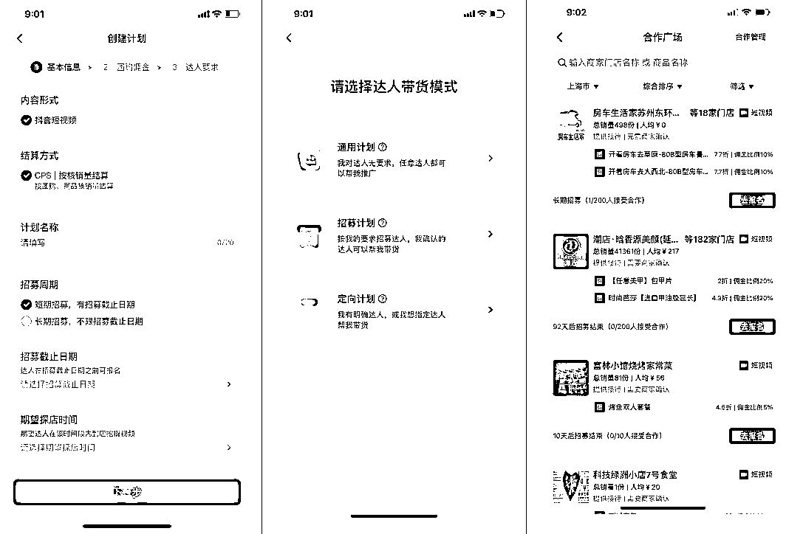
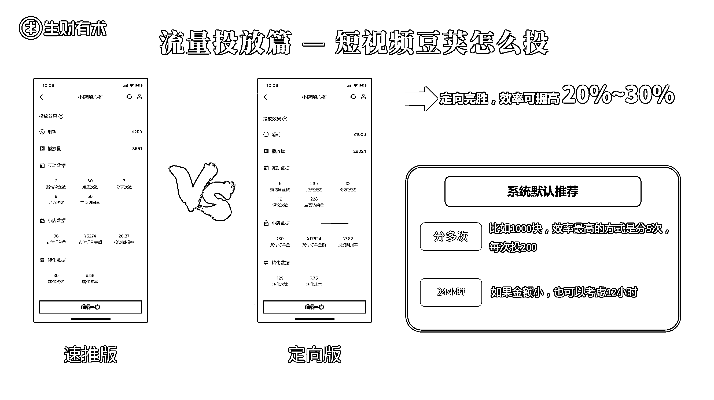

# 3.2.2.1 关键一：应该怎么找达人？

第一步：找哪种达人

团购达人是有带货等级的，主要看达人的带货等级来评估，不需要去额外因为粉丝量付费。

达人带货分为 1 - 6 级去评估他本地团购的带货能力，这个等级考核指标里面是不看粉丝量的，只看实际效果，所以高粉丝量的达人并不意味着他的作品效果比千粉的达人要好，相反是高粉丝达人的成本要远远高于千粉达人。

也就是说商家在选择 KOL 和 KOC 的时候，不管是大品牌还是小商家我都建议合作达人的时候优先看带货等级而不是粉丝量，优先合作内容优质的 KOC ，投产比更高。

如果看粉丝量：

• 20 万粉丝以下的达人，你可以海量的去找，只要他不收你坑位费，他可以跟你玩分佣，你就让他去到你店里拍。

•20 万以上需要坑位费的达人，你谨慎地去选择。

如果各位老板想找达人可以参考这个顺序：先找那些不要坑位费的；再找那些要坑位费的。建议不要一上来就找那些要坑位费的达人。因为你很可能一步错就步步错，一下就崩了。

什么时候找要坑位费的？当你自己有一定经验了，你再找那些需要坑位费的；在你还不懂的时候，你就找那些可以到这拍免费拍视频的。

达人从哪里来？简单点的操作是直接找服务商，现在每个城市已经有团购达人服务商手上握着很多达人资源了。

如果你不想花太多费用找服务商的话，抖音创作者服务中心有个团购达人，点击进去可以看到每个城市入驻的团购达人和全国达人，你可以选择你所在的城市去挨个私聊就好了，或者谈个达人给他一部分费用让他帮忙招募，成本都能再低一点。

现在抖音商家可以自主创建招募计划，然后还可以设置达人要求，达人可以在自己团购中心的合作广场里看到你创建的招募计划，直接报名联系你们。

第二步：确认和达人的合作方式

团购达人是有分佣机制的，这样就大大降低一口价成本为效果付费。

所以千万不要只是上架个团购商品就完了，一定要去设置佣金，这样你才能更好的更低成本的去和达人谈合作，你才会有自来水达人帮你免费推广，并不是非要投入很多资金才能做起来这个事的。达人合作市面上目前模式主要有三种：

1\. 餐补 + 一口价 + 零分佣模式。目前是一些大品牌做品宣这么玩，付了一口价费用不设置佣金了；

2\. 餐补 + 一口价 + CPS 分佣模式。这个是目前主流模式，但是探店达人一口价目前市面上报价水份很大，同一个达人可能报价从 300 - 3000 都有，目前给大家一个我这边定的合作价参考： LV3 达人 200 元、LV4 达人 400 元、LV5 达人 600 - 1000 元。当然这个也和品有关，热卖的有流量的品一般达人会酌情降价的。

3\. 餐补 + CPS 分佣模式。这个就比较适用于一些预算比较低，中小型商家了，刚起步的时候可以用这种模式，投产比一般能跑正的。

第三步：达人怎么拍

•每个达人都要让他突出你那个最核心的亮点，最核心的卖点。

•别的不用他拍，就拍那个最核心的，比如你的拿手菜，或者你的金牌服务，或者你店里的一个必须要做的活动。所有达人都放大这个东西。

第四步：投 Dou+

我给大家分享一个我花了几十万投 Dou+ 投出的经验：如果你有 1000 块钱的预算投 Dou+ 的话，你不要一把 All in 进去。最好在同一时间段，同时投 5 笔 200，要比一次性投 1000 元，效果提高 20% 到 30%。

另外提供圈友 @宋威的投流方法供你参考：

我一开始和达人合作的方式基本全是第三种置换模式。通过给达人提供 80 元代金券采买产品 + 10% 的分佣比例 + 到达 1 万播放的达人投 100 Dou+，到 5 万播放的时候追投 100 Dou+。这两个 Dou+ 的核心目的是追涨，卡在 1 - 10 万流量吃中间助力上 10 万流量池。
DOU+ 投放有几个选项，直接选择门店点击即可，效果最好，然后范围选择门店 6 公里内，性别和年龄根据自己的用户画像选择就好。这样做的目的是能大大降低推广成本和提高推广效果。