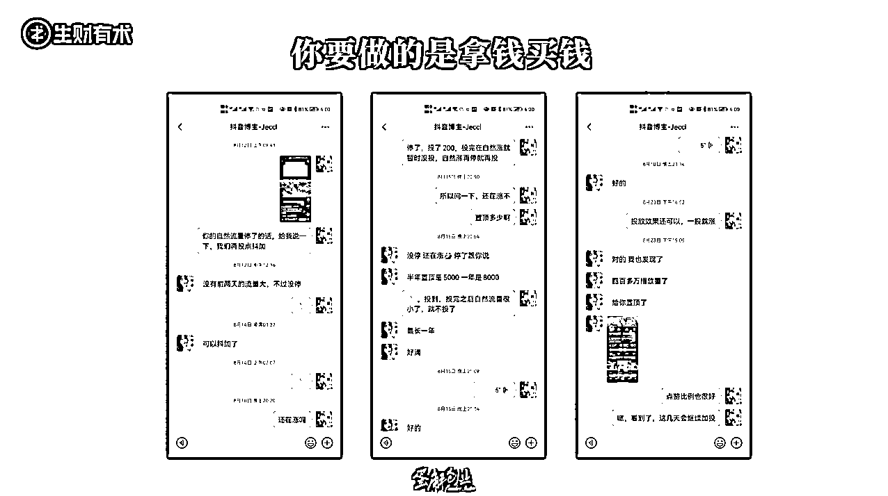

# 3.2.2.2 关键二：计算 ROI ，不断放大展现效果

找探店达人，他到你店里拍视频仅仅是你万里长征的第一步。接下来要干嘛呢？

•去看他发的这条视频到底有多少播放量？

•到底有多少人通过这条视频领了店铺优惠券？

•到底领了这些优惠券的人有多少人到店内核销？

•算出这样的一个比例，也就是我们俗称的转化率。

如果转化率足够高，你的客单价又足够高，你就应该算出 ROI 了。什么叫做 ROI 呢？就是投入产出比。

比如说，今天我卖一个 99 元的套餐就能挣 30 元钱。你找了一个达人去拍了条视频，这个达人给你 5000 播放量，有 300 人领券，其中有 100 人真的到店内核销了，也就是说这条视频转化了 100 人，每个人能挣 30 元，那你挣的是 3000 元。

也就是说你每投 100 元钱的 Dou+ 能换回 3000 元。那最应该干嘛呢？ 应该投 1000 块钱 Dou+ ，换回 3 万，投 1 万块钱 Dou+ ，换回 30 万。这是一个算术题。

所以找达人去你店里，仅仅是你去做同城号万里长征的第一步。如果不关注后续的数据，那就是一个天天被各种白吃白喝的人白嫖的一个老板了，你说对吗？

大家可以看看下面这个图，这个老板怎么说的，他跟这个达人的对话被我截下来了老板说：你这条视频的自然流量，如果停了的话跟我说一下，我帮你投 Dou+ 。

所以说你找一个 500 万粉丝的账号去探店，比如说找 2000 万粉丝的 「大 LOGO」，他探你一回店可能 20 万起步，还不包播放量对不对？ 但是如果他效果不好，你 20 万就白花了。