# 3.2.3.1 如何通过做自有账号引流 @怡伶 78667 @Nico 酱

从去年 10 月运营艺术体验门店到现在，我的小红书个人号也就 700 粉，询单爆发时才 500 粉不到。目前 90% 门店客源都来自于小红书，其中不乏单价 1W+、2W + 的企业单。

我的闭环设计很简单：从小红书等公域引流到私域，客户在微信预约后到线下店后消费成交。小红书客户基本都很精准，来一个成交一个，私域没有过多维护，我甚至连朋友圈都没咋发。

生财里教大家怎么注册账号、定位、设计主页、私域维护的分享已经很多了，我就不班门弄斧。这部分我主要想聊聊我对小红书内容种草引流的思考，有成功经验也有雷区踩坑。

先分享我亲自实战过，非常有效的种草笔记写作经验吧。我把主营业务优化为 Tufting 类目后，主要发了两类引流种草笔记：

•个人引流名片

•案例作品种草笔记

这两种都给我的账号、门店带来了不错的曝光，也吸引到了超多精准成交的目标客户，是高转化种草笔记。实战营同学测试过的，基本都出了效果，适用于很多类目。因此我觉得值得分享下经验。

我的评论区词云图（高频词：预约）：

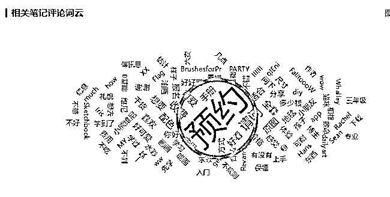

引流方法一：置顶个人引流名片的笔记

置顶个人名片是我写的第一篇 Tufting 笔记，也是询单、客户预约最多的一篇。在小红书里搜索「上海 Tufting」或「Tufting 上海」这篇基本都排在前十名（每个人的搜索呈现结果不一，会有些偏差）。引流名片笔记，是软性植入自家产品或服务的「神器」。那这类笔记怎么写呢？

我分两部分说：「笔记类型」+「写作技巧」。

从笔记类型来看，引流名片主要包含故事经历型、硬广介绍型和伪真实体验型三种。

故事经历型：自我介绍和故事经历描述。但这个描述不是流水式的，一定要重点说自己的工作部分，方便软植入产品和服务。在不明确导流的情况下暗示用户「在我这里可以买 XXX」：

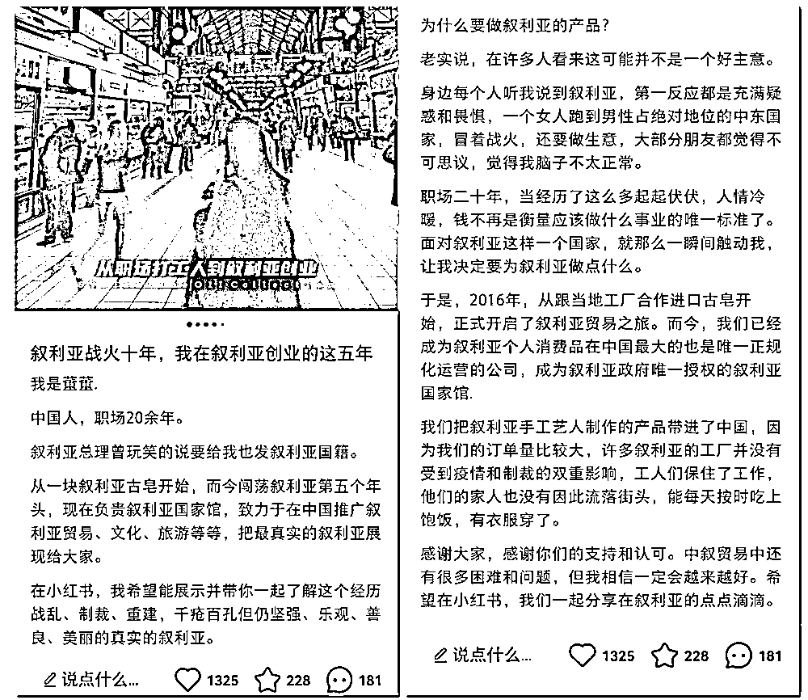

真实体验型：一开始写得比较硬广，后面做了优化调整，模仿常见的探店笔记写了一篇置顶到主页，直接放了门店地址都没被系统判导流违规。如果你也有店，可以试试这种伪探店口吻；如果没有也可以模仿下素人体验口吻，有时候系统还真识别不出来你在打广告，非常好用。

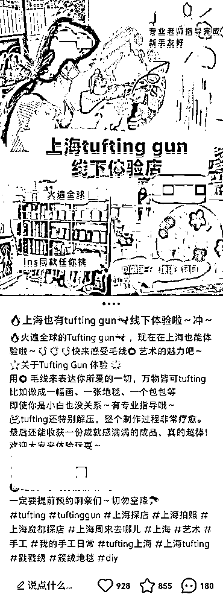

硬广介绍型：简单粗暴介绍自己是谁，提供什么产品服务，什么流程、理念等等，偏硬广一些。这种更适合企业号，个人号写不好的话可能踩雷违规。

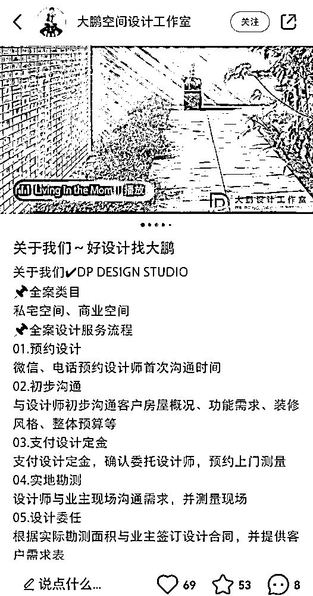

这 3 种你们可根据自身情况测试，将笔记一直置顶在主页（发布 20 篇笔记即可解锁置顶功能）。

我这篇笔记的互动数据都源于自然流量，因此下面询单比较多。如果前期互动不够好的话，可以人工控制冷启动，错开布局「怎么联系」「怎么预约」「店在哪」等询单型的评论，会有不错的效果。每个新用户过来第一眼就能看到你的自我介绍和下方评论，有需求自然会来询单。

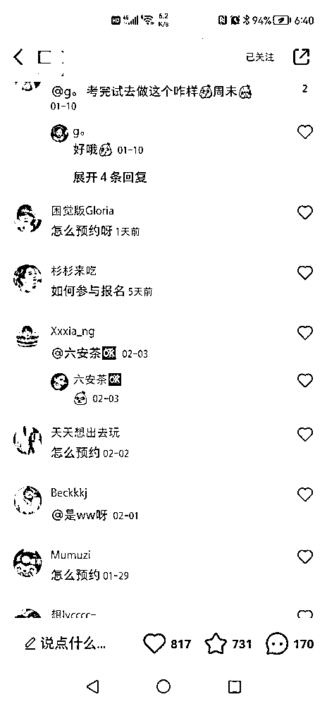

写作技巧方面主要是图片和文字：

图片只要跟你的工作、产品或服务有关的就可以，最好能真人出镜，不想露脸就侧脸或者真实场景露出也可以。

文字部分没啥技巧，用大白话就成，就那种我跟你聊天的感觉，越接地气，小红书用户戒备心就越弱，更愿意来询单。

引流方法二：案例作品种草笔记

对于定制、客定、设计类商家 IP 来说，少不了要用到客户作品来做种草的。比如我肯定要发客户的 Tufting 成品才能吸引到对这个体验感兴趣的目标人群。

但这里就容易遇到两个问题：

•很容易把案例作品种草写出干巴巴的硬广，对个人号来说效果不是那么好。

•爆款种草笔记大多是素人体验口吻，商家也不好一直说是自己来亲自体验的，角色切换有难度。

调研了比较多做得不错的企业号和商家个人号后，再结合自己实战，我觉得可以这么解决：

第一，大大方方告诉用户你就是老板，从老板的角度描述客户来体验的过程，描述他们的作品；或者打造一个公司 / 工作室里的员工人设也可以。

比如我这篇，就是老板视角的笔记（赞藏一般但评论和私信询单不少）：

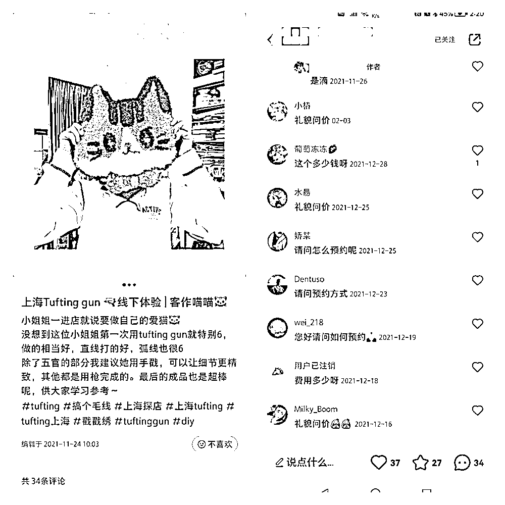

比如小浔溪这篇，就是踢脚线工厂打工妹的角色（又爆又精准的代表）：

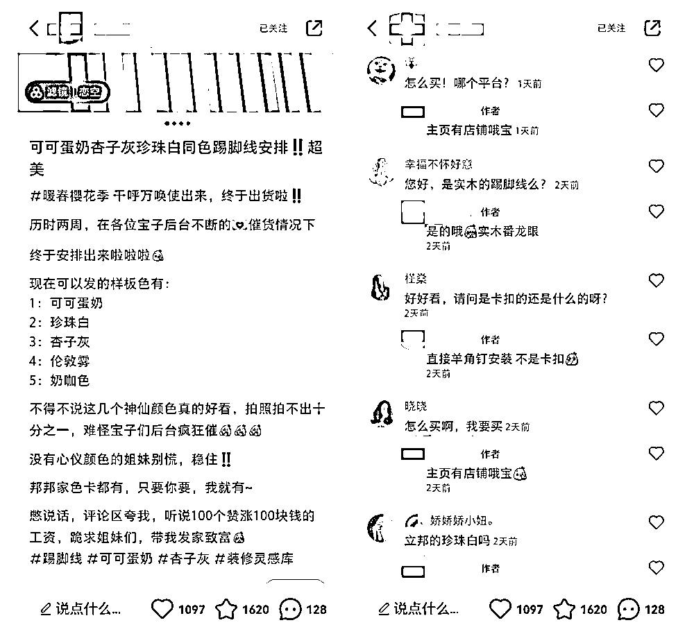

第二，无论是老板还是员工视角，口吻也要聊天式，街坊邻居唠嗑的感觉。文字内容不用太长，语气可以适当俏皮一点。举两个例子给你们感受下：

•生硬种草：冬日上新 这款实木餐桌真的很值得买买买

•聊天种草：客户全家都夸爆的实木餐桌！姐妹们快给我冲！

种草笔记的口吻真的挺重要的，就算明说你是企业、老板，只要够接地气，用户还是不会太反感，反而可能会因为你的「可爱」「真实」「坦率」而种草你家产品。

另外以下几种小红书引流方法也可以参考：

引流方法三：利用个性签名引流，在小红书个性签名处留微博进行跳转引流。

引流方法四：评论区剧本式引流，举个例子当时我发布了一条美业门店资料的笔记，我安排了几个小号到评论区回复：求分享，求完整的电子版等类似的话术，造成从众效应。

引流方法五：私信引流自动回复，相同的内容不能超过 3 次，需要提前准备带联系方式的图片。

引流方法六：笔记收藏式引流，用小号发布一些带联系方式的笔记，用大号进行收藏，这样别人在看大号信息时就可以看到联系方式。

引流方法七：小红书名字设置成微信号引流，这是所有方法中效率最高的引流方式，客户咨询时直接回复“看我名字”。

种草笔记的其他注意事项

1\. 首图

用户第一眼看到的就是首图，前期必须好好打磨。我观察下来，小红书的爆款首图要么特别美好精致，要么真实接地气，主要看类目和 IP 人设。我的产品比较网红时尚，好看精致更圈粉，所以我的图都不会太丑，每张都处理美化一下。

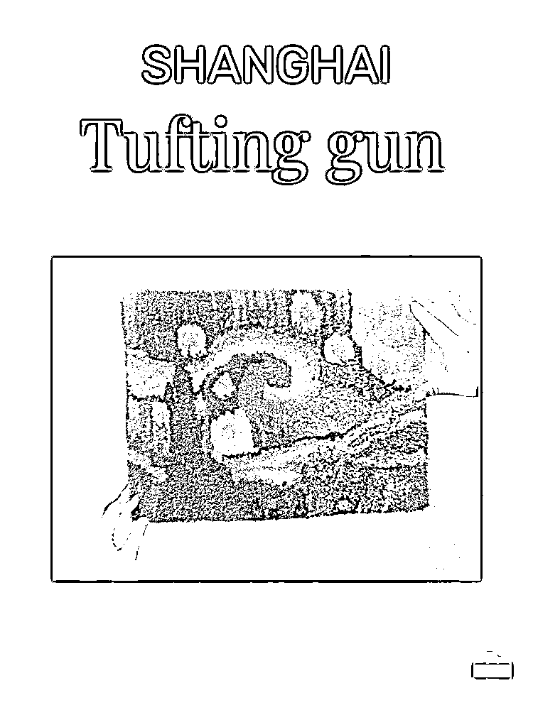

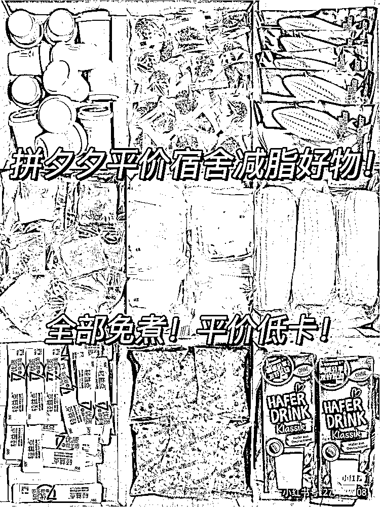

美好精致型（左）接地气型（右）

首图制作推荐美图秀秀、黄油相机，有比较多好看的文字和贴纸。稿定设计也有现场的小红书模板，很适合新手。

2\. 关键词

关键词用对了真的 YYDS，下面这套方法还适用于其他平台，逻辑都差不多。

首先你要挖掘到自己行业的高流量产品关键词。在小红书搜索关键词如「画画」，看到图中画圈位置出现了很多相关关键词，从中找到适合你的去添加在你日常文案中。继续往下滑，就可以看到这个画圈位置出现了更多细分关键词，也可以参考使用。

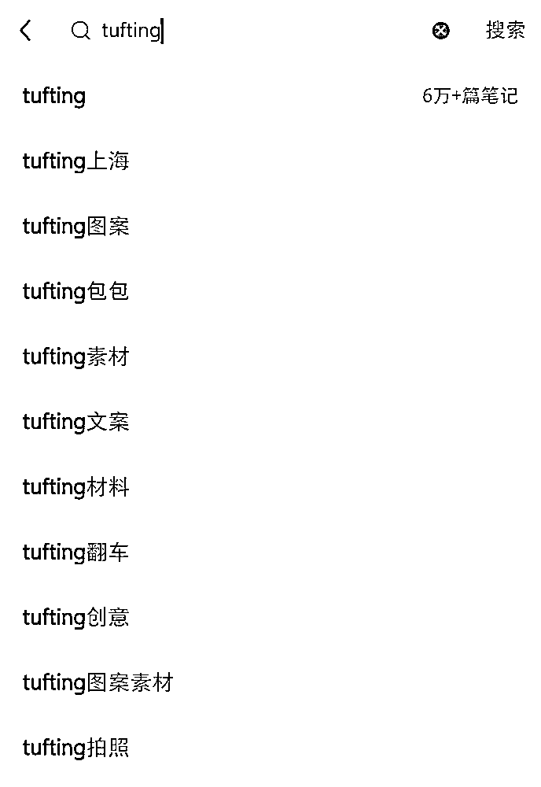

在同行对标帐号里收集，他们的爆款文案中有哪些关键词，你也用小本本记下来。

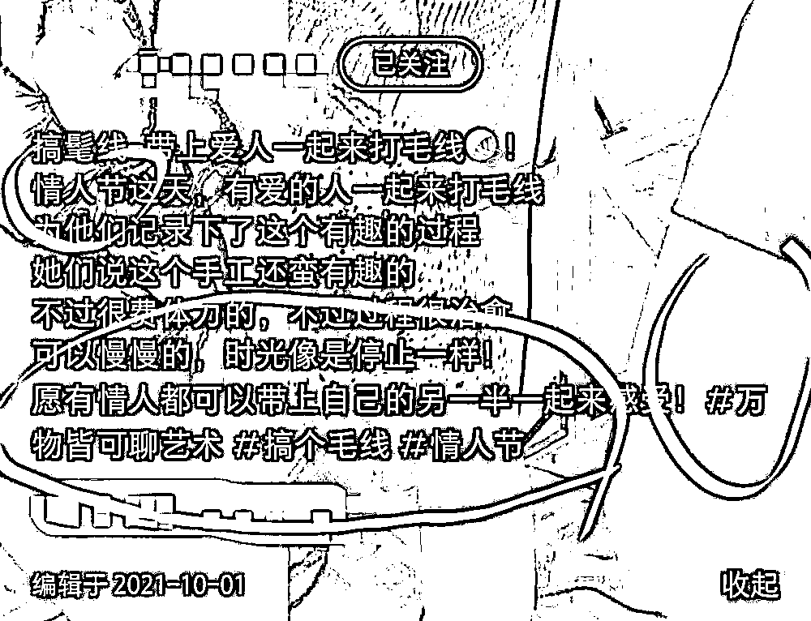

看企业号的关键词投放、买量、搜索情况。这个专属功能还挺好使的，我刚升级了企业号，回头有新的经验总结再分享出来。

收集完就可以开始铺词。我一般会在笔记标题、正文、末尾都打上关键词，尤其是本地关键词（比如上海 Tufting）。

起号阶段最好是泛词 + 精准词组合放。泛词是指更大众一点的热词，比如探店、上海探店、周末探店；而精准词跟你的产品细分词有关，比如 Tufting、上海 Tufting、戳戳绣。

刚开始我就只放精准词，其实流量一般般。但加上泛词的强曝光，整体效果就不一样了。当然，前提还是你的笔记内容要吸引用户。这个玩法用在大众点评上也吃香，如果有在做大众点评的老板，可以把店铺名 + 团购都加上关键词试一试。

内容来源：《千粉不到月入 10W ，我如何通过小红书救回濒临倒闭的艺术体验门店？》、《200 家日式皮肤管理加盟店背后，我是怎么把美业生意和互联网运营结合的》

