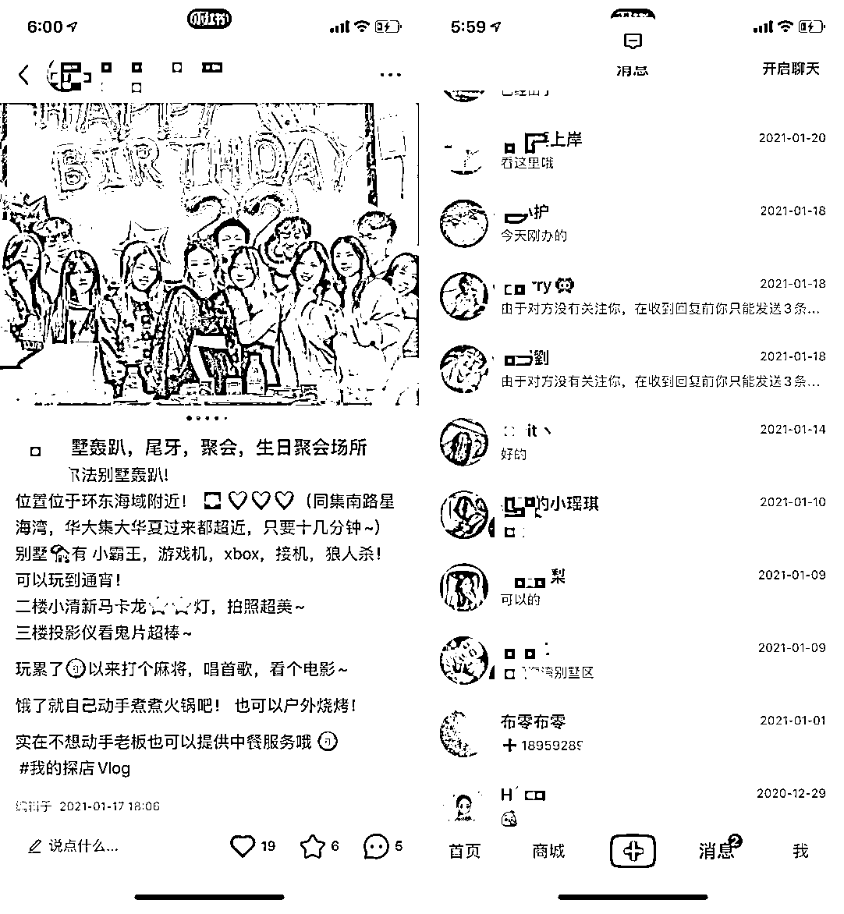

# 3.2.3.2 与本地达人合作引流 @Mage

我是做轰趴别墅的，会在小红书找本地探店达人置换，免费请他们过来玩，要求就是帮我在小红书发一篇帖子。

小红书置换的流程

1\. 首先打开小红书，定位所在城市，开始刷。目标主要是置换 18 - 35 岁爱在小红书分享 / 打卡的这一群体，点进他们的主页后做以下动作。

第一，看粉丝数，粉丝数量太少的，置换没什么意思，纯属我们亏本，粉丝量太高的一般都不接受置换，需要广告费，大概 500 - 10000 元，我一般是选粉丝数在 5000 - 3W 这个区间的进行筛选。

第二，看这个置换的达人发的是否是这个城市相关的吃喝玩乐，如果发的都是美妆 / 护肤类，这种就是泛粉，当地城市的精准粉丝较少。

第三，看这个达人的拍照和文案功底，起码看起来如果我刷到是有兴趣点进去看的，而不是过于随手拍类型。

第四，这是最重要的一步，看粉赞比，一般 5000 粉至少要达到 10W 以上的获赞和收藏，这样的达人就算比较优质（比例大致是「粉丝：获赞与收藏」在 1 : 20 以上）

2\. 接下来就是打招呼的过程。一般我会说：哈喽博主你好，关注你很久了，我这边是位于 XX 地区的 XX 别墅轰趴馆，觉得你在小红书上发表的内容和拍的照片都不错，想诚邀你和你的朋友到我们这边体验一下，不收费～要求就是你帮我们在小红书上写一篇文章帮我家宣传一下哈～～～

这样拿着账号批量去和小红书的达人打招呼，在有意向的博主回复之后，就把场地的照片位置和可以体验的时间发过去，再就是加上微信等他们过来探店。一般发 10 个博主会有 3 - 4 个同意，最后会过来的有 1 - 2 个，其他的可能说没时间，或者等下次朋友过生日等。

在达人来到门店的时候，我会做一个横幅，欢迎 XXX 前来探店，成本就是 10 元，虽然是一个简单的操作，但达人到了之后会有完全不一样的感觉，打心里会觉得这个商家很尊重我，我一定要好好帮它拍照宣传一下。

3\. 当达人体验完置换之后，要尽快对他们进行催稿。最好是 1 - 2 天内完成，然后发到小红书上面，我们的要求是尽量让达人一个月之内不要删除。而且，如果你手中掌握了大量的当地小红书的达人资源，也可以走其他的变现模式，比如品牌推广、店铺营销等等。

小红书打招呼过于频繁会封号，我一般一天打 10 - 20 个左右，控制好数量，可以多个账号操作，当认识的达人多了以后，在当地都会有一些群 / 组织， 想办法进群，就会更方便做置换了。

内容来源：《从亏损 8000 到盈收 3W+，轰趴别墅通过精细化运营实现转介绍率 70%》

