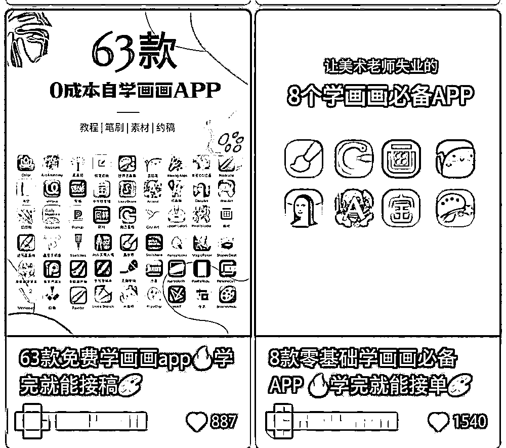

# 3.2.3.3 小红书引流注意事项 @怡伶 78667

踩坑一：盲目追逐爆款

初期我做油画体验那会，其实在小红书写了好几篇爆款笔记，都是干货分享为主，比如绘画接单 App 大合集、油画棒选购攻略、绘画教程等等。

互动数据不错，1 篇千赞、1 篇 800 赞。但这类笔记吸引过来的都是白嫖党或者来交流的，都不是来我这消费的，基本没有意向客户。

虽然我也能留钩子引流到私域，但很像广撒网，不那么精准，种草转化路径比较长。后面我改成写 Tufting 种草笔记，互动量爆款不多，但询单成单立马激增。

因此，做产品种草的没必要盲目追逐爆款，精准转化更重要。在选题、选笔记类型的时候，就要思考清楚，用户看到这篇笔记后会采取什么操作，来交流还是来询单消费。

踩坑二：缺乏闭环思维

小红书等公域引流只是一种流量获取手段，但能不能成交还是取决于你产品或服务本身的质量。

比如我一开始做的油画体验，早就身处红海，同行恶意低价竞争激烈，而且我也没差异化优势。就算客户通过小红书引流过来，也基本不会成交。当时，我还把重心放在内容优化上，但实际上是整个闭环有问题，尤其是变现端。产品本身不行，内容做得再好也是白费力气。

因此我觉得做任何平台的 IP，都要有闭环思维，在运营过程中审视和优化调整「定位 - 内容 - 引流 - 变现」每个环节。它真的是环环相扣的，错一环满盘皆输。

内容来源：《千粉不到月入 10W ，我如何通过小红书救回濒临倒闭的艺术体验门店？》

