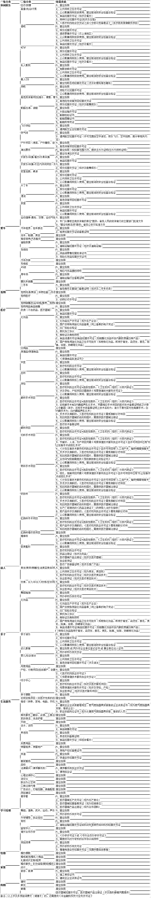
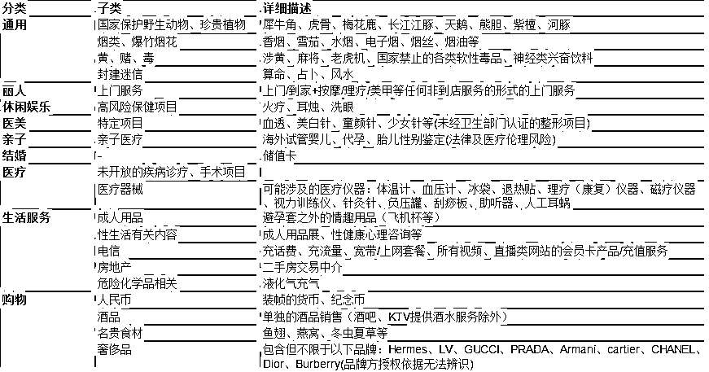
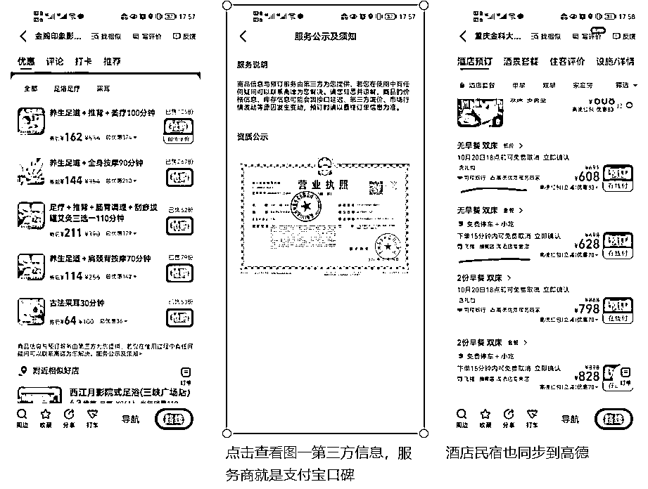

# 3.2.4.1 平台入驻 @封伟-自动化变现 @Mage@芷蓝

美团 / 大众入驻收费是根据所在行业城市来评定的，我当时入驻是 7800 / 年，另外加了 3000 元推广通，就是 10800。推广通就是直通车，在美团上成交也是要抽佣的，一般都是直接引流到微信上进行成交。

大众点评入驻流程：

1、进入大众点评我的页面里；

2、点击 “合作 / 入驻”；

3、选择入驻大众点评形式；

4、再点击 “立即开店”。

需要注意事项：

1、在开通流程中，你需要提供的行业资质

2、有哪些行业不可入驻？

美团 / 大众入驻以后，是可以直接发手机号或微信号引流的，虽然平台会提示不要使用第三方交易，但基本没什么问题。

如果是做民宿，酒店等行业，途家 / 小猪民宿 / 爱彼迎这些平台入驻也很简单，提供租房合同和基本信息就可以，这些平台统一扣点也是 10%，有时候一单 3000 元的单子就要抽 300，还是很多的。

这几个平台是不能发微信和电话号码的，审核比较严格，被查到会进行罚款处理，不管你这一单是否成交都是一次罚款 50，严重的可能会降权，为了规避平台的检测，也试过各种稀奇古怪的方式给客户发联系方式。这一种被查出的概率会比较低：我们地址是在 135 街道 660 路 138 号 XXX，类似这样，把微信 / 电话掺杂在里面，也会检测到，但概率比较低。

除了美团和抖音，说一个免费的，支付宝口碑，好处在于开通后会同步到高德地图，可以在高德上直接付费。类似的还有飞猪同程等也会同步到高德，做酒店住宿的不要放过，其他的业态也可以去高德上搜搜。

内容来源：《从亏损 8000 到盈收 3W+，轰趴别墅通过精细化运营实现转介绍率 70%》、《实体店如何有效互联网化，90%的老板容易忽略的细节》、《门店私域运营 | 小航海学习手册》

