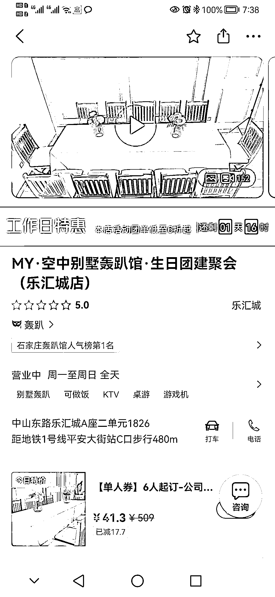
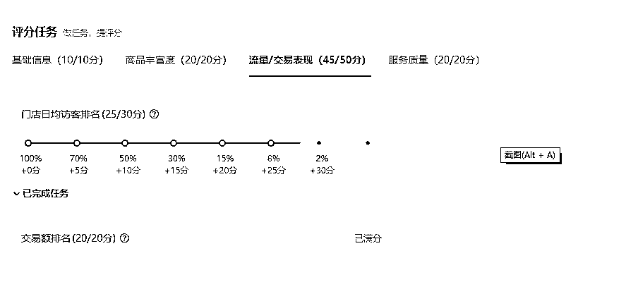
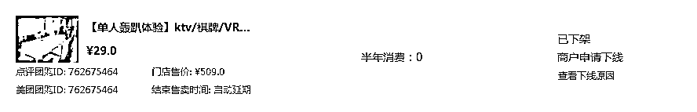

# 3.2.4.2 如何做美团 / 大众点评引流 @米菲

•第一步：门店基础信息的搭建，包含店铺名称、地址、头图、标签等

店铺名称大家可以参考这个公式：品牌 / 店面＋产品＋商圈。比如我的店面叫：MY＋空中别墅轰趴馆生日团建聚会＋乐汇城店

这样做的好处是：

1.客户搜索产品需求，比如搜索轰趴，团建，聚会，可以搜索到门店，增加曝光

2.客户搜索商圈，门店同样也在商圈里面

可以用品牌 logo，店内环境，优惠活动作为头图。标签包含停车信息，付款方式，设施服务 ，WiFi，特色等。

•第二步：分析竞对，进行团单套餐设计

我们进行团单设计之前，首先要通过美团点评对周边的竞争对手进行分析。

美团的商圈是这样划分的：某城市-某行政区-某商圈。由于我们轰趴品类较小，因此同城的竞对数据都要看，如果只做区域生意，商家数量多的话，可以只选择某个行政区或者某商圈。

我们可以根据销量/人气优先的顺序，挑选 5-10 个竞对。分析竞对有几个维度：

半年的销量里分别是多少？有销量的团单是什么样的套餐内容？有没有拿到金银铜牌？有没有进入榜单？评价积累有多少？店铺星级多少？

我们再根据自身情况设置保本团单、限时限量低价团单、主打团单。

•第三步：提升经营评分，拿金牌

在美团开店宝后台，我们可以看到店铺的经营评分，每天都会更新

经营评分就是我们日常经营的步骤，小白商家的成长体系。经营评分大于 80 分，且点评星级大于 4 星就可以拿到金牌。拿到金牌后，一方面，店铺在商圈同品类的排名会比较靠前；另一方面，金牌标识也能增加客户的信任度。

其中交易表现 / 流量这两个板块决定了我们拿金牌还是银牌，并且两个板块的排名参考的是整个地区同类别的全部门店。

1\. 交易表现：交易额的提升，要鼓励客户从线上下单消费并核销，不要舍不得平台扣点的费用。

2\. 对于流量板块，我们需要：

第一步：开通推广第二步：鼓励进店用户打卡，收藏店铺。可以收藏赠礼，收藏店铺给予优惠等来引导收藏。第三步：体验过程中可以观察或者询问客户满意度

如果客户满意度高，可以采取美团点评下单并核销，并引导客户给予真实评价（注意：不可以直接要好评）

•第四步：提升店铺星级（好评）

星级分为美团侧和大众点评侧。美团需要下单消费后评价；而大众点评不用消费也可以评价，可以先打卡，再评价，这样评价过审几率更大。

体验过程中可以观察或者询问客户满意度，客户满意度高，可以采取美团下单并核销，并引导客户给予真实评价（不可以直接要好评）

•第五步：进入榜单

美团侧休闲娱乐的榜单分为「销量榜」和「人气榜」。

销量榜是按过去 180 天商户销量排序，销量高就可以进入榜单，不涉及评价等其他条件。所以，销量榜是可以快速通过人工干预进入榜单的。

在团单设计上，可以通过增加低价团单，来冲销量。下面为大家展示两个案例：

【案例 1】增加特价饮料兑换团单，并制作醒目的 kt 版 粘在冰箱门上，鼓励用户购买，每个账号限购 3 瓶

【案例 2】设置单人体验活动，活动可以作为临时性的，等进入销量榜可以根据自身情况考虑是否下架

人气榜是按过去 7 天商户的人气来进行排序的，提升人气榜排名的方法，可以参考第三步拿金牌的方法。

内容来源：《如何让店铺在美团运营上进入榜单、拿到金牌》

