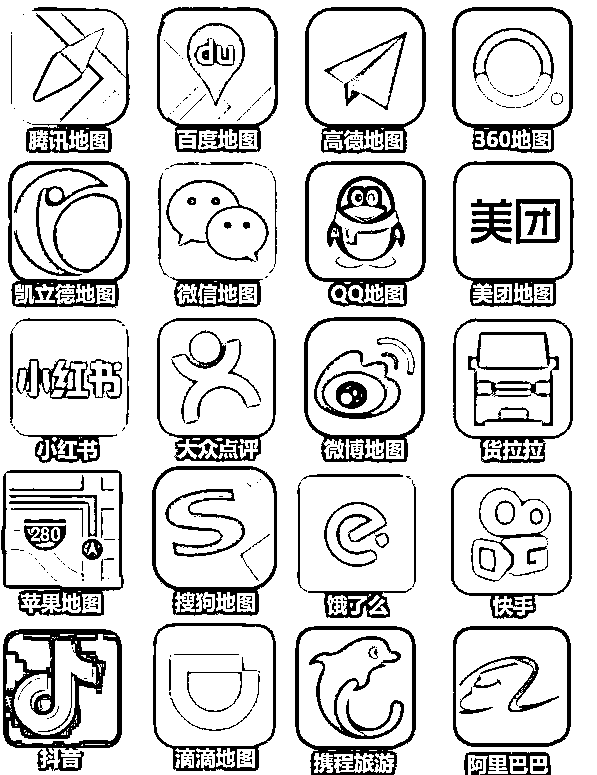

# 3.2.5.1 可收录地图平台

常见平台：百度地图（百度地图 app 标注）、腾讯地图（腾讯位置服务公众号）、高德地图（高德 app 标注），一般申请这 3 个够用了

全网平台：包括高德地图 + 百度地图 + 腾讯地图 + 微信位置 + 苹果地图 + 朋友圈位置 + 企业微信位置 + QQ 地图+ QQ 空间 + TM + 滴滴出行 + 闲鱼 + 西瓜 App + 携程旅游 + 高铁管家 + 花小猪打车 + 货拉拉 + 陌陌 + 哈喽出行 + 饿了么 + 快手 + 微博 + 小红书 + 大众点评 + 曹操专车 + 快狗打车 + 哈罗顺风车 + 58 同城 + T3 出行 + 凯立德 + 阿里巴巴，抖音位置（有行业限制，部分行业不收录）

