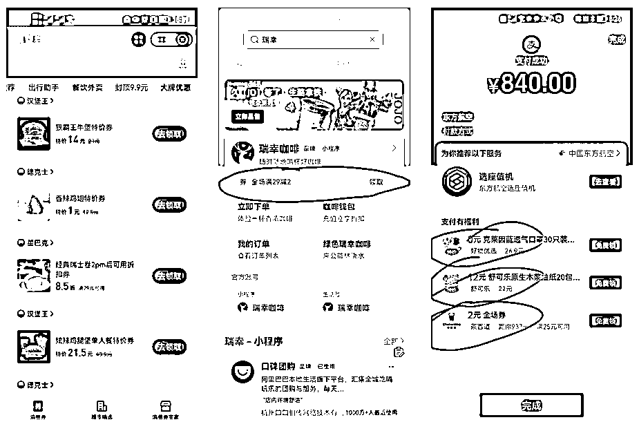
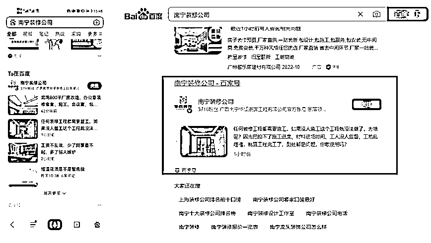

# 3.2.6 同城活动平台引流 @封伟-自动化变现

💡小节概要
线下门店的消费受到地域限制，主要的流量来源还是在周边或者本地，因此同城的一些活动平台，其实是很好的引流渠道。
这一节我们整理了常见的同城活动平台，比如豆瓣、QQ、本地生活团购平台等等，你可以根据自己的需要，找合适的同城平台进行引流。

1\. 常见的同城活动平台

•豆瓣

•QQ

•本地论坛。特别三四线城市，虽然用户时间碎片化了，但当地论坛及社群的人气还是不错的

•本地生活团购平台。一般都是本地站长结合本地平台衍生出来，上线成本比美团低很多

•物业社区

•垂直平台同城站点。如妈妈网重庆站

特别提一下：

•豆瓣同城活动，创建活动后可以更新活动时间刷访问量，很容易排到前面；

•本地生活团购平台很有潜力，比如之前一家理疗店做线上引流，直接跟当地的企鹅生活汇对接，免费上线爆款活动（平台免费入驻，成交后抽点），辅助其他优化，当月业绩直接翻 10 倍。

内容来源：《实体店如何有效互联网化，90%的老板容易忽略的细节》

2\. 根据可实现的功能，平台可划分为三类

•打通口碑、收银、全平台公域发券：支付宝生活号 / 小程序。目前只有支付宝平台能免费做到，做品牌连锁的建议重视

•附近的小程序：支付宝、微信

•门店、团购、电话一键直达：百家号、抖音、快手、小红书

举例 1 ：支付宝优惠券玩法很多，做高频复购的老板不要忽略，首页发券，品牌区发券，支付发券，生活号发券，小程序发券.....

举例 2 ：百家号这个很多人不知道，地域名 + 关键期认证后直接快速上首页，SEO 效果不错。百家号认证后会在百度移动 + PC 首页显示。

内容来源：《实体店如何有效互联网化，90%的老板容易忽略的细节》

