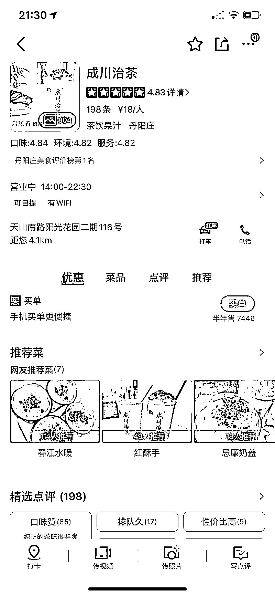

# 3.2.7 多平台组合引流 @缄默

💡小节概要
我们在实际的引流过程中，往往不止做一个渠道的引流，而是多管齐下，比如这里讲到的大众点评 + 小红书 + 公众号引流。
具体如何结合各种渠道达到引流目标，需要你根据自己的实际情况进行设计，这里提供其中一种参考。

引流渠道大家无非觉得是电视广告，公众号投放，大众点评，小红书，电梯电视广告，但是这里面比较有效果和性价比较好的是大众点评和小红书一体的宣传。电视广告，公众号投放只能占到到店率的很小一部分，一般多见于运用在网红餐饮，医美这些门店类型。

大众点评，可以说是门店线上引流必做的一个板块，但是大家会忽略他的维护问题，因为团购什么的会收取 6 到 12 个点的服务费，但是我们不一定要做团购，只做（口碑评价），那么重点就是积累点评。

一般来说这种在二三线城市做量搞知名度很轻松。还有一边也是套餐，就是小红书种草，利用大规模水军账号去铺笔记，并且把其中一两篇刷赞刷评论做排名，跟大众点评是同时运行操作的。

一般大众点评刷评论都会一半以上是 v5 等级，评论有首页流量扶持，10% 是 v8 等级账号评价，打分都在 4.5 或 5 分，视频 150 字以上，自顶自评。

小红书上也是一样，大规模铺笔记，一般是 60 到 90 篇，水一些数据，制造种草假象，让用户有种“网红必打卡”错觉，跟风发布打卡笔记，借机将某几位用户的真实笔记数据水上去就可以了。

后期再借助地区公众号做个推广，网红店就打造成功了，线下门店在线上最具性价比的入口 90% 以上都是这么操作。

内容来源：《门店的一些引流套路》

