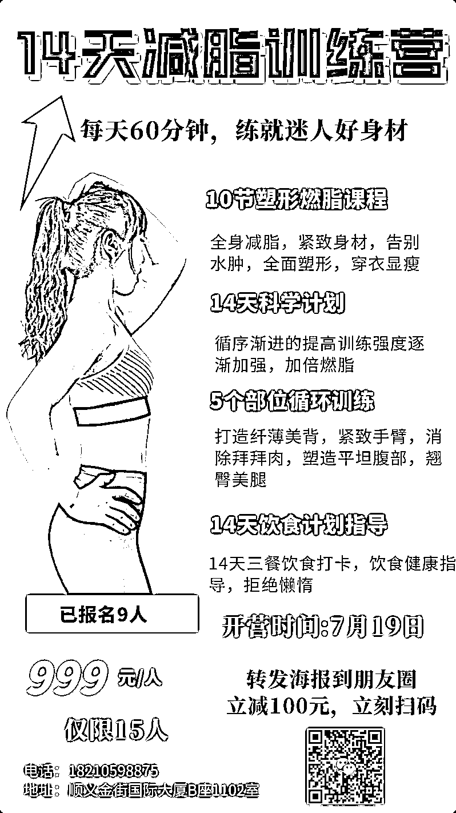
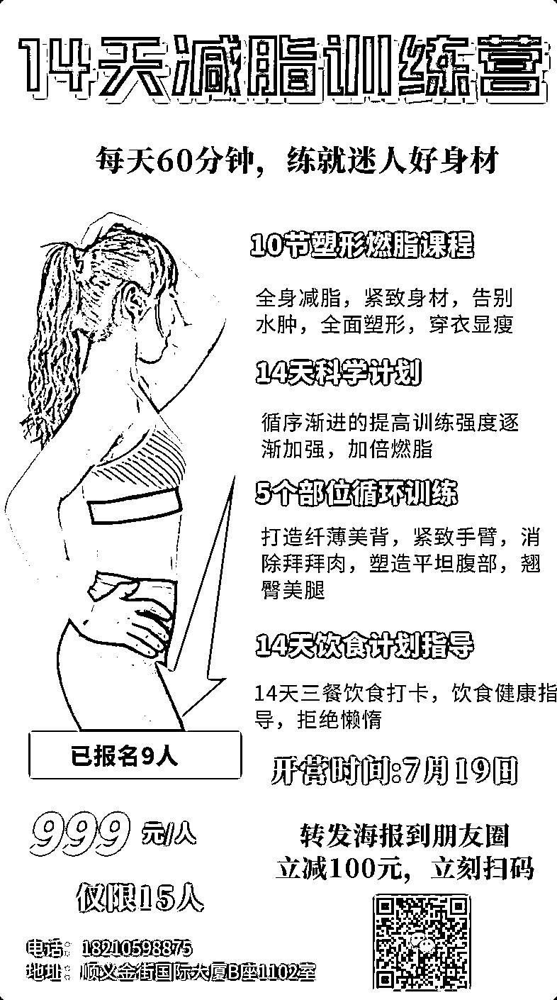
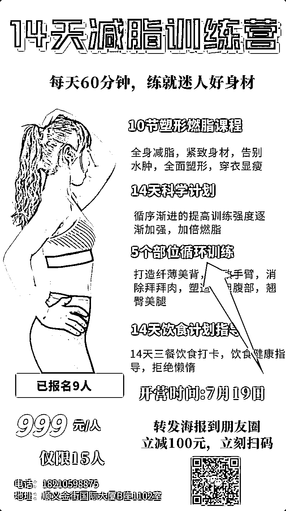
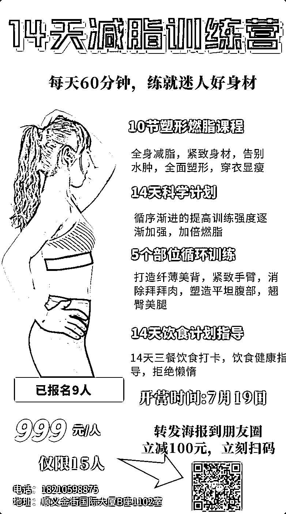

# 3.3.1.3 一张合格的裂变海报应该怎么做？@芷蓝

制作裂变海报运用的是 AITDA 这个成交模型。从我们看到商品，到最后去付款，这就是成交的整个流程，这个流程分为 5 个步骤，也就是经典的 AITDA 模型。

他们分别是：抓住注意力（Attention）→激发兴趣（Interest）→建立信任（Trust）→刺激欲望（Desire）→催促行动（Action）

接下来，我会以我自己舞蹈室之前做的一个《15 天线下减脂训练营》的海报案例，给大家展示具体的操作方法。

1\. 主标题抓住用户注意力

无论你的海报呈现的是什么营销活动，第一步依然是要抓住用户的注意力，否则用户不会把目光聚焦在你的海报内容上。

那么，对于一张营销海报来说，主标题就是抓住用户注意力最好的素材，这有点像新媒体文章的标题党，区别在于标题党的文章无法为用户提供和标题相符的价值，而我们的海报要为用户提供解释标题的内容。

我的海报标题用了 “14 天减脂训练营” 这样的一个标题，通过给出具体的时间暗示，让用户联想到自己可以在 14 天内就获得减脂的效果。

这里，芷蓝给大家分享 4 个标题模板，无论你的门店属于行业，都可以使用。

① 冥想 5 分钟等于熟睡 1 小时（用数字的强烈对比来抓住注意力）② 如何在家练出好身材？（设置操作门槛更低，获得价值更高的的场景）③ 怎样用普通手机拍出专业级照片？（同样也是对比法）④ 免费收听茶艺入门。（免费 2 个字总能吸引到人）

2\. 副标题激发用户兴趣

当你已经通过一个大标题抓住用户的注意力后，就需要对这个标题给出一个解释，这个解释就是用来连接标题和海报下面内容的副标题。

如果没有这个副标题，用户很可能觉得就是一个标题党，然后退出自己的注意力。

比如我的这张海报副标题是 “每天 60 分钟，练就迷人好身材” ，既对主标题有了一个具体的解释，又能让用户觉得只需要每天付出 60 分钟，就能得到一个自己想要的好结果。

这里列举几个副标题，大家可以参考一下。

主标题 1：冥想 5 分钟等于熟睡 1 小时副标题 1：1 小时学会轻松冥想术
主标题 2：如何在家练出好身材？副标题 2：不去健身房，不请私教的健身方法
主标题 3：怎样用普通手机拍出专业级照片？副标题 3：3 节课教你学会 18 个实用手机拍照技巧
主标题 4：免费收听茶艺入门副标题 4：1 小时让你从喝茶到懂茶

3\. 有效背书建立用户信任

信任是用户采取下一步行动的基础，否则就算你的主标题＋副标题说的再诱人也没用。怎么建立信任呢？这时候就需要用上 2 个核心要素：权威＋从众。

① 权威

比如你的海报上的老师很厉害，得到过 xxx 奖项，专利和技术等等，另外也可以通过侧面提现，比如找同领域大家都知道的 KOL 联袂推荐，这些都是常见的提现权威的做法。

② 从众

假如你现在去商场吃饭，时间充裕的情况下，有 2 家产品在你面前，一家十分冷清，一家十分热闹，你会选择哪家消费呢？一定是去哪家热闹的吃对吧，这个就是从众效应。

从众效应具体在海报上怎么体现呢？我们可以把这次报名的人数打上去，数字越大，越能引发从众效果，比如你的海报加上 “ 99 名小仙女已经报名学习” ，就可以有一定的刺激效果。

同样，大家可以看下我的海报，当初因为我请的老师并没有很出名，只是一个健身房的教练，所以就在下方加上了“已报名 9 人”作为一个从众元素展示出来。

权威＋从众，单独使用可以，如果一起使用效果会更好。

4\. 课程收获刺激用户欲望

有兴趣，有信任还不够，还需要刺激潜在用户的需求，如果没有需求，这时候就可以在海报上写上一些更有诱惑力的小标题。

比如这节课讲的是什么，解决什么问题，什么人特别需要听等等，同样的可以用我们刚刚提到的 4 个模板来写，一样的方式，只不过用的地方不一样。

比如，我的这张海报右侧，给出了一些减脂用户平时非常在意的细节，有了这个具体的刺激，他们报名的冲动会变得更强烈。

芷蓝再给出一些其它的文案模板，大家可以模仿。

① 一节课掌握中国舞的 4 大基本手势② 3 小时学会吉他的 5 种基础和旋③ 19.9 元 6 个老婆饼带回家

一般来说，用户能感受到的确切收益都是在时间和数量这两个维度上，一个是我很快就能得到什么，一个是我花很少的钱能得到很多的东西。

5\. 报名方式催促用户行动

不管是写文案还是做海报，没有让用户采取行动的海报，就是无效海报。

限时、限量、限购、免费、优惠和倒计时等刺激的字眼，让潜在用户马上采取行动，这个行动有可能立马付款，也有可能是扫码报名，总之要让用户行动起来。

所以，你的海报中最重要的元素就是：二维码

很多人海报做的挺好，最后用户看完也觉得不错，有想购买或者报名的想法，但是最后居然没留二维码，还要去问发海报的人到哪报名，这就是一张裂变海报最大的失误。

就像我的这张海报，如果不加二维码，你看完觉得挺好，但是不知道该怎么报名啊，哪怕你是去微信上问我，就多出这一个路径，也会流失掉一部分用户。

最后给大家总结一下，一张合格的裂变海报需要具备一下几个基础元素：

① 抓住用户注意力的主标题，字体要大，颜色要显眼。

② 能够解释主标题＋让用户产生兴趣的副标题。

③ 通过权威＋从众心理建立和用户之间的信任纽带。

④ 继续刺激用户购买的价值收益细节。

⑤ 催促用户行动的一个二维码。

优惠信息、门店信息、门店个人号活码、门店地址等都是必备内容，且需要配备相应的推荐话术。

内容来源： 《门店私域运营 | 小航海学习手册》

