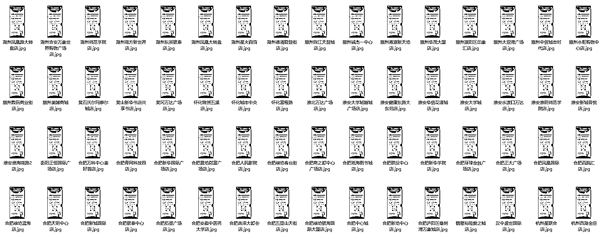
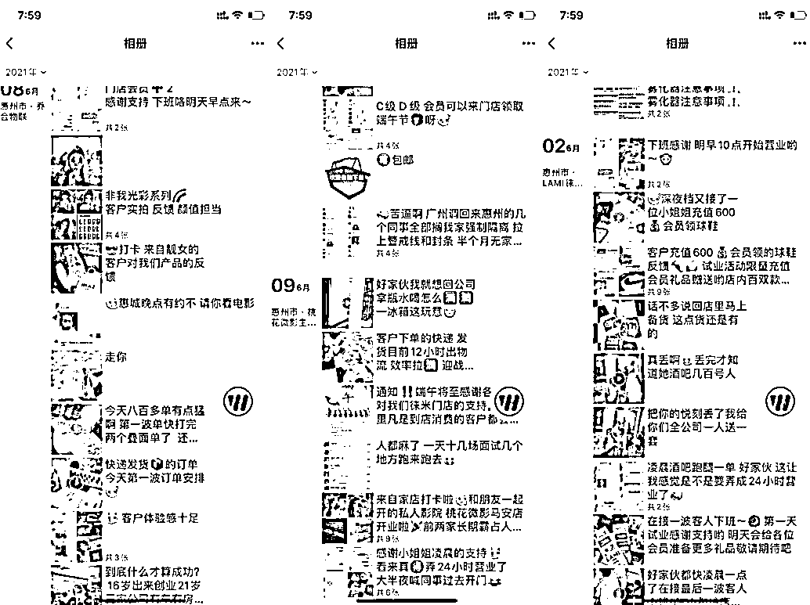

# 3.3.3 进本地生活群 @封伟-自动化变现 @乔合 @尹基跃

最多的就是企微群、QQ 群、豆瓣群组了，找到进去引流。重点说下开放式的同城微信群，可以直接找到并 100% 进群。

常见的有：银行（如招商银行）、出行平台（如高德、滴滴）、连锁门店（如瑞幸、唯品会）、本地生活（如罗森、哈罗）、商超（如沃尔玛、永辉）商场公众号、社区团购（如美团）、快递驿站、餐厅点餐码（有些会设置关注进群）、业主群等，找到符合你用户画像的社群。

如何一个码加多个群：企微群大部分用的是活码，你用多个号多次扫码会扫出不同的当地群出来，这样获得的群数量远远大于二维码数量

举例：滴滴同城群、瑞幸同城群、永辉同城群。

如果你的目标用户是一些年轻人，可以到本地圈子的一些年轻人的酒吧群、密室群、剧本杀群等等做了活动宣传，达到了覆盖性传播的效果。

这些群怎么进去？把本地的这些店全部玩一遍，本地玩密室和剧本杀的那些店主都会拉你进去的（打广告记得发完直接发个红包）

具体如何找到更多的群，以及入群后如何混群和引流，可以参考圈友 @尹基跃分享的《同城进群 SOP》和在小航海时分享的[《搭建门店流量池与快闪发售模式》](https://shengcaiyoushu01.feishu.cn/minutes/obcnyarks4x6jqx56x1b5172)。

[同城进群 sop 2.0.pdf](https://search01.shengcaiyoushu.com/upload/doc/VlzidzM7UonrKBxDNP6cVB3Pntg/IzYObVpchofUDKxDVJjcdbkQnMd)

内容来源：《实体店如何有效互联网化，90%的老板容易忽略的细节》、《00 后实体店创业者：用互联网思维破局疫情影响》

