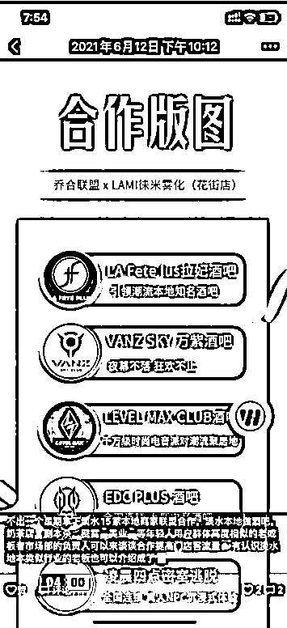

# 3.4.2 和其他商家联盟合作 @芷蓝 @乔合 @尹基跃

联盟合作分同业联盟和异业联盟两种。

•异业联盟合作

联合不同业态的商家设计一张权益卡，这个卡对外销售金额是 98 元/张，可以包含比如洗车店的几次免费洗车、家政公司的几次免费擦玻璃、餐饮门店的折扣、教培的体验课等，加起来价值大几千，所有给到优惠的门店都会给他导流。

要参加这种异业合作的商家要先付费 5000 元采购权益卡（商家有优惠，可以给到 120 张卡）他只要推出去这个卡就能够把钱赚回来，这样所有的商家就都有推广的动力。

好处是，能够在一个城市快速引爆全城，不好的地方是需要联合足够多的商家才能够跑这类活动。

•同业联盟合作

同业联盟卡主要是针对教培行业的，教培行业不同的品牌进行联合，比如篮球、油画、音乐等不同的细分品类各自出一个引流套餐课程。

比如一共是联合了 20 家机构，这个联盟卡对外售价是 298 元/张，可以任选 5 个机构的课程，这样的话家长就能够以最低成本来试错，给孩子多报名几家课程。

在找商家的时候，直接去大众点评上以位置信息为基础搜索就可以，当然合作一定要找业务上没有冲突，但消费人群又一致的商家去谈。

在寻找商家以及和商家沟通的过程中，有以下几点需要注意：

① 你需要在大众点评上查看该商家的星级，以及最近半年内的产品销售量来判断该商家的客流量。

② 一定要选择消费用户画像一致，但产品服务不同的商家，比如我的舞蹈室消费者是 20-35 岁之间的女性，这些女性也有美甲美睫、咖啡西点的消费需求。

③ 在第一次和商家沟通时，一定要说明自己的工作室就在附近，最好能邀请商家过来查看，如有必要，可以赠送自己的服务或者产品给商家，保证合作的顺利达成。

如果没有找到这么多个商家一起合作，另外还有两种合作方式可以选择：

合作方式一：互换商品体验券

具体方法有 2 种，一个互换你们的商品体验券，然后放在自己的门店里，只要客户消费，就搭赠一张。这种方法的好处就是简单，不过没有办法监督和捆绑利益。

合作方式二：固定合作伙伴

还有一种方法，是找到 2 - 3 家固定的合作伙伴，然后去制作一张类似于【29.9 元 = 美甲一次＋中国舞体验课一次＋xxx】这样的通券，用户会觉得更有价值感。

电子烟门店和酒吧异业合作的案例 @乔合：

跑通了模式、有了收益直接放大操作，一开始我们合作了几家酒吧，他们也需要你这里的年轻人客户，也是一种资源互换，酒吧一般给我们的都是酒水卡，你自己出开台费就可以去玩了。

渐渐的发现这些酒吧给的流量远远不够，为了谈了更多的商家，我每天挨个在地图上搜那些剧本杀、奶茶店、密室的电话，加他们客服和他们聊。

大部分实体店老板没有互联网思维的，就知道开店、上美团、上团购等流量来，我们发现后考虑到既然小店不行，我们就去找大店合作，越大越好，因为这种公司有互联网和互利思维，你稍微一说他就懂，合作的成交率就更高！

经历两个月的跑线下市场，我们合作了店铺 60 多家 + 20 多个地摊 ，那些地摊的就不用让他们给你优惠券了，你直接给他们礼品券，让他们直接帮你派发，你只需要送他几套电子烟即可。

老板直接发个朋友圈：来喝奶茶送电子烟，也算是在帮他维护客户了，而且不用他出成本。这样他卖一杯奶茶出去送客户一张电子烟礼品券，客户拿着礼品券就可以到我们店铺领一套电子烟。（切记不能收这些摊主成为你代理，不然没利润。)

内容来源：《00 后实体店创业者：用互联网思维破局疫情影响》、《门店私域运营 | 小航海学习手册》

