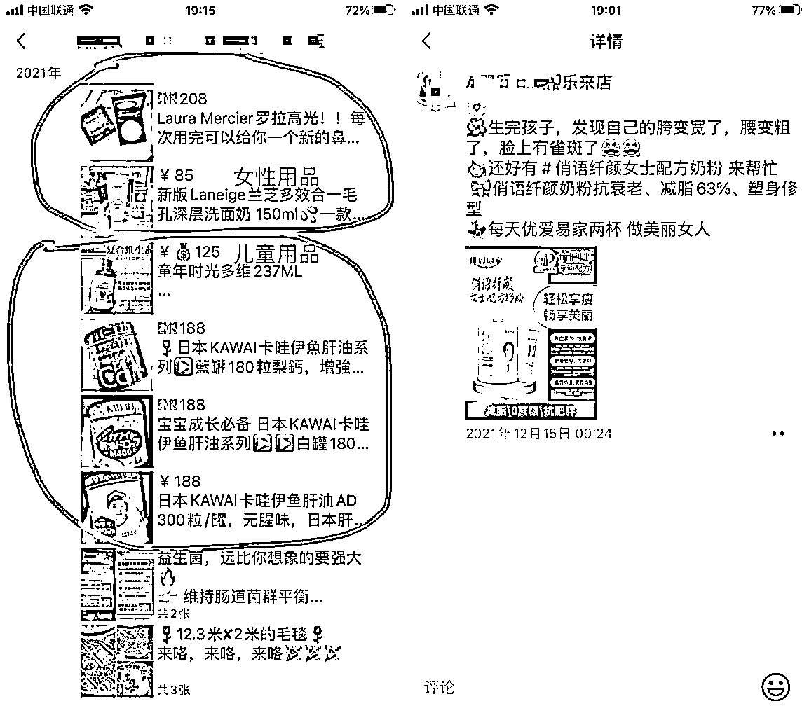

# 4.2.2 如何在线上变现 @佳佳

这里说的线上变现主要是私域运营，门店店长和店员将到店顾客或者潜在顾客加到私人微信上，然后进行深度服务和多渠道变现。

门店到店顾客一定要记得加微信，流量还包括前面说到的在各个平台、微信群、线下引流过来的，这些流量都可以在私域进行变现。越来越多的商家开始将私域作为精细化运营和降本增效的核心阵地，实现破旧立新、加速迭代的新零售转型。

私域流量是不用付费，可以在任意时间、任意频次直接触达到用户的渠道，比如用户群、微信号、企微个人号、企微用户群等，可以在任何时间段内向这些客户传播我们想要传播的信息，比如店铺的新品、折扣、活动等等。

1\. 售卖实体店产品

所有的实体门店都可以线上卖货，比如母婴门店可以售卖店门店里的母婴用品，与婴幼儿、宝爸、宝妈相关的其它非门店产品；餐饮门店可以在线上卖门店自制的半成品或即食品；宠物门店可以在线上卖宠物用品相关的产品.......

2\. 售卖行业相关产品

除了可以售卖门店自身的产品，还可以售卖行业相关的产品和服务。比如，母婴门店除了售卖门店用品，还可以顺便在线上卖女性用品、儿童用品，甚至一些店员也卖微商产品。

卖女性相关：化妆品、减肥产品、保养产品…卖宝宝相关：婴幼儿营养品、日用品…

3\. 卖货渠道

将目标客户群体都引流到私域，在 1V1、朋友圈、社群、直播、微商城都可以进行转化，在多个场景进行私域变现，比如朋友圈直接树立 IP 人设卖货；社群可以进行建立各种快闪群或者服务群；视频号的短视频和直播也是可以变现的。

内容来源：《以多个店铺为例，分享通过输出内容在线上多平台获得流量，搭建自己的私域流量池、线下运营从人货场分析冲出重围的线下店铺》

