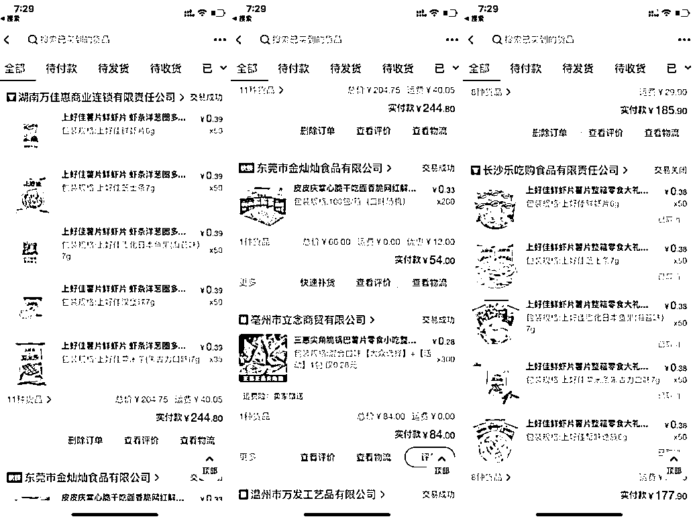
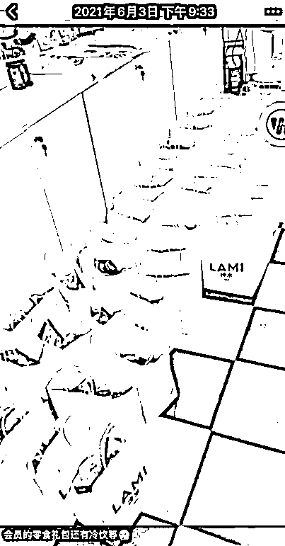
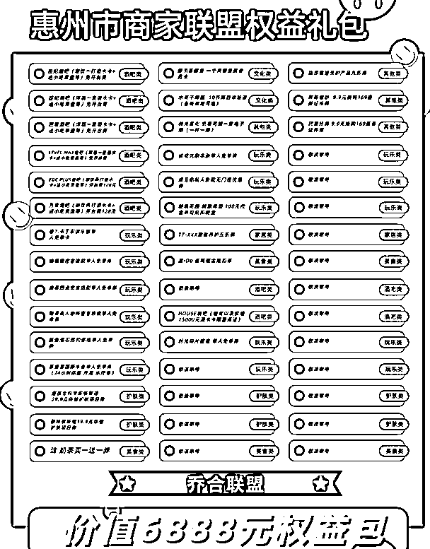

# 5.1.1 海底捞方式服务 @乔合

（先说下电子烟的利润保底都有 50% ，所以以下这套玩法不合适利润低的行业）

第一点：4 公里免费跑腿配送，很多门店都是需要客户额外支付配送费的，我们直接免费，配送成本 8 块钱。

第二点：客户下单全部都送一袋子零食，是不是很熟悉！一袋子就放个七八包薯片 + 一瓶小可乐，薯片成本就 4 毛钱，可乐 1.5 ，加袋子一共也就 6.5 块钱成本，但是客户收到电子烟的同时也会收到一大袋零食，超预期交付，让用户产生惊喜感！

第三点：客户下单送他其他商家的联名优惠券（怎么得到这些优惠券下面会给大家分享）

如果你是客户，你买一盒 78 块钱的弹还给你免费送到家门口，顺带还送你一袋子零食 + 这些优惠券你觉得值不值？

第四点：把私域维护的客户的方法一样拿过来玩，对于下过单的客户在门店全部都会记录客户信息以及生日，每次在客户生日前都会通知他送礼品、打折等等。这看起来是一个很简单的方法，但是真的有效果，会让客户终生难忘。

试想一下你在一家店就消费了几百块钱，但是这个店每年都会联系你，记得你的生日并且会送礼给你，你会是什么感受？反正礼品也不贵送一件 T 恤或者其他小礼品什么的也就十几块钱，但是你的心意他收到了！

内容来源：《00 后实体店创业者：用互联网思维破局疫情影响》

