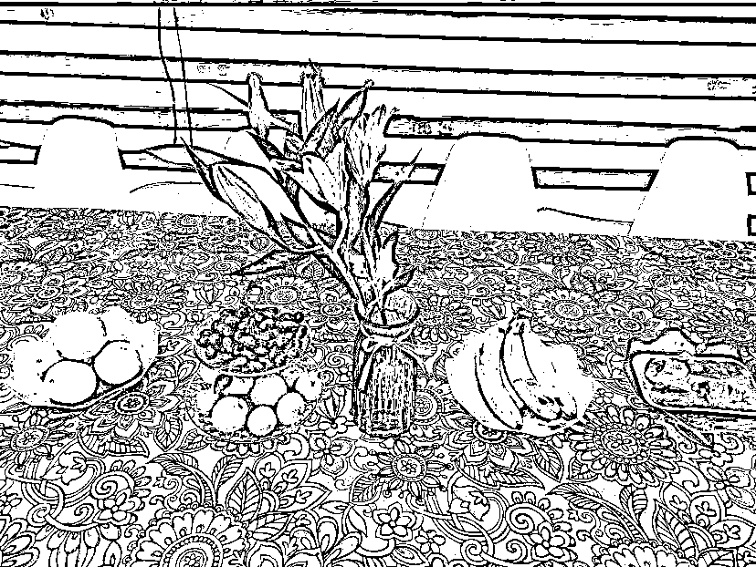
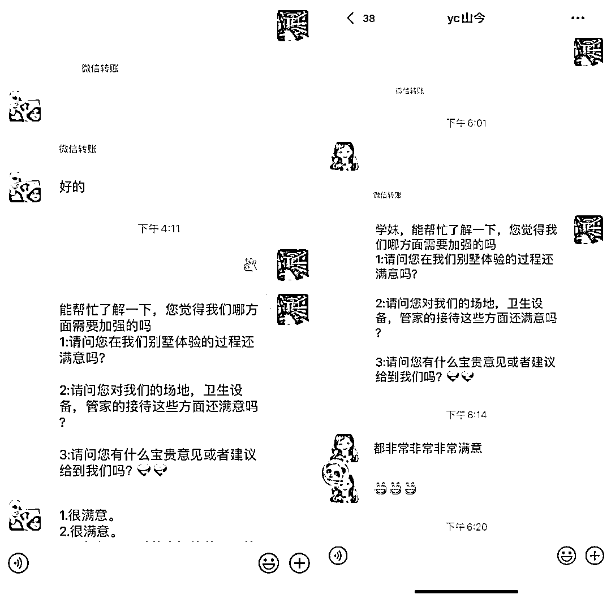
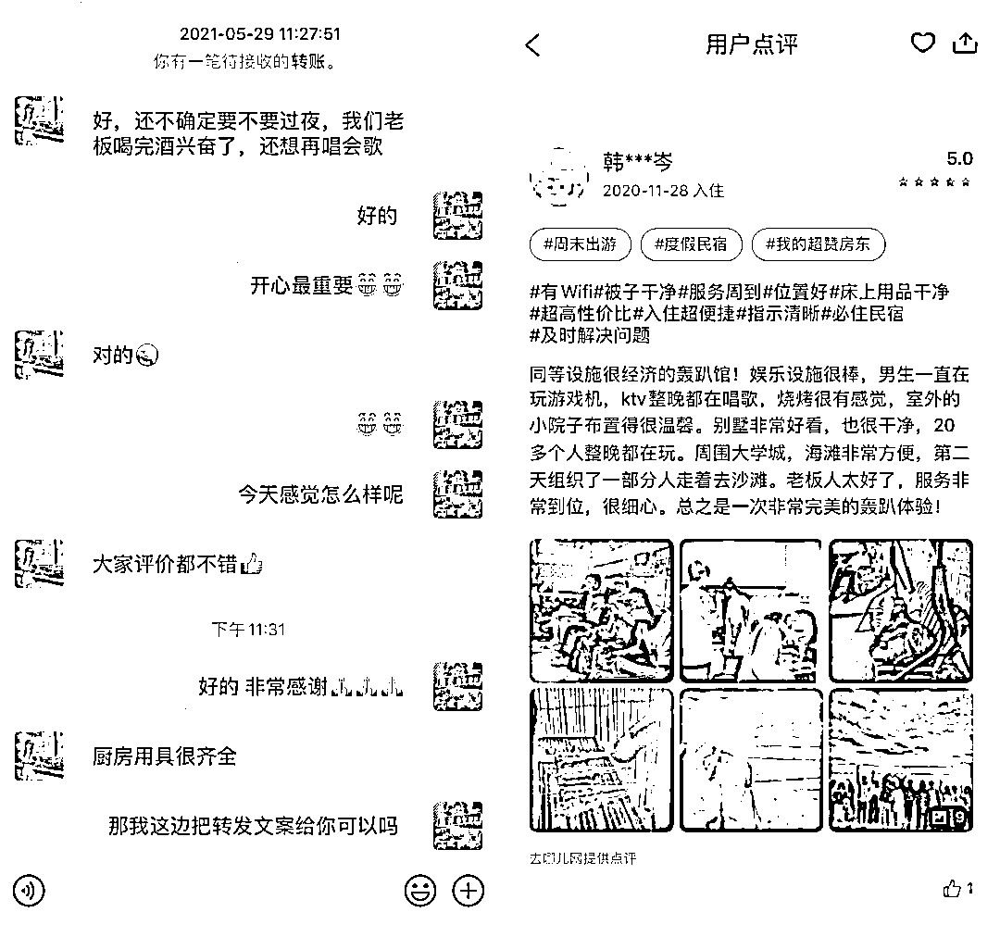

# 5.1.2 轰趴别墅如何做好线下接待 @Mage

比如夏天的时候，我会提前 1 - 2 个小时开好空调，并且准备切好的冰西瓜放在桌子上，客人从室外 35 - 36 度到别墅里有空调，还有冰西瓜，感觉上是挺不一样的。

另外，我会免费帮他们记录团建的短片 + 图片，客人团建过后发给他们，如果是过夜的客人，晚上会提前帮客户调节好热水，以及房间插好驱蚊灯，并且会在每个房间里放上鲜花，做的是一些细节上的东西。

实际上，做这些事情额外增加的成本并不高，但是给客户的感受会完全不一样，客户离场后我还会给客户发一份满意度答卷，根据需求再实时调整服务状态和策略。

在客户运营上，我会建立客户微信群，把有咨询未成单的客户拉进群，每天固定在群里发红包问好，每次大概是 10 - 20 元，发 20 - 30 个包，红包个数不要发太多，太多只能抢到几分钱，大家都不爱抢，导致群不活跃。

然后一周发 1 - 2 次其他客户团建的视频（一般会发聚会和生日这两种类型）， 每周固定做一场定时秒杀，一般在周三和周四左右，把后面还没有预订出去的档期拿来做秒杀，秒杀的价格一般是原价的 5 - 7.5 折。

除了咨询未成单的客户外，已经来过的客户也会建一个微信群，这个群里面都是已经来过的客户，每周大概在群里轻度营销 1 - 2 次即可，太多了客户容易反感退群，这些客户已经来过且知道，你的微信群聊存在他的聊天列表中，如果有需要肯定会想到你。

内容来源：《从亏损 8000 到盈收 3W+，轰趴别墅通过精细化运营实现转介绍率 70%》

