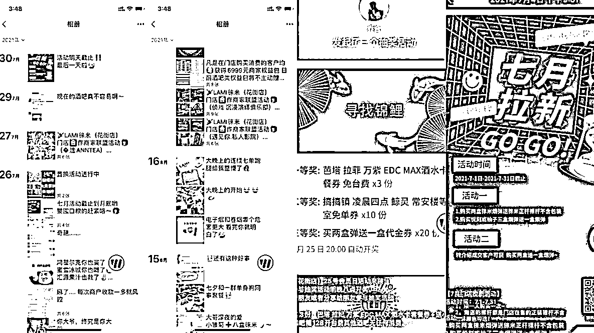
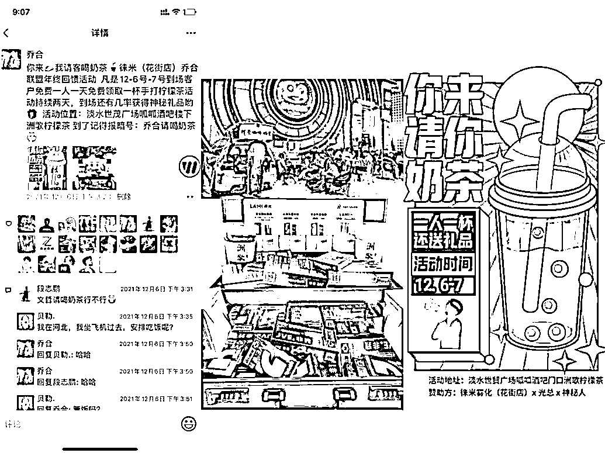
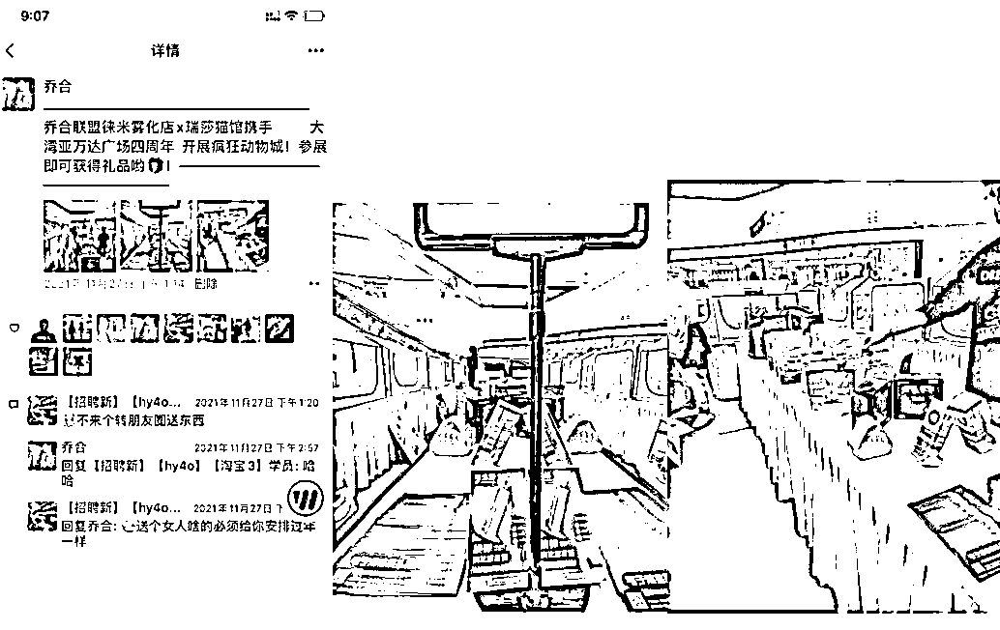

# 5.4 新老用户意外惊喜 @芷蓝 @乔合

帮助老用户记录自己的成长，这是一个沉淀和总结的过程。而如果你能够不停的给老用户惊喜，那么就会让他对于你的服务有一种期待感。

就像你去迪士尼乐园随便问一个服务人员该怎么去某个位置，大概率他除了会告诉你怎么走，还真的会带着你走过去。这就是超值交付，这就是让你每次去迪士尼感受良好，去了还想去的原因。

那么，对于一个门店的运营者，要如何给老用户意外惊喜，或者说超值交付呢？我来分享一些我自己的小技巧：

① 生日的时候送上红包＋生日礼物② 看到有的学员没有吃饭就来上晚课，我会准备一些速食意面或者饺子，这样就比冰冷的面包强。③ 帮助老用户把自己的跳舞视频剪辑好，发给她方便转发到朋友圈或者抖音上。④ 每年的各种节日都会去朋友圈评论送上祝福，有的关注你的朋友圈，会让用户觉得有一种专属感。

其实，意外的惊喜都在于一些小细节上，处理好细节，用户就会慢慢积累对于你的好感和信任，而信任就是用户续费的动力。

方式一：每个月会员日做活动

会员日会送其他商家的礼品券，这样子把你们圈子的用户在重叠一次，产生群体共鸣，其他商家也更开心和你合作，你给他们带了更多的流量+潮牌礼品+店铺优惠券

方式二：线下合作联名做品牌活动（异业联盟）

逻辑和谈合作商家差不多，还是你送礼品券给展会的品牌方，你去谈这些会场品牌方都是很乐意的，互惠共赢。

方式三：会员生日

你可以在客户生日的时候送上红包＋生日礼物，或者是生日祝福，这个时间是你每年重启客户的最好的日子，这就是我们为什么要记录客户生日的原因。

内容来源：《00 后实体店创业者：用互联网思维破局疫情影响》、 《门店私域运营 | 小航海学习手册》

