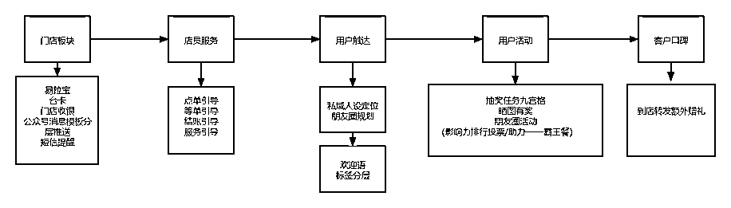
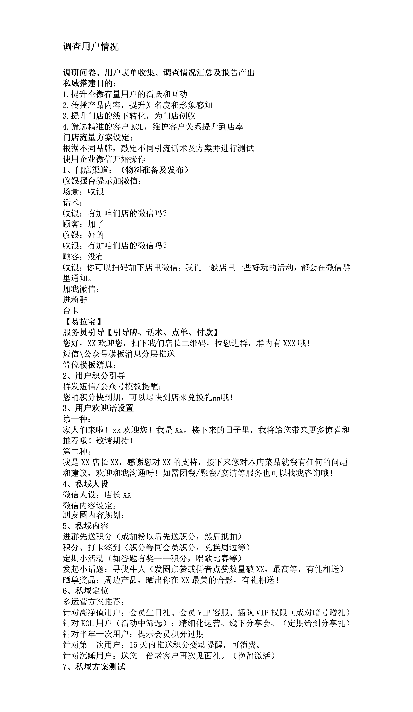

# 6.1 餐饮行业

关键词：到店需求、转介绍、品牌口碑效应、KOL 筛选 @椰子青青

餐饮需要的是运营人员有极强的营销意识的，因为餐饮大多数属于客户数量多但服务较重的项目。以下我以一个连锁餐饮的门店私域搭建方案为例展示私域方案的方法和思路。

搭建框架：模拟用户进入私域的路径，搭建私域。通过入店的流程、接触点，再到与店员的接触点，用户产生的行为及结果，我们通过这样的模拟，就可能很快的做出一份社群的门店方案，思路如下：

在门店方案中，也需要按照顺序进行方案的调整，我们曾操盘过的一个餐饮门店项目方案如下：

注意：餐饮拓客注重引流诱饵选择，运营注重用户的长期维护和到店。

整体思路中，标注好方案的节点、时间、人员安排、统筹、执行，即可形成相应的项目管理图。在搭建的过程中，同时注意要有闭环意识，比如我在做方案的时候，会从引流，承接人设、私域内容、话术、私域定位来确定方案，并且需要做 AB 测试，及时关注数据变化，进行分析来调整方案。

没有谁的方案是一次性过掉的，所以总会有调整优化的空间，有些方案在这里行得通，但是换一个时间、换一个人甚至换一个条件，都有可能产生不同的效果。 作为操盘者和项目参与者，预期好这样的心态，随时改进和迭代就好，也是互联网人必须具备的心理素质要求。

内容来源：《不同行业私域如何搭建社群体系及运营团队》

