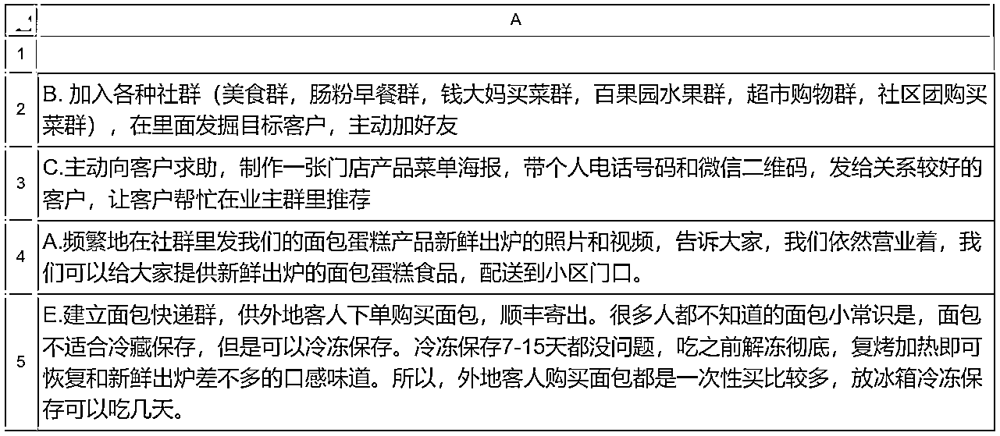
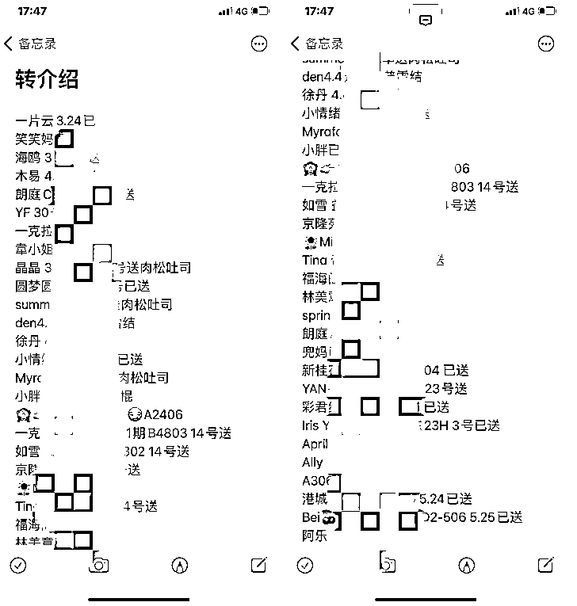

# 【案例一】私房烘焙店 @沙拉

开店之前我做了 3 年的私房烘焙，有一个 150 人的种子客户群，客户在群里用小程序群接龙下单购买面包。疫情封城期间，大家的注意力都在线上，我开始做了一些拓展用户的动作：

由于我们的面包产品确实好吃，疫情期间有很多顾客自发的帮我转介绍，邀请人进群里来。每一个转介绍面包给朋友，邀请朋友入群的人，我都会把他们的名字登记好，送上一份面包大礼包。我会严格把控产品质量关，让足够好，好到顾客转介绍，这个名单会持续的新增。

通过转介绍，我们的社群也从 1 个变成了 5 个，订单从每天 10 几单变成了 60 - 70 单，线上营收从每天 200 多到每天 3000 多。相比线下 20 左右的客单价，线上顾客客单价在 40 - 50 之间，更加优质。

在拓展线上客户时也有几个小技巧：

A. 发掘美食群主，主动赠送面包蛋糕，协商在她的美食群里发布我们的面包蛋糕接龙活动。
B. 发掘客户里的超级链接者，她们通常是那种情商高，人缘好，人脉广的宝妈。我的顾客社群，就有一个这样的邻居宝妈，介绍了比较多的熟人进来购买产品。
C. 发掘懂得欣赏面包，会摄影摆拍，有生活仪式感和格调的美食达人顾客，他们通常会主动在群里发出精致的面包蛋糕食用美图，这会调动其他顾客的兴趣和购买。

朋友圈的运营

我自己的朋友圈内容输出分为几类：

•专业内容：和烘焙相关的知识，资讯，自己的观点和思考，帮助面包学员解决问题的成功案例

•生活内容：亲子阅读，育儿趣事

•个人成长：运动打卡，读书心得笔记，冥想练习分享，和高能量圈子朋友的互动，展示自己的自信，坚韧，勇气，真诚，用心，努力等正能量的内容。

•好评案例：顾客的面包蛋糕好评截图（征得顾客同意后隐藏头像和昵称发朋友圈），顾客购买面包蛋糕的小故事

和顾客的朋友圈互动：主动给顾客朋友圈点赞；发表真心实意的评论和夸赞。

顾客分类打标签

我会给每一个顾客打标签，标签内容写在微信好友备注上：

顾客的名字居住地址几个小孩爱吃什么类型的面包其他的喜好和特征等信息

对每一个顾客情况的熟悉，能够让我们和顾客建立更好的关系，提供更适合他们的服务。

内容来源：《深圳疫情封城期间，我如何通过私域运营，让实体面包店扭亏为盈》

