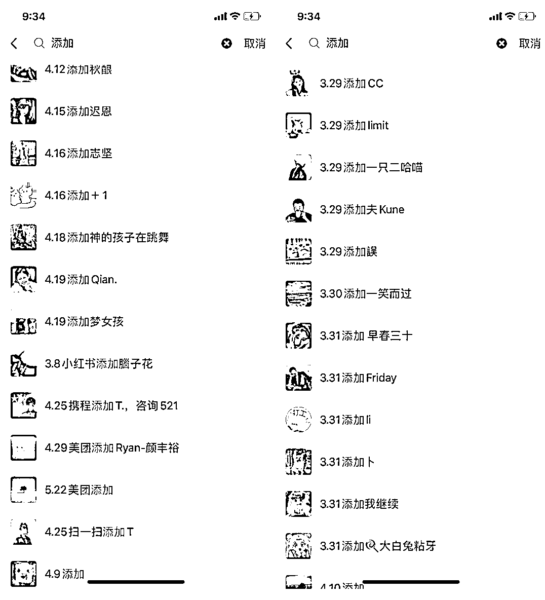
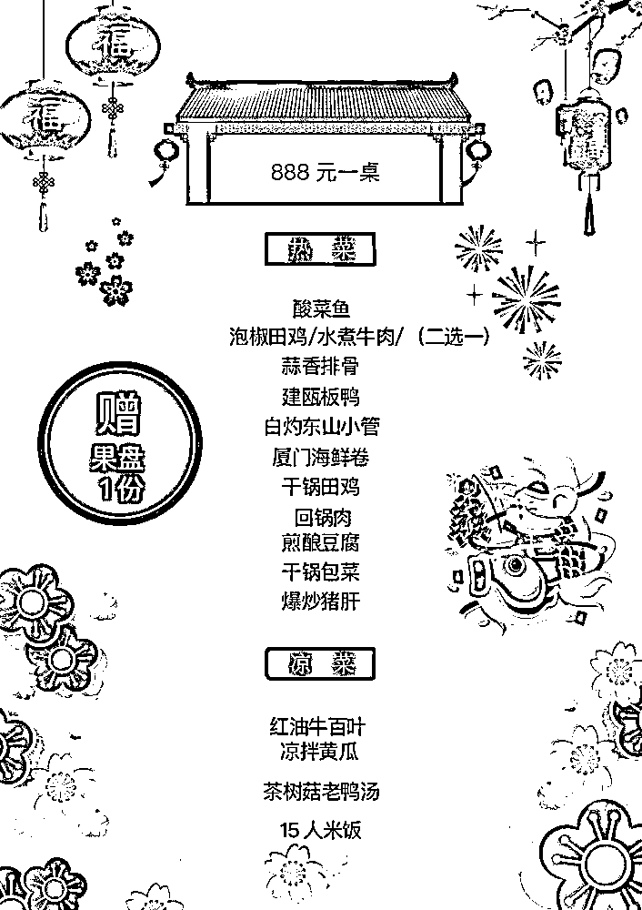

# 【案例二】轰趴别墅@Mage

轰趴也有大中小类型，所以客群定位也会不同，不同的客群定位所对应的流量来源也会有所不同，主要分为以下几种，公司部门团建 / 家庭朋友聚会 / 学生部门聚会 / 节假日游客。针对不同的客群制定不同的推广方案，雨露均沾 。

•公司部门团建主要是 hr 或老板来找场地，当时进了一些 hr 招聘群还有场地周边一些办公楼的物业群，偶尔在群里发发广告配合红包。

•家庭聚会没找到很好的切入方式，主要还是靠团购平台和转介绍。

•针对游客主要入驻了市面上的平台并且多开房源增加曝光，学生在校内设置了代理和部门进行合作。

利用多种渠道获取流量，利用细节做好存量和复购，到目前接近 2 / 3 左右的订单是来源于微信转介绍。

另外轰趴属于服务行业，挣的也是服务的钱，除了传统的场地预订之外，还有提供订餐服务。像这样一份套餐，利润就有 15% - 20% 左右，有时候一场场地费可能才两千多，但是客人在别墅让我提供预订 + 酒水消费可以达到一千多的利润。

后续能提供的服务取决于你对客户了解的情况，例如今天是什么类型的聚会，有没有准备食材酒水，没有就可以推荐自己的套餐和酒水。

还有就是同行互相推荐和布置场地，比如我这边周六场地已经布置好了，现在客户又急需周六想订，这时候可以把客户推荐给同行，一般有 10% - 15% 的返佣。

内容来源：《从亏损 8000 到盈收 3W+，轰趴别墅通过精细化运营实现转介绍率 70%》

