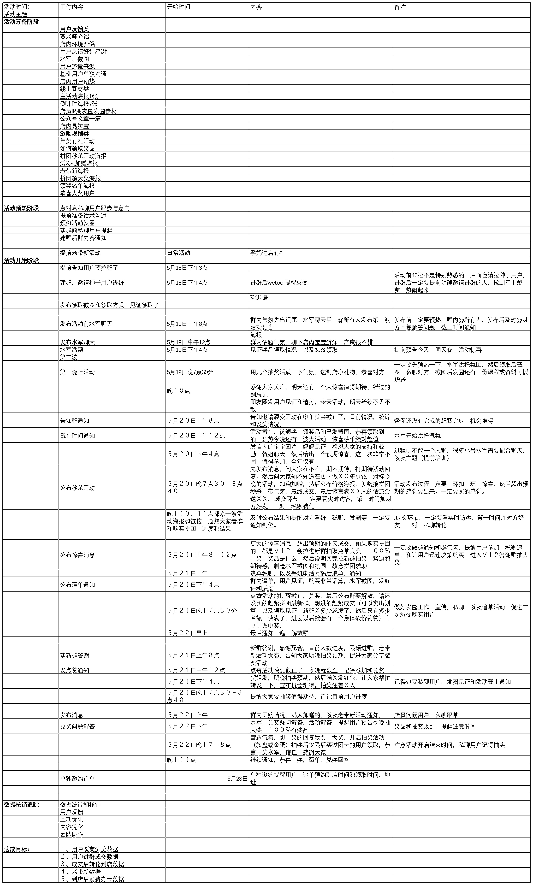
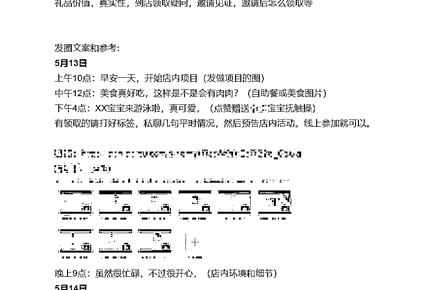

# 6.3 个护产康行业 @椰子青青

关键词：客单高、充值升单、导购激励和培训、用户转介绍裂变。

短期的拓客活动方案展示如下，大多数的高客单门店经常有拓客的需求，利用社群邀请、任务宝、分享卡等形式进行拓客非常有效。因此，有很多公司会专门以拓客为业务点进行合作。

这种门店因为客单较高，需要及时的动员导购来进行销售，对店内服务人员的激励必不可少，这样后期升单的空间和效果特别好。（谁用谁知道）但是门店导购一般文化水平有限，活动方案也需要先进行培训告知操作方法。

门店的拓客利用就是人性，贪婪、虚荣、炫耀等情绪去做分享和裂变的转介绍，因此，在做方案的时候尽量多考虑人性，多考虑人的心态，并设身处地想一想如果是自己会不会有兴趣参加，如果能打通这个关键节点，方案一般不会太差。

拓客方案最重要的就是如何利用好现有门店的资源（如没有会进行地推、线上投放等形式获取流量），进行用户的二次分享裂变或转介绍。基于社群的多层裂变会产生波纹效应，从而达成 1+1 大于 2 的结果。以下就是门店的拓客活动方案，方案最终数据结果是社群转化率 20% 到店进行消费，并且充值数十万元。

长期的产康社群需要利用 IP 人设着重搭建，着重服务和态度，人性化顾问。因此，在做社群的时候一定要注意利用好每次和客户接触的机会，并且给客户打好标签。做框架方案的时候就需要把这些注意点写明，这样的方案才是完整的。

内容来源：《不同行业私域如何搭建社群体系及运营团队》

