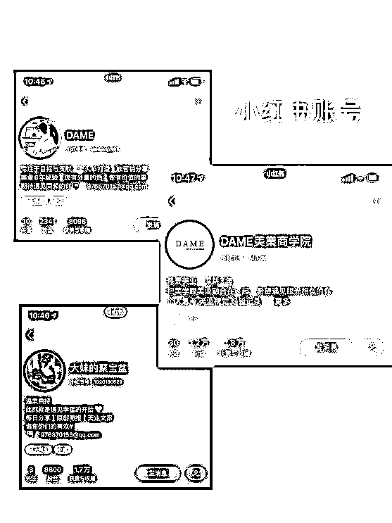
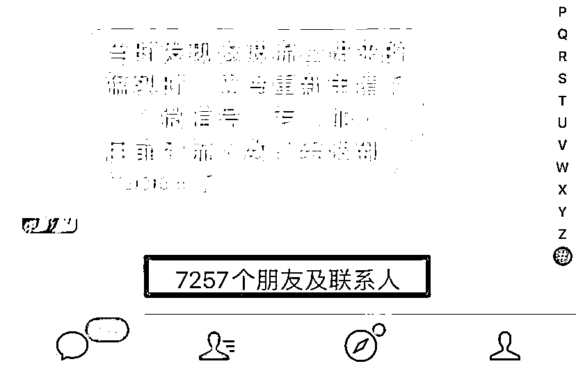

# 【案例五】美业店家 @陳大妹 May

1\. 通过小红书引流获得美业店家流量

起初只是单纯的在小红书账号输出素材，来吸引美业的店家加 V，并为他们无偿供应无水印的美业海报，在当时这个细分领域里面，竞争对手非常少，每天进来的流量非常多，所以特别新申请了一个微信号来做引流对接，目前已经加到了 7000+ 人：

美业海报在小红书上开始有词条了，也加入了很多竞争者，这是我开始就预料到的，这么大的蛋糕我一个人肯定是吃不完的，而应对这种局面我也提前做好了准备，就是我一个人的力量是有限的，我每天再花更多的精力去经营更多的小红书账号，也是不可能抗衡整个竞争圈。

所以通过素材库加入我们护肤品牌的团队成员及我们自身品牌优秀的代理们，我发起了联名推广素材库的提议，号召大家一起去小红书做自己的引流，而此时我们的素材库已经累积了上千张精美海报，并且除了我之外，也有很多的团队成员在里面发布自己做的海报，所以这个素材库已经趋于成熟。

通过筛选，我授权给一些优秀的代理去售卖素材库的权利，那么在这样的背景下，整个美业海报圈里面就有很多人在同时售卖我们的素材库，而他们获得了素材库的提成之外也获得了自己的流量，并且我们也进入了抖音圈。

2\. 朋友圈转化

朋友圈转化是我认为的在这套流程中最重要也是最终的目的，朋友圈布局就是提高你转化率的地方，简单来说就是：

第一，我的朋友圈美观，不刷屏，别人不会把我屏蔽，甚至赏心悦目，会复制我的话术和图片；第二，我的朋友圈有内容，有表现力，我把自己的能力和价值表现了出来，让别人对我感兴趣；第三，我不是光说不做，我没有吹牛，我说的计划和目标都实现了，我是一个有成果的人。

就是这三点，比起市面上更复杂的朋友圈的教学来说，我觉得只要做好这三点就足够了。

内容来源：《通过在小红书输出美业素材精准引流，售卖素材库+加盟+建立会员机制实现变现》

