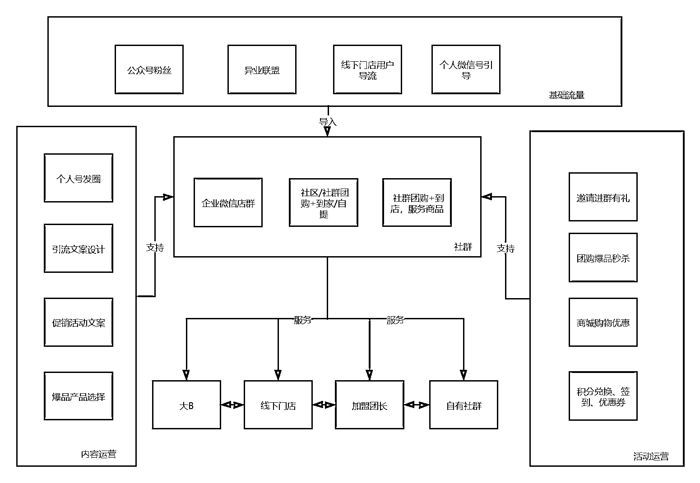
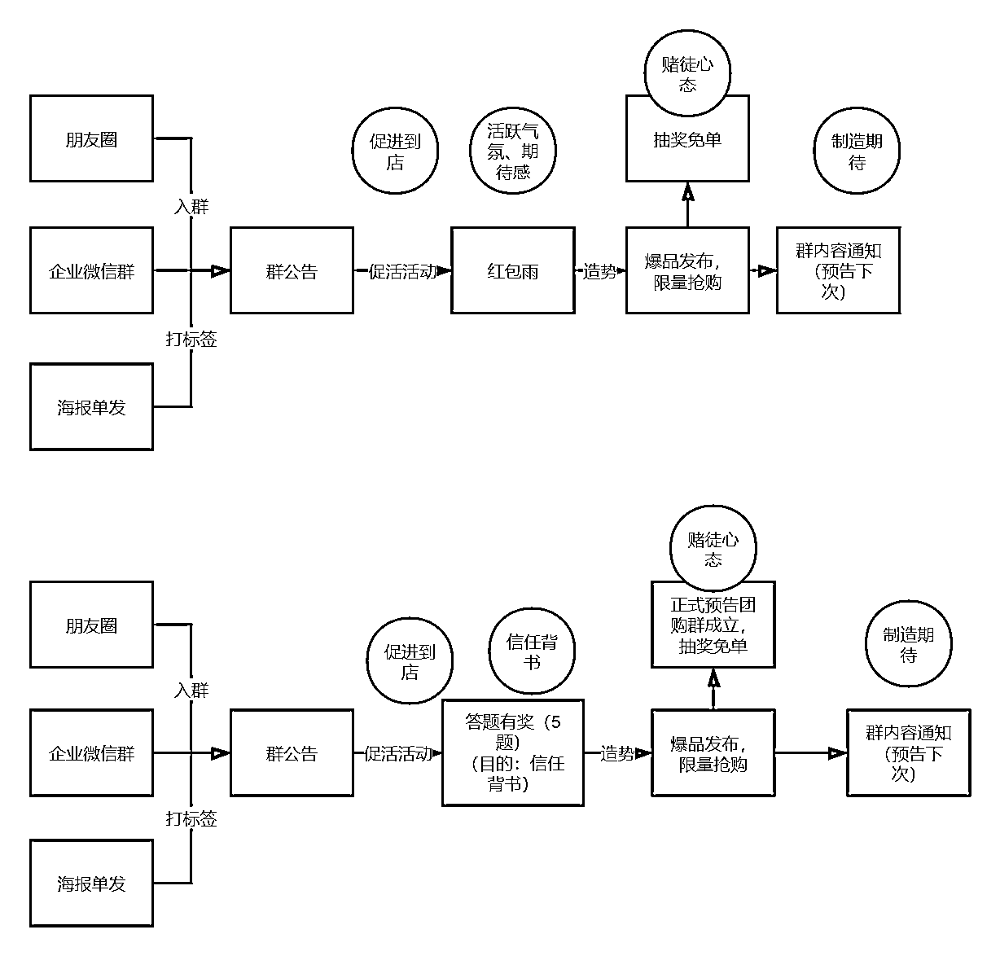
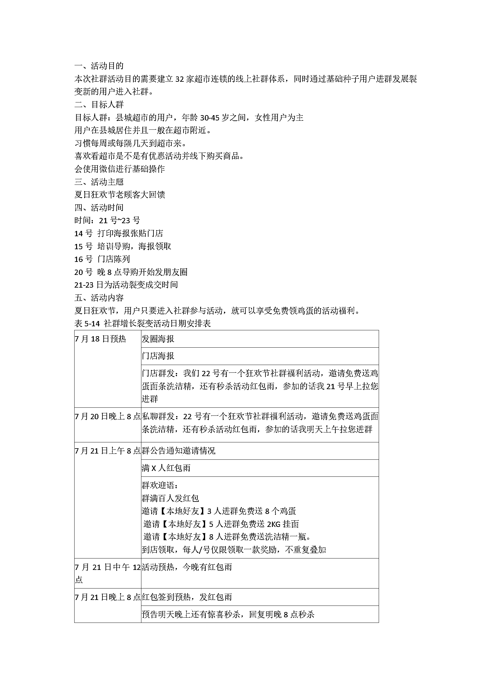
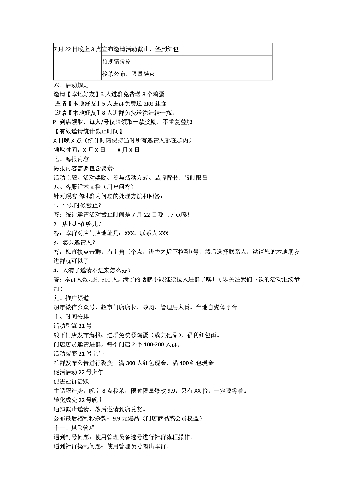

# 6.7 商超行业

关键词：客单低，利用门店导购，注重导购赋能、宣传效应。

在搭建方案的第一步，我会先做一个思路导图，来梳理清楚方案的框架思路，一般会按照基础流量的运营、用户运营、活动运营、平台支持等内容做一个闭环导图，通过以下这个图我们可以看到方案的雏形，有了这个框架图，做方案也就是优化流程和内容即可。

因为有了以上的框架思维，就需要做活动的方案了，以下是活动方案呈现：

将活动的进入路径如餐饮门店项目一样进行解析，利用用户进入的触点和路径设计好两套不同的方案以供测试或讨论。通过以上的方案设定，我撰写了如下的活动整体方案。

整体方案中包括了细节的比如：邀请话术、邀请时间、活动节点、培训计划、风控计划等，以上方案经过二次讨论和确认就可以进入到执行的项目甘特图中了。

内容来源：《不同行业私域如何搭建社群体系及运营团队》

