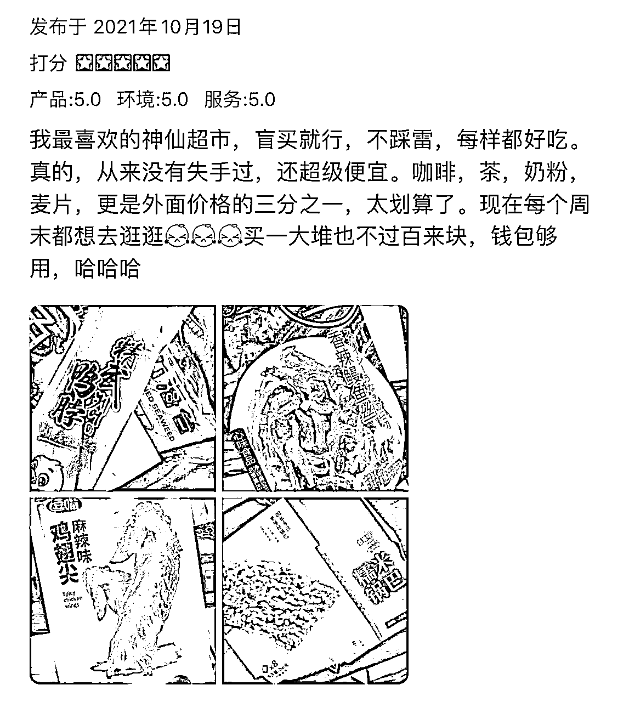
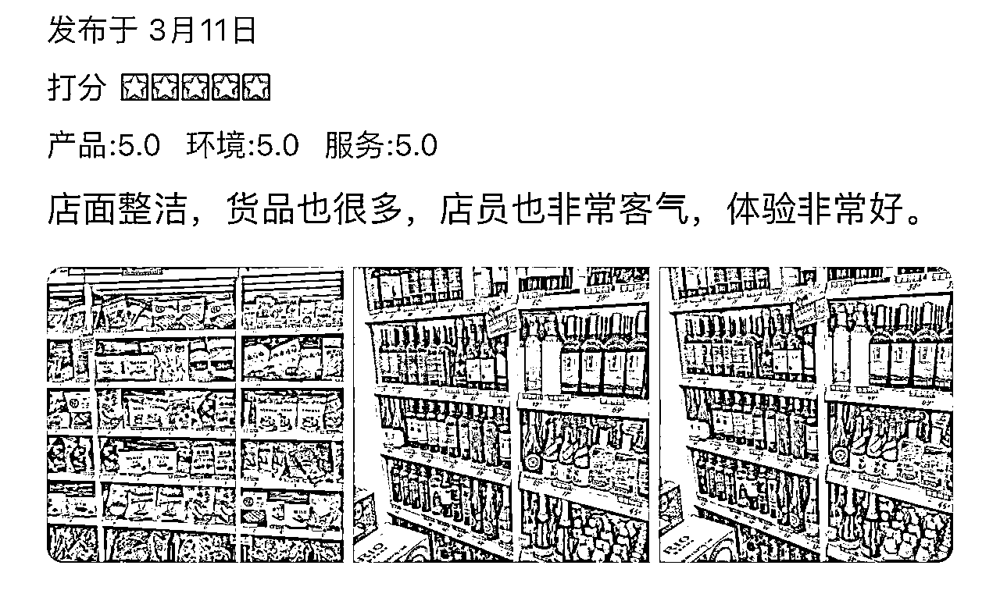
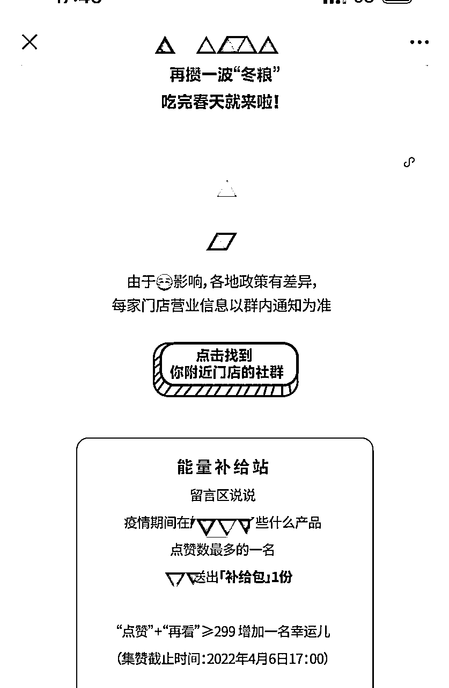

# 【案例八】临期食品门店 @Bester

1\. 开业期间

首先在装修期就可以在围挡上面做广告，围挡内容为预计开业时间、店名、logo、店铺性质、以及挑选一些附近人群较熟悉的产品做价格对比，突出店铺特点以及种草，达到预热的目的。有足够精力可以配置好公众号，二维码印在围挡上面，设置转发活动扩大宣传面，达到裂变的效果，做店铺冷启动。

开业前三天到一周可以在店铺周围大量发放传单吸引到店，条件允许的情况下可以用大喇叭循环播放话术，如：xx 店开业，全场 3 折，30 元带走一大包；xx 店开业，xx 产品原价 xx 元，现价仅需 xx 元（大家都知道的产品，价格极低）等。

2\. 日常运营

日常运营动作主要目的是吸引到店。

线下

•可以在门店玻璃窗显眼位置放显示屏循环播放特价产品信息（大喇叭让用的话也可以时不时用一下，声音的传播效果会好于视觉宣传）

•不定期发放传单、小零食等激活周边用户

线上

根据城市特点可以选择大众点评、抖音、小红书、甚至微信朋友圈等作为线上宣传渠道，以适当折扣或赠品为噱头吸引用户发布内容，同时在自有公众号不定期设置裂变活动，线上线下结合巩固效果。

3\. 门店引流私域

引流私域有几个好处：

•产品种草与宣发

•活动营销触达

•短保产品预售提高周转率，减轻库存压力

4\. 会员体系

会员可以选择做月费、年费或者永久会员，一定要付费，付费可以提高会员粘性，人都是有损失厌恶心理的。

办会员卡时的会员福利一定要够丰厚，比如会员永久 95 折、88 折，首次办卡送 50 元无门槛代金券，会员永久享受 xx 服务等，反正写的越有价值越好。

也可以不定期准备下会员小惊喜，刺激一下。整体的会员体系不用做太复杂，积分体系视情况可加可不加，折扣等福利足够了。

5\. 节假日礼品

节假日礼品是一块很好的营收来源，选择一些看起来逼格较高，品质还不错的产品以及常规的酒水饮料牛奶等作为节假日促销和送礼的产品，有条件可以办一下烟草销售许可证，顺带着卖。

6\. 给 B 端客户供货

如餐馆、酒店、其他小商店等，都属于拿货量没那么大，但是周转率还不错的店铺，因此他们对保质期没有特别高的要求，同时因为我们有货源优势，零售价甚至比他们拿货价还便宜，很多小的 B 端客户很喜欢过来进货，可以建立长久合作关系。

7\. 异业合作互相引流

如题，找不产生竞争的其他业态合作，店内互相放置物料，做联合活动等。

8\. 其他注意事项

•保证上货的及时性。没货了就抓紧用其他产品占满坑位，不然货架空荡荡的很影响顾客体验。

•做好员工培训，尤其是服务这块，不要和顾客争辩，无论对错，有则改之无则加勉。

•如果要做私域和会员，收银员工培训和激励体系也要规划好，确保每一个结账顾客都会被“推销”到，以便引流到私域或会员体系、会员群。

内容来源：《临期食品店玩法：多 SKU+高坪效》

