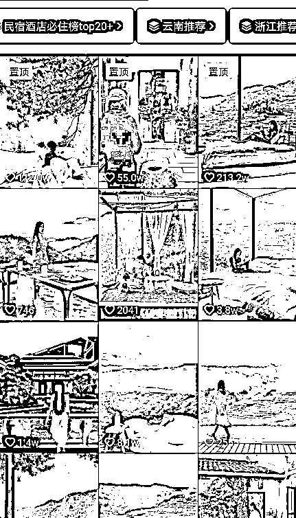
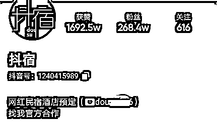
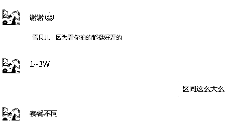
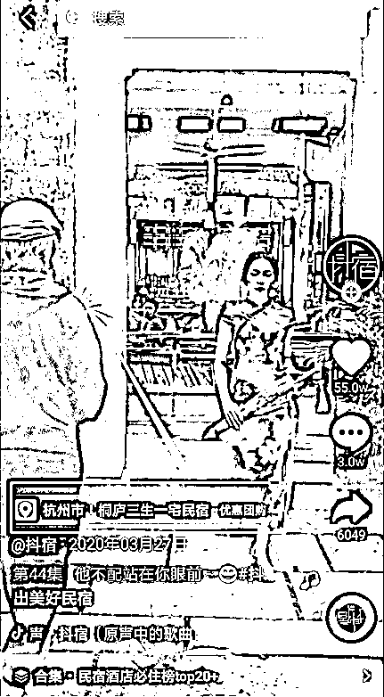
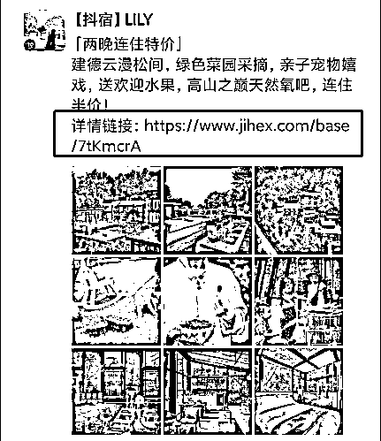

# 【案例九】抖音账号：抖宿@大江

💡民宿相对来说，引流见效较慢，复购低频，很多人都是做探店为主，所以这里会基于一个民宿探店号的案例，来帮你了解民宿酒店如果找达人合作的话是什么样的。
不过想和你说明的是，达人流量成本比较高，而且如果民宿没有特色和亮点，达人没能带来精准流量，那么这次合作就没有太多效果。所以我们在给民宿打造特色的同时，还是要把私域和个人 IP 做起来，建立自己的流量池。

1\. 抖音号发什么内容

民宿酒店吸引人的地方，一般都是因为它的地理位置、周边的风景以及酒店的环境非常独特和美好。所以，抖音视频要把这些独特的、美好的、令人向往的东西拍出来，而且要拍的高清、唯美。城里人，厌倦了钢筋水泥，高楼大厦，对大自然就非常的向往，想去看看，想去体验下亲近大自然的感觉。

像@抖宿，它的视频就是一个大自然的搬运工，把你带入到大自然的环境中，它把酒店和大自然的风景融为一体，展现出来，另一个有意思的点，这类视频往往少不了美女，美女映入大自然的美景中，美女 + 美景，让人无限向往。

正因为要体现大自然的风景，所以视频都是选的旅游地，这个在视频的合集里就可以看到。总之，视频从几个方面会让你有一种想去看看，想去住住，想去体验大自然的感觉或冲动。

民宿自己的抖音账号也可以参考此类内容产出视频。

2\. 引流

通过抖音简介引导到微信

3\. 变现

这种账号的内容就是探店型，民宿给钱出视频。合作时要了解清楚包括哪些平台，各类花费是怎么样的，以及确认好分佣价格。

•视频团购分佣

抖音视频里面挂了团购小程序链接，有成交就有分佣，卖得越多，赚得越多。

•微信朋友圈成交分佣

投放达人的微信朋友圈，朋友圈发民宿的信息，后面带团购链接，客户下单完成订单后进行分佣。

内容来源：《民宿酒店探店号，怎么做？》

