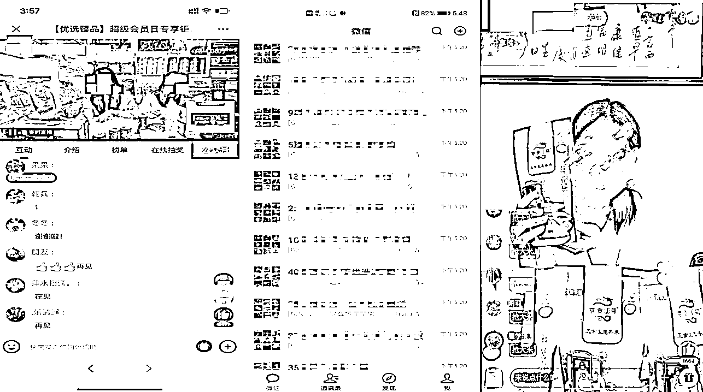

# 【案例十】线下大健康门店 @李雪梅

1\. 准备期

我 2020 年 4 月进入的公司，进去之后我发现一个问题：

就是公司的客户很多，但是全部掌握在员工的手里，因为平时都是销售员去接触客户，除了一个闲置不用的 CRM 系统，公司的高层对客户是一点不了解，如果某天某个门店的领导要撤脚，公司就面临客户资源随时被带走的风险。

于是，我便组织公司所有销售人员，各自拉个群，把客户全部拉进群里面。

由于考虑到有些客户年纪大了，用的是老人机，所以规定进群率不得低于他们手上客户的 80%，由公司出人出力出钱给他们维护客户，这样一来绝大部分员工是愿意的。

我们有 60+ 员工，但是新员工手上没多少客户，就让他们先积累客户，等到了 30 个以上再拉群，于是便拉了 41 个群，后来慢慢新增到了 60 多个。我们做益生菌活动，就是靠这 41 个群做起来的。

由于对客户不了解，对他们的消费习惯、喜好和家庭成员等各方面的不了解，我发布了一条通知，每人每天至少录入五户相关客户的资料进 CRM 系统，里面包括客户家庭成员情况，客户喜好，客户的职业，客户平时的消费习惯，客户脾气、客户习惯接听电话的时间等等一些细节性的东西，要求必须补充完整。

2\. 启动阶段和预热阶段

我们一共整理了 41 个群，差不多 8000+ 人，我们进群的客户全是消费过高端产品的客户（我们产品分为普通和高端两种，有一般的绿色有机食品，也有保健品），也就是这部分客户全部消费过保健品。

所以进群的人，最低消费也是在 6000 以上的，当然，这只是保健品的费用，加上零售的，最低的消费基本在 1W 以上，所以进群这部分客户就是属于我们的 VIP 客户。

没有消费高端产品的客户，我们又拉了另外的群，慢慢每天在里面植入，每天更新不同的内容，慢慢帮助市场部攻单，之后升级为 VIP 客户。

进群这帮人，对于我们的产品至少有个基础的了解。

通过 CRM，我把去年没有买过益生菌的客户调取出来，把买过益生菌很多年，客户反馈很好的那部分也调取出来。

先是把买过益生菌且反馈很好，很愿意作为我们分享嘉宾的客户筛选出来，作为种子客户。

我们当时有五个地方开有分店，于是我们便建立了五个群，每个地区一个群，由于第一次做，不敢拉太多群，也不敢有大动作，先小试一波。

每个地区负责人把员工拉进群后，再由员工把一部分种子客户以及一些 CRM 里面筛选过购买了高端产品但是还未尝试过益生菌的部分客户拉进群，这样五个群的准备环节就一切就绪了。

3\. 如何引流及裂变？

我们当时选了一个群管理助手，好像叫火把助手，五元一天一个群，其实很不划算，主要是功能不太齐全，还随时闪退，不过第一次用也就硬着头皮克服了各种困难去使用了。于是便有了第一条群规则：凡是进群的人，每邀请一个当地的客户进群，便可获得门店 10 元代金券一张，一次可使用一张，邀请越多，获得的代金券越多。

这样一来，我们的群很快就满员了。而且群内基本都是当地的居民，便于我们之后邀请到线下做活动，而且线下有门店，这部分客户获得的代金券直接可以到门店进行消费，便于提高可信度以及回暖一波线下门店空无一人的状况。她们也同样可以参与这波活动，所以第一天晚上八点左右，群就满了。

在考虑要不要继续开新群的时候，我们及时叫停，因为第一次做，一切要在自己能掌握的范围内进行，于是我们五个群满员了就没有再进行新的拓展了。

值得一提的是，这波代金券也促进了线下的消费，我们线下门店终于感觉像疫情之前一样了，开始热闹了起来，每天都有很多客户来领取代金券并且进行消费。对于老客户是一个很好的维护，对于新客户，让我们有了接触之后，更加了解新客户的基本情况。

4\. 如何进行群运营？

在第二天，我们在群里开始红包轰炸，其实吃咱们产品的这帮客户，大多是四十岁以上的老年人，她们的空余时间很多，抢红包不是为了抢多少，只是为了消磨时间和图个热闹，我们先是群内造势，先让各个店的负责人在群里发表一下之前准备好的感谢词和一些疫情当下我们应该要如何保护好自己的感言，发表完之后，便发红包。

当然，我们发红包也是有讲究的，每天早上九点一波，十点一波，下午两点一波，三点一波，晚上十点睡觉前来一波，发完后就不准任何人在群里发消息了，这样的话培养客户线上的习惯，也让她们学会在线上也要准时，只有准时，才能抢到大红包，才能不会错过每一项福利。

发红包第一天（线上操作第二天），我们有 10 个店的负责人都发表了感言，一个店的负责人发 10 个红包，所以当天一个群内的红包是 100 个，加上小助手预热和关灯红包，一共 106 红包，客户抢的很开心很快乐，第三天还没到点，就准时蹲守了。

第三天，我们依然是发红包，发礼品，礼品领取方式是自己到线下门店领取，第三天发的红包都比较大，然后发完红包后会在群内随机抽取幸运客户，送出门店的特色食品（比如木耳、东北大米、粉丝、豆浆等门店销量好反馈好的食品，我们设置的抽奖助手有一半的人都会中奖，中奖几率还是蛮高的）参与度特别高，不管是客户还是员工都异常兴奋。

到了下午五点，我们便引出我们的主角，讲益生菌课程的老师，于是小助理便出来宣讲接下来三天的听课规则和奖励了：

这三天好好听讲，认真做好笔记的人，在群内晒笔记的照片，由工作人员检查后便可获得豆浆一包，听课时间，每天早上九点到十点，下午两点到三点（因为她们要做笔记，所以整场下来，每个人在群里的时间消费一天在三到四小时左右）。

第四天，课程开始了，课程开始和结束都会有红包开路。

出乎意料的是，这些客户做笔记异常认真，而且写了满满的几页纸，再加上一些客户晒笔记在群里，获得豆浆一包后，不想动笔那部分客户也开始被激励了，有些客户晚上十一二点还在补笔记。三天的课程每天晒笔记得到的礼品都不一样，客户热情度就很高，又可以学到东西，还可以领取到各种礼品，所以基本进群的每一个人都在认真听课。

然后课程的第二天，也就是整个环节第五天，我们开始回到正题，开始植入讲解相关产品，课程第三天，也就是整个环节第六天，开始宣讲咱们产品优势和在国内获得的专利，以及哪些人在用我们这款产品，于是便在群内放购买政策了，现在有意向报名的人，还可继续免费获得三天益生菌的试饮装，而且还可获得买一赠一的机会，不过现货不多，需要在群里打出「我报名」三个字。结果，就爆了，基本都报名了，少数没报名的人看着这么火爆也开始报名了。

5\. 线下成交

于是我们便邀请，第二天来店里面领取，等到员工通知了再来，因为害怕一次性来了招待不了，体验感差，所以让他们分批次来，而且这么多人，疫情之下，更是要注意，所以就分批次去到门店了解，并且兑换这几天听课的礼品。

当天，也就是第七天，下单客户总市场就 400 家左右，整场业绩在 240 万左右，其实后续几天都在持续出单中，大概也有一百多万的回款。

所以整场下来，其实 400W 销量是有的，而且对于那些没出单的客户，来线下兑换礼品的时候，我们的销售人员继续跟进，继续维持关系，最后即使没下单益生菌，也会让他慢慢信任我们，购买了其他产品。

当然，过程中，以及售后客户关系的维护都很重要，所以我们的客户粘性很高，粘性高到一个什么地步呢，但凡我要上新品，客户一定会购买！很多客户家里甚至摆满了一面墙，都是我们的产品。所以我们产品的回购率在 80% 以上，满意度在 98% 以上。

内容来源：《以大健康线下门店为例，从快速梳理客户、获得第一批客户、裂变到客户成交这 4 点详述线下门店获得自己第二增长曲线的方法论》

