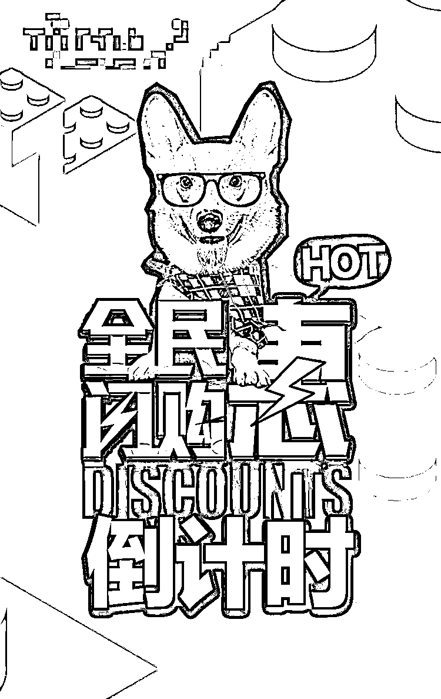
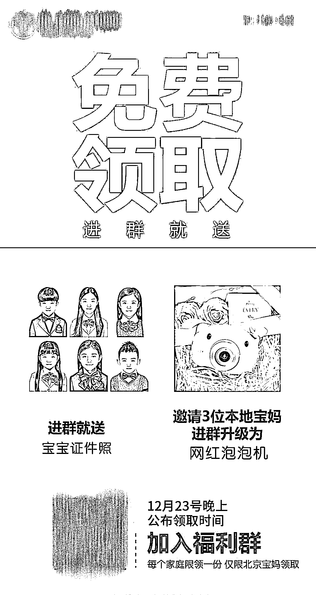
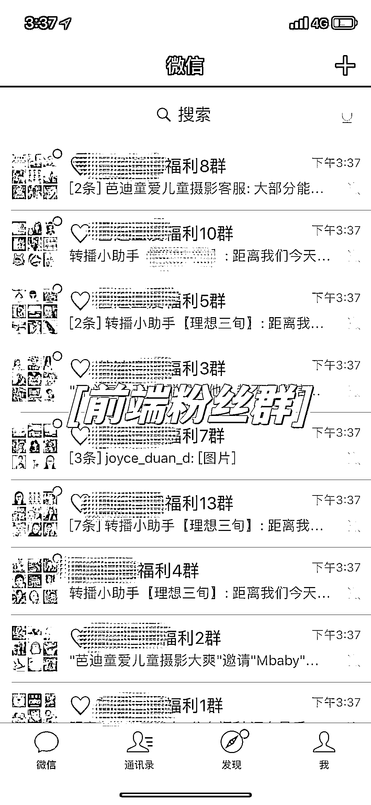
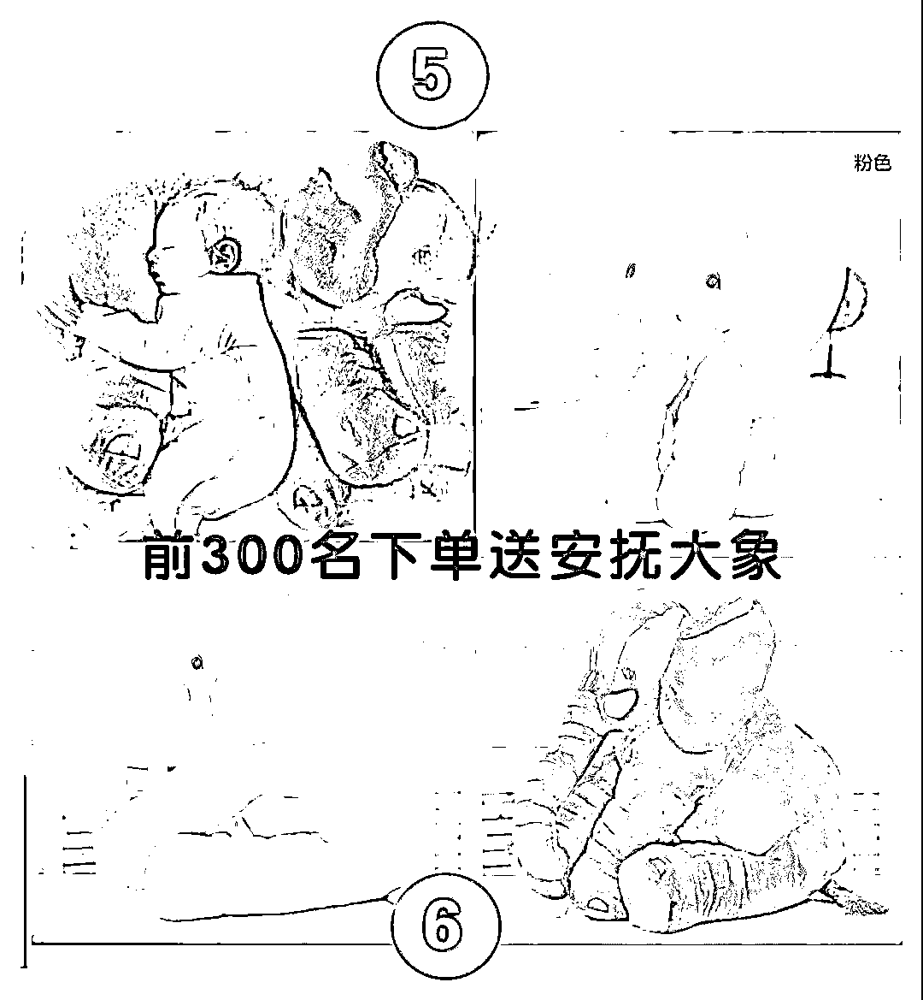
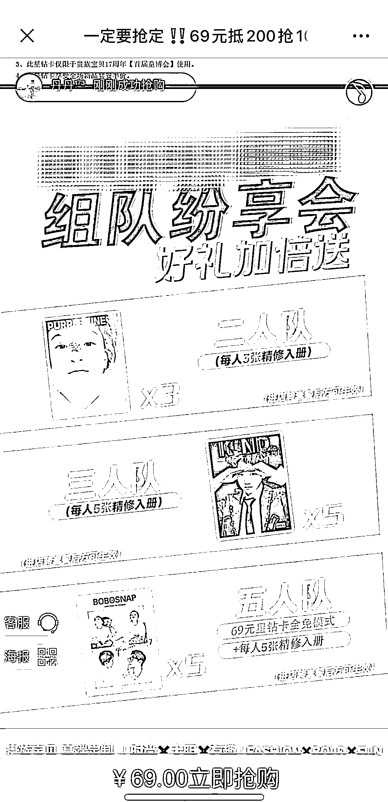
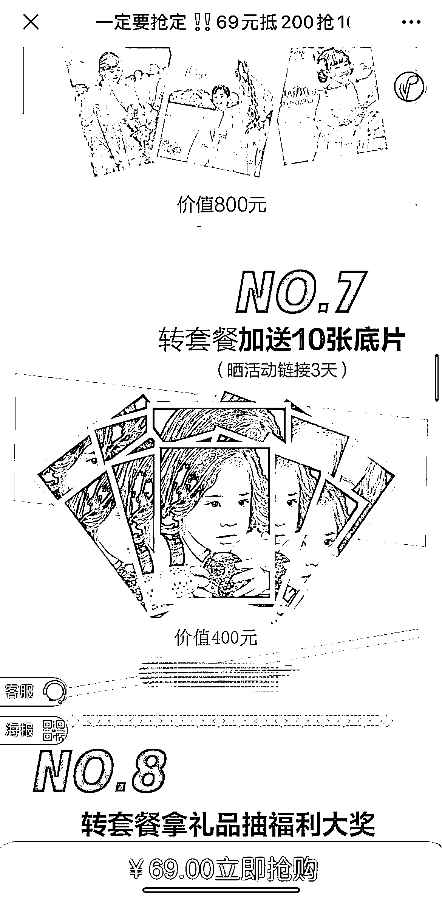
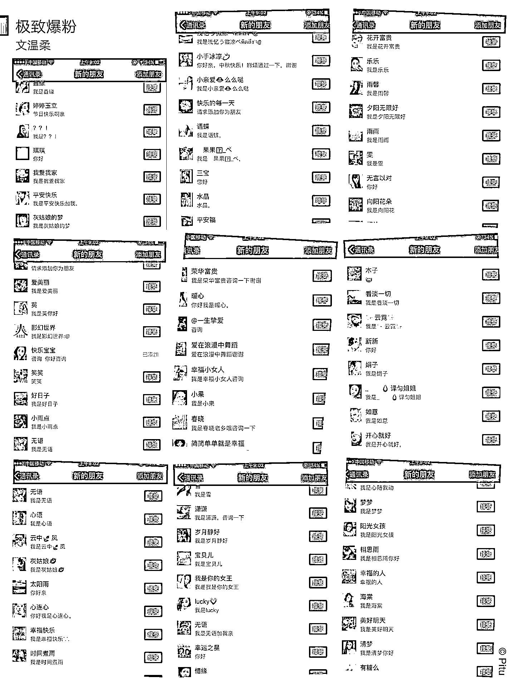
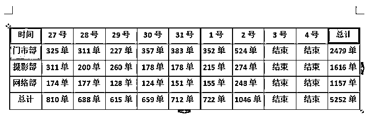

# 【案例十一】儿童摄影门店 @文文

•Part1：前期准备【确定价格 / 产品 / 活动噱头】

首先在活动发起之前，我们对目标客户及现有客户基础进行了一个系统的分析。这家门店本身的客户基数一般，都零散的分布在各个员工的微信号上，并没有进行系统的管理和标签分组等。

所以我们筛选之后判定：一部分老顾客都是已经可以重复唤醒进行再次激活产生复购的，同时，只要设置好强裂变机制，就可以实现 1:2 甚至 1:3 的客户转介绍。

所以，我们这次的活动目标就非常清晰，通过一场线上活动，整理并激活微信上所有的用户，实现重新复购及新客户的裂变成交。建立在这个基础之上，我们开始制定活动方案，因为此次的目标在于引流锁客，进店拍摄完毕之后才会进行二次转化和成交。

所以此次的活动内容设置主体为体验拍摄的引流套餐，我们推出了几个爆款主题，同步筛选出了一些市面上较为新颖的产品，以“新品发布会”形式为活动噱头。同时，朋友圈开始进行全面而广泛的造势，进行预热铺垫等，唤醒客户关注度。

•Part2：前期准备【发起快闪群 激活客户 完成新粉丝积累】

因为店内微信号没有进行系统化的整理和维护，所以活动启动前的第一步，那就是先来唤醒用户的关注度，再通过福利引导吸引一批新粉丝，所以我们发起了一个为期 2 天的快闪群。

顾客进群之后即可免费领取 99 元的宝宝最美证件照拍摄，同时，邀请 5 位本地宝妈进群还额外加赠网红泡泡机一个。这步举动有三个意义：

1.通过进群送礼品的方式把顾客邀约到快闪群内，方便活动发起第一时间进行成交。

2.顾客进群之后邀约身边好友进群完成 1:5 的精准粉丝裂变

3.礼品和拍摄都是需要顾客进店领取，增加了一次后端成交和完成客户转介的机会。

搭建社群第一步：发朋友圈造势，点对点邀约种子客户进群，设置每 1 个员工创建一个福利群（根据微信粉丝数量为标准），同时控制群内种子客户人数在 70-100 之间，方便留有余地让种子客户邀约新粉丝进群。

同时，设置好快闪群的配套三件套：群名/群公告/群欢迎语等，在此基础之上创建了 17 个社群，同时在 48 小时之内完成种子客户的进群及之后的邀约新粉丝的过程。这个时候，我们的社群人数就已经将近达到了 5000 人。

也正是这波基础粉丝的铺垫，奠定了我们后端的首批成交顾客基础。

•Part3：正式发售【群内首批成交客户】

前端粉丝福利群创建好之后，进入到了第二天晚上的销售时间，由工作人员统一在群内进行转播，为大家公布此次活动的优惠政策及福利内容，同时告知大家规定时间到店内领取礼品。

福利公布完之后，直接放出此次成交价格及活动内容吸引顾客参加，在这个过程之中，每个群内都提前埋伏的有水军，方便在社群发售的时候进行互动，从而促进群内快速成交。

为了保证当天群内的客户快速决断，我们还设置了一款引导顾客快速下单的福利礼品，当天晚上前 300 名付款成功的顾客，可以额外加赠安抚大象一个。

其实这个礼品的成本核算本身就在套餐里面，发售当晚抛出是为了利用顾客厌恶损失的心理，从而实现快速成交。

与此同时，所有人的朋友圈同步做好客户见证和顾客订单截图及好评，再次炒热一波儿，激活那些还在观望或者没有来得及进群的顾客的关注度。群内也同步采用订单顾客群接龙的方式，引导更多的用户参与进来。

•Part4：客户裂变【拼团 团购 拼多多】

首批顾客成交完成之后，接下来最重要的就是怎么实现快速裂变，毕竟，这才是作为门店老板最想要的核心。

我们设置的第一个裂变方式是以团购模式作为发起。为了方便顾客快速成团，所以设置了三个阶梯式的团购内容及对应的不同的奖励机制。团购的人数越多，对应的奖励机制也就越丰富。（对于宝妈群体来讲，2、3、5 人成团是我们测试出来最容易完成的裂变人数）

同时，活动报名是以 h5 链接的形式进行呈现，顾客打开链接输入信息可以直接进行付款购买，我们会引导顾客直接分享活动链接给好友，邀请订单，拼团成功后，客服也会第一时间告知顾客，同时激励顾客冲刺下面人数更多的团购福利。

如果没有用 h5 链接，而是采用微信红包进行直接收款的话，那一定要主要做好客资统计和客户信息登记。同时，要求客户把客服微信推送给一起拼团购买的用户，我们在微信端同时做好备注和标签登记。

上述不管哪种方式，都是在通过给予用户团购福利的形式，完成客户裂变的过程。

•Part5：客户裂变【分享朋友圈】

除了引导团购之外，第二个裂变方式，设置的是以分享朋友圈，提升曝光量为核心的任务设置。顾客只需要配上我们发给他的一段文字＋链接分享到朋友圈，即可完成福利领取。

这一步操作还是很简单的，但因为是顾客后期到店之后兑换领取的，所以顾客不会删掉或者屏蔽这条朋友圈，而且赠送门槛是需要顾客转发 3 天进行激活，所以这三天的时间也是我们重点开发团购顾客的高峰期。同时微信粉丝也同步获得了大幅的增长，基本都是顾客被动添加或者好友推荐的。

因为这两步裂变机制的设定，实现了我们此次活动 70%的新客占比，给予介绍人与被介绍人同等的福利与内容，在此过程中一定记得及时做好客户提醒和监督，我们是每天晚上都会提醒客户，记得转发朋友圈，记得推荐身边想要一起拼团的小姐妹，大家快来一起领取福利等。

•Part6：活动倒计时【倒计时促单】

在活动进入第 6.7 天的时候，已经基本算是进入了尾声，这个时候，我们就需要给顾客营造一种紧迫感。开始采用每天定时发放 700 个名额的形式，抢完即止，朋友圈同步进行名额倒计时的推送。

对于已经成交的顾客，进行最后一轮提醒，邀请顾客尽快组团成功，否则活动一旦结束还未成团的顾客就没办法领取福利了。基本这个时候，很多在观望或者犹豫的顾客都会下单进行购买了。

•Part7：活动复盘【客资统计 邀约进店】

活动的最后一步，就是做好客资统计与归纳，毕竟一次引流活动不是目的，把这些用户做好客户分类从而实现长久的转化和成交才是真理。标签/备注/分组/客户来源等进行细致的划分之后，进入邀约顾客进店的环节。

最后，给大家看下最终的成果展示：

原定于 9 天完成的目标，我们用了 7 天时间成功突破了 5000 单，最终完成了 5252 单～

内容来源：《活动复盘：7 天线上活动，为儿童摄影门店拓客引流 5000+》

