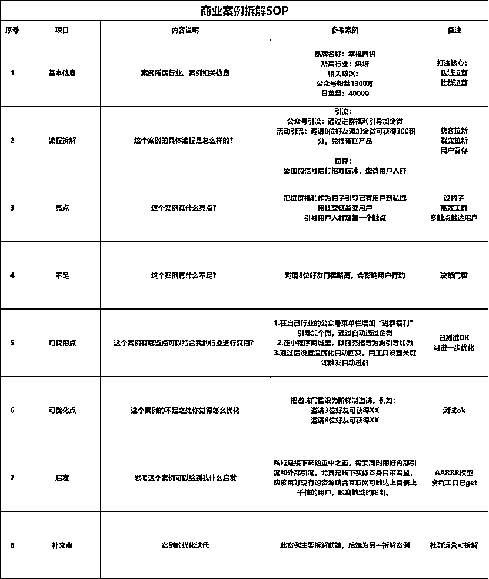
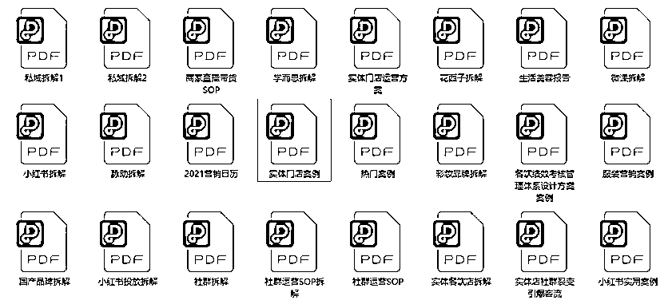
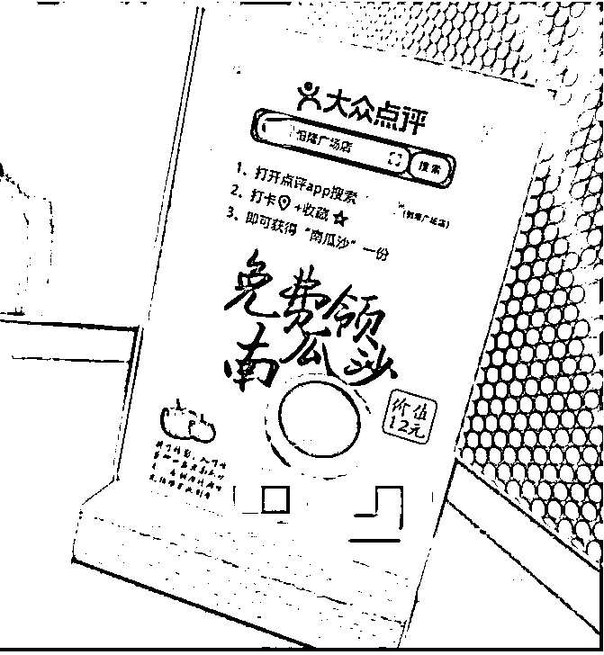

# 6.11 附：案例拆解方法 @Nico 酱

💡小节概要
上面我们提供了一些行业案例供你参考，不过每家实体门店的情况不同，还是要根据自己的情况来进行引流方案的设计，可能上面没有非常适合你的案例，所以在这一小节，我们附上了圈友 @Nico 酱的拆解案例的方法。
任何你认为做得好的，值得学习的行业案例都可以进行拆解。然后结合自己的行业拆完后抽取可以复用的玩法直接用，形成正反馈。
接下来我们就来看一下如何拆解一个行业案例吧！

如何快速确定案例拆解对象？

•第一步：参考 APP 排行榜单，找排行在前的实体门店进行拆解

•第二步：朋友圈、社群、广告，身边的朋友愿意推荐分享的，每一个让你有点击欲望的都值得被拆。

•第三步：定向搜索某个行业或者某个运营目的的活动，有针对性地去拆。

•第四步：看别人拆解过的案例，每个人看到的都是不一样的，从不同的角度再拆一遍。

我会去深扒他们背后的运营套路，拆解每一个环节的设计逻辑，看有没有可以学习的地方。我自己一般会按照五个步骤做拆解。

•第一步：我会写上这个案例的具体流程是怎么样的？把自己站在一个体验者的角度，梳理这个案例的基本流程，然后拆解它的运营目的。

•第二步：我会思考这个案例会有什么亮点和不足。

•第三步：我会思考这个案例的亮点有哪一些是我可以复制到我这个行业的？我应该怎么结合自己的行业做调整？

•第四步：我会思考这个案例的不足如果是我去设计的话应该怎么做优化。

•第五步：我会思考这个案例可以给到我什么启发。

平时看到好的案例我会用印象笔记的剪藏功能进行收集，然后去拆解，也方便后期查找。

拿百草园的案例举例，我这里简单拆解这个案例的亮点和可复用的地方。

从今年初到 8 月份近 5000 家门店百草园已经导流企微社群用户 410 万人，平均每个门店组建的社群人数近千人，流量进群后，月消费提升 7 倍。

亮点 1 ：开店前通过线下门店触达了精准用户

亮点 2 ：打造了真实场景为消费者创造了购买理由

亮点 3 ：营造推动客户购买的决策氛围

结合美业门店做复用的话，新店装修期间，在门口摆一个小桌子送美妆蛋、女孩子喜欢的可爱玩偶等等，而获取这些小礼品的条件只有一个，就是进群。

进群后店主会每天在群里分享新店装修进度、自己的心情等等，持续在群里分享专业的护肤干货并进行互动答疑，然后她用打造真实的消费场景这个方法在群里做新店特惠限量接龙秒杀，拿面膜、项目等等做活动，把他们的图片、使用场景、效果对比、别人的反馈等发群里参与接龙，满足一定条件下甚至可以享受免单。

在开店之前组建社群，用这种方式不止解决了开业前没收入的问题，还解决了新店开业没人到店的问题。

再拿我前几天通过大众店铺排行榜过去的粤菜举例，一到店我就看到了写着「收藏+打卡送一份南瓜沙」的台卡，在点餐的时候服务员自然而然地进行引导。

当时我就想：

为什么要引导收藏 + 打卡？因为可以提升店铺权重。为什么要提高店铺权重？因为可以提升排行，增加店铺曝光率。为什么要提高店铺曝光量？因为想要有更多的用户进店。为什么是点餐的时候引导？为什么是穿着典雅的服务员小姐姐来引导？引导的时候用了什么话术？那么是不是美业门店也能通过收藏 + 打卡送某个增值项目或者特惠充值优惠等进行运用呢？

用 5W2H 和 5WHY 不断深入分析。

这是一个特别简单的例子，效果也显而易见，但实际在运用的美业门店是特别少的。

所以，当门店在选择和互联网的结合方向时，我认为可以从商业案例拆解做起，边学边用，搭建自己的案例拆解框架，思考背后的商业模式和设计逻辑。

内容来源：《200 家日式皮肤管理加盟店背后，我是怎么把美业生意和互联网运营结合的》

