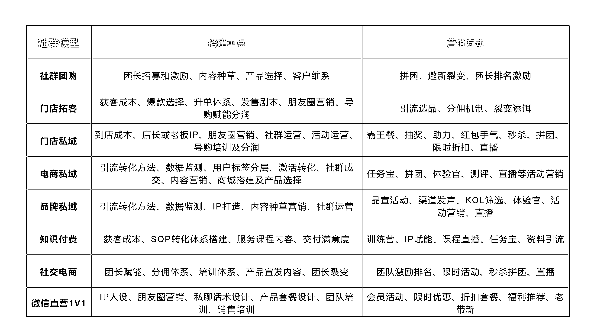
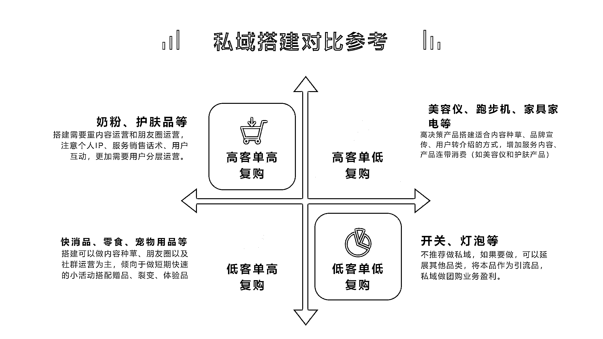

# 七、附：门店私域的团队搭建方式 @椰子青青

💡小节概要
由于有一些引流方案或者到店服务，会涉及到店内各个员工，所以在这一节你可以了解门店私域的团队是如何搭建的，一般来说团队组织其实不需要太复杂，一方面是一线员工加粉的提成，另一方面是运营团队设计成交的提成如何设计。
这里根据团队大小，提供了两种团队搭建方法，你可以根据自己的门店情况进行灵活调整。也建议你一开始不用搭起非常大的团队，先跑通引流路径后，再增加人手即可。

每个不同种类的引流方式，其实有不同的搭建框架。比如 1V1 销售的注重朋友圈和销售话术，社群团购注重产品的迭代和团长的招募，门店私域则是拓客和用户维系，电商的则需求也不一样。不同品牌如何搭建自己的私域团队需要的是不同的方法。

哪些品牌要筛选，哪些要精细化运营，哪些就是暴力方式。精细化怎么做，粗放的怎么做。负责人需要有一定的经验或者框架思维，能理解顶层的逻辑以后，不管是操盘哪些类型的方案，都会信手拈来。

同时，客单和消费频次、需求、渠道也会决定客户的搭建方式。

举例：如快消品、高客单的产品、低客单高复购的产品等不同的搭建模型。如果你正好想搭建私域项目，可以在一开始就想好自己在哪个象限并且用什么样的方式做私域。

搭建方式有两种：小团队，大团队。