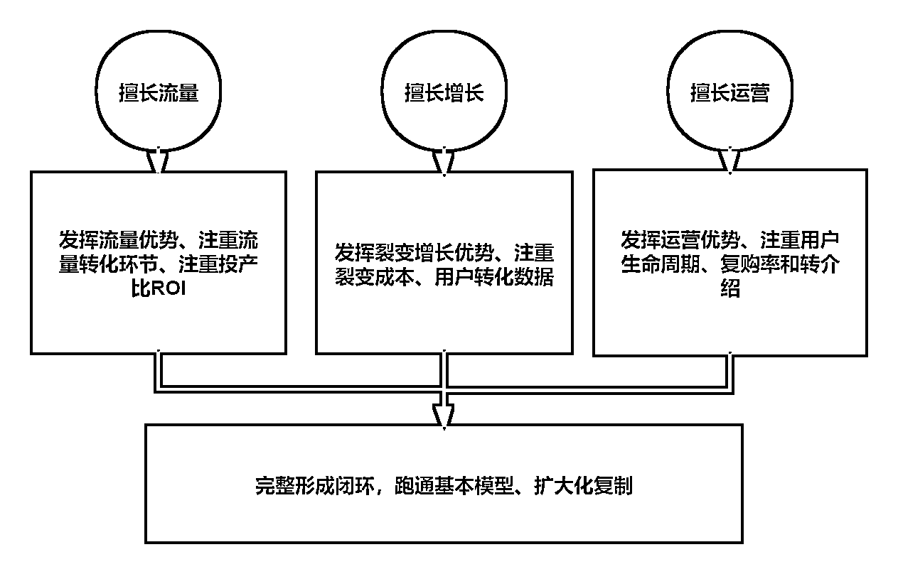

# 7.2 大团队

大团队最大的难度就是：分配任务和时效性管理。人多并不是力量大，如果大家都没有明确的分工和职责，很容易产生吃大锅饭的思维，推卸责任。

这时候大团队——3 人以上的团队一般开始先要明确项目分工，明确任务责任到人，同时也要做好利润分配和激励政策。让每个人都有动起来的动力并且知道自己要做什么。

激励机制的奖励方法参考：以部门奖金池的方式季度或年度进行奖励，个人奖励以一线员工——部门负责人线路进行业绩激励，设计中一定要独立到个人，一线社群销售可以以基础薪资+提成方式进行，这样一线员工在进行社群销售的时候能够发挥出更大的积极性。

搭建的过程可以从： 团队搭建、团队管理、分工，IP、朋友圈、社群运营、内容运营、活动运营、商城搭建开始做。因为大团队人多、完善，一开始就可以做好内容赋能。这样有效可以增加转化率并且提升人效。

因为不同的私域需求，也产生了不同的体系搭建方法，跟团队的基因也非常有关系，擅长流量的团队建议以流量优势发挥出 ROI 的投产比即可，多关注获客成本和转化成本。

如果是擅长增长的团队可以设计好裂变诱饵，多注重裂变成本和客户转化活动。而擅长运营的团队需要发挥出运营的优势，精细化运营客户，挖掘客户的长期价值，注重客户的生命周期。

内容来源：《不同行业私域如何搭建社群体系及运营团队》

