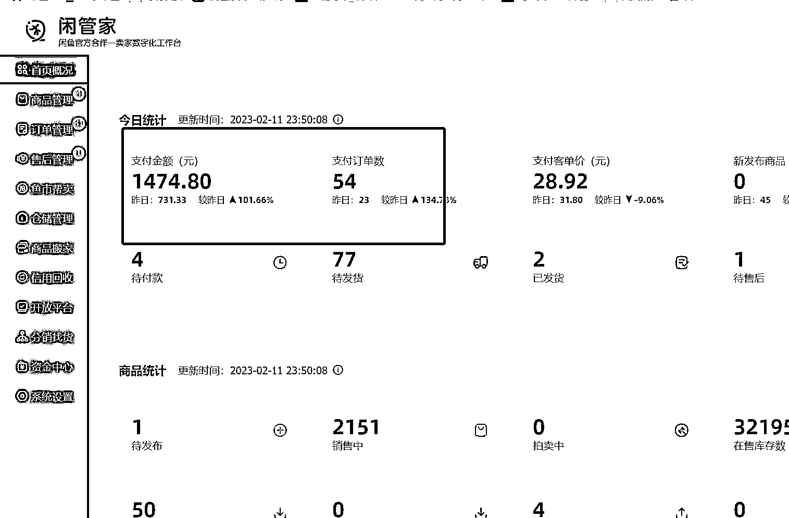

# 1.2 为什么做闲鱼二手书项目 @老瞿 Qu

一方面，我们上面说到，闲鱼平台的操作门槛较低；另一方面，从以下这几个方面，我们也可以感受到二手书的市场需求也越来越大：

（1）80% 以上的高校教材开放

据不完整统计，在国家鼓励对资源的可回收利用大政策的影响下，目前 80% 以上的高校已经放开了教材的预订，也就是大学生可以在学校预订教材，也可以自己解决，学校不做干预，这为大学生购买二手书提供可能。

（2）大学生对二手书的接受度提高

目前高校大学生对二手书的接受度越来越高，且每年都在递增，主要因为教材在大学的使用率较低，大家越来越接受二手书这种形式。

同时因为目前国家对盗版的打击比较厉害，这也为二手书提供了一波利好，二手书相对新书价格优势明显，一般为标价的 1-4 折。

（3）大环境下消费降级对二手的利好

这几年的经济环境大家有目共睹，目前经营闲鱼二手书店铺有个明显的感受，随着消费的降级，越来越多的家长开始给学生买二手字典，二手字典在闲鱼成为小爆款，供不应求。

（4）学校周边的二手书店倒闭，电商模式优势突出

一般在学校周边经营二手书店的老板，年纪较大，疫情这 3 年，绝大多数倒闭，因为学生无法出校，哪怕仅仅就隔了一个校门，同时因为经营者年纪太大，他们的电商运营能力较差，无法通过电商实现业绩的突破，而随着网购的普及，目前学生网购二手书的习惯已经形成。

而在二手书项目的几种玩法中，闲鱼无货源二手书项目，是目前最推荐的玩法。闲鱼平台处于红利期，而在淘宝和拼多多上做二手书，相对来说更难一些，不建议轻易入场。

如果你是一个人做，建议找一个家人的身份证，一起办理 2 个出版物许可证，开 6 个账号，管理 6 个账号基本上是一个人的极限了，精细化运营下来，预估一年的利润能达到 20-50 万。

比如目前开学季，我们单帐号每天的销售额在 1000-2000 元，平时在 500 左右，利润率在 30%-50% 。

闲鱼可发布的商品数量为 500 本，仅适合挑出爆款书籍售卖，所以更适合做无货源，避免压货。

另外官方可能在开学季会发布活动，可以关注相关活动动态，及时放大。比如之前有过活动：上架满 500 本书，同时开通 7 天无理由退货和不符合描述退货，就可以开通上架 3000 本的权限。

闲鱼二手书无货源玩法有这 5 点优势：

（1）目前处于红利期

一般人在闲鱼只能发布 5 本书，2020 年 9 月之前在网上有一个可以突破发布数量的 bug，现在已经修复。

闲鱼官方是在 2021 年邀请了 200 多个商家进行测试的，也就是进行出版物许可证的认证，就可以发布 3000 本书，2022 年申请通道一直处于关闭状态，直到 2022 年 12 月份才重新开放测试。

目前在闲鱼 APP 已支持申请出版物许可证认申请，可以确定有这个类目市场可做，不过有变化的是：一个号开了鱼小铺，最多发布 500 本书籍。

（2）书籍这种类型的商品，一旦上架，无需重复选品

闲鱼最畅销的是大学教材 + 小说，一般的大学教材至少 3-5 年才会更换版本，而小说的使用年限就更久了，所以一旦商品上架成功，后续这部分精力就可以省去，不用每天都在选品，忙个不停。

（3）售后较少

因为图书的商品属性以及价格偏低，所以售后问题基本上低于 10% ，我们实操下来，基本上低于 5% 的订单会有售后问题。之前也看到圈友在闲鱼卖投影仪这类型的商品，这种售后问题就会多很多。

（4）成本低

具备无货源的所有优势，不需要垫资，没有资金压力和库存风险。

（5）起号难度低

目前商家数量相对较少，起号比较容易，一个人第一个月做到 5K 的利润，第二个月利润过万，只要执行力在，问题不大（带人实测结果）。

但没有什么项目是十全十美的。讲完优势，也来讲讲这个项目的劣势：

（1）前期上书需要一定的时间积累，要有耐心

该项目推荐精细化运营，首图找实拍图效果更好，文案每个账号尽可能标准化且有所差异，每天上架 20-30 本书。

强烈不建议使用群控软件，效果较差，所以前期上架书籍有个积累过程。一般上架 300-500 本书以后，帐号就能相对比较稳定的出单。

（2）不能躺赢

平均客单价较低，大概在 20-30 元左右，所以订单多了以后，需要比较大的精力去买书发货，相对短视频带货等项目来说比较琐碎。

（3）不能搬运内容

不能直接搬运别人的账号，被举报以后容易被封号。

（4）单帐号天花板较低

目前跑通的最好的帐号在旺季利润在 1-2 万/月，淡季的话平均一个账号每个月的利润在 5000 元左右，跟短视频带货那种爆了一个视频，赚几十万没法比，赚的是辛苦钱。

内容来源：《深耕行业 2 年后，分享咸鱼二手书无货源、绝版二手书等 5 种项目玩法》

