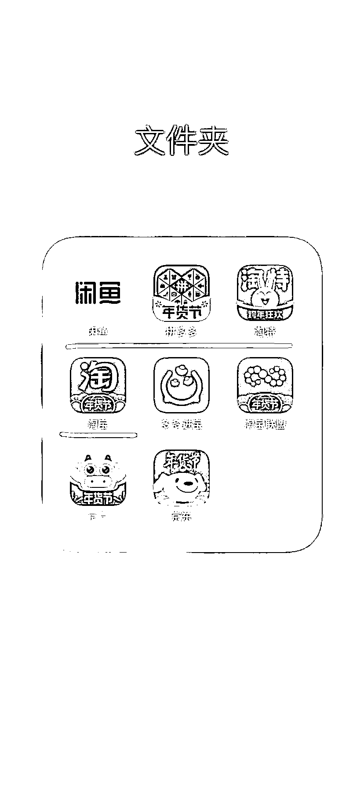

# 2.2 基本软件下载完善 @老瞿 Qu @小嵩

需要提前准备的软件/网站有：

•闲鱼

•孔夫子网（首选）

•淘宝

•拼多多

•淘特

•……

建议首选孔夫子，其次淘宝，最后才是拼多多。拼多多盗版多，还会给用户发信息，淘宝最近也会发一些带价格的信息，是不太利于我们做这个项目的。

闲鱼 APP 目前整体风控比较严格，建议一机一号。比如二手手机可以在闲鱼买 200 元左右的红米 7 或者 8 ，或者同等配置的手机即可。

闲鱼账号绑定的支付宝需要跟执照是同一人。

一个出版物许可证可以用在三个闲鱼账号上开店铺，每个店铺对应一个支付宝，而一个身份证可以注册三个支付宝。

也就是说，只用自己的身份信息做这个项目的话，只需要办理一个出版物许可证即可，不需要办理多个。

还有要注意的是一店一机，一台手机来回切换闲鱼账号的话，账号是很容易异常的，异常会导致闲鱼币不能使用，所以一机一号保险点。

内容来源：《深耕行业 2 年后，分享咸鱼二手书无货源、绝版二手书等 5 种项目玩法》、《加入生财有术一年，终于实现副业月入过万》

