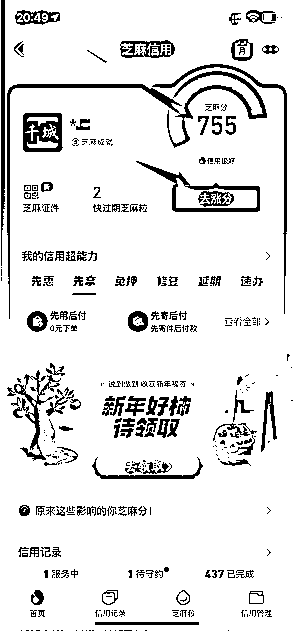

# 2.4.3 注意事项

芝麻信用分尽可能 650 以上，700 左右，自然越高越好。具体查询，打开支付宝，首页搜索“芝麻信用”点击即可。

如何提升自己的芝麻信用分？

下方有一个“去涨分”可以按照提示进行，外加平时多使用“花呗”支付，并且及时还款，外加补齐自己的一些身份信息来的。

一些信用分低的怎么办？

刚开始可以直接借用身边亲人，朋友，信用分高的进行使用。

内容来源：《闲鱼电商｜小航海学习手册》

