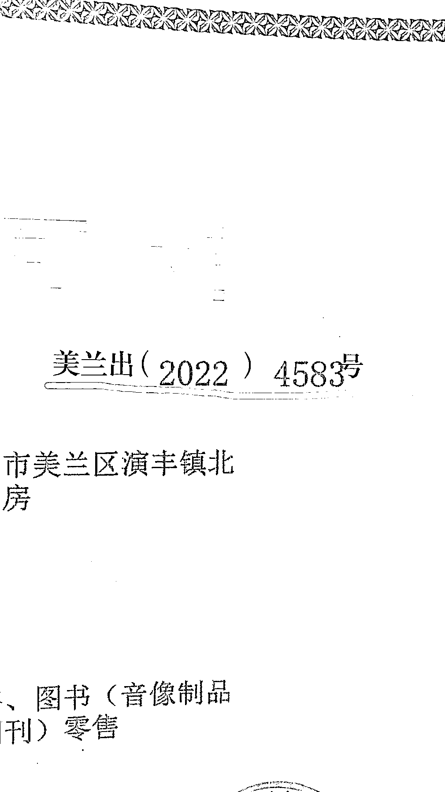
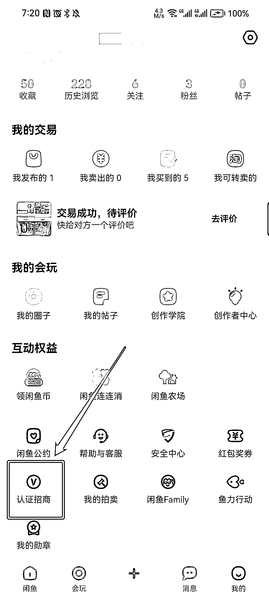
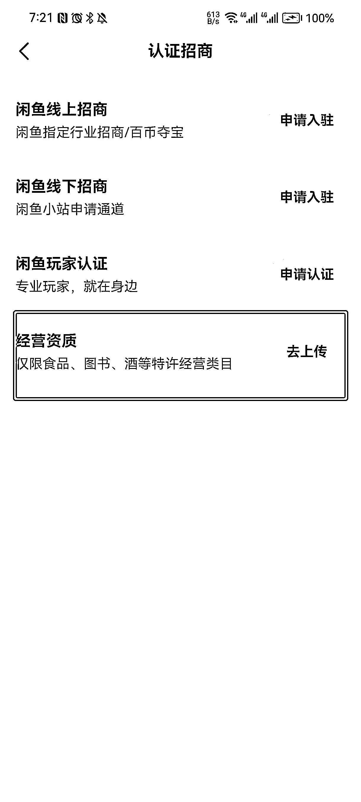
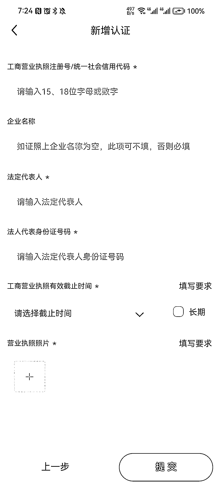

# 2.5 申请开通书籍销售许可 @老瞿 Qu @小嵩

打开闲鱼 APP，在“我的”页面，点击下方的认证招商，选择【经营资质】，选择经营资质类型为【企业/个体工商户经营资质】，根据步骤上传执照。

现在经营资质认证申请已基本全面开放，认证申请会分为 2 种情况：

•1 - 5 天就出来的证，大概率代办公司发电子版的时候，在闲鱼审核是查不到的，需要等待 1 - 3 天再申请

•需要 1 周以上办理的证书，一般都是可以直接去认证的

提交以后也会有不同的情况，有的审核只需要几分钟，有的审核可能需要 1 - 2 天，所以都不需要太焦虑。

要注意的是「出版物编号」是要把所有的文字 + 数字全部写上（如下图整个划红线处），而不是只写个数字。如果审核出现问题，一般主要是出版物编号写错了，所以这部分需要多多注意。

万一审核没有过，去看看具体原因就好，目前闲鱼对证照的审核还是相对容易过的。

建议审核通过后的第二天开始上书。审核通过当天不建议上书，这个时候上书容易被判违规。因为系统可能存在延迟，如果第一天就上架很多书，系统会以为没有证导致误判，误判以后再去申诉是很麻烦的，所以安全起见，这里稳妥一点，第二天再上书。

内容来源：《加入生财有术一年，终于实现副业月入过万》

