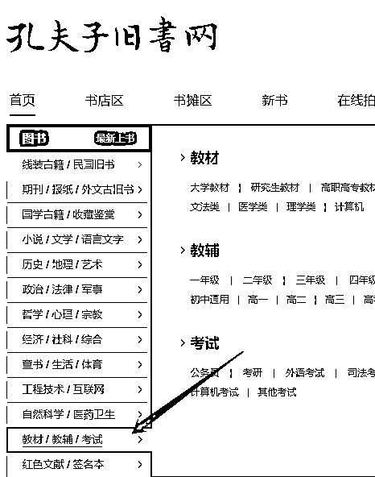
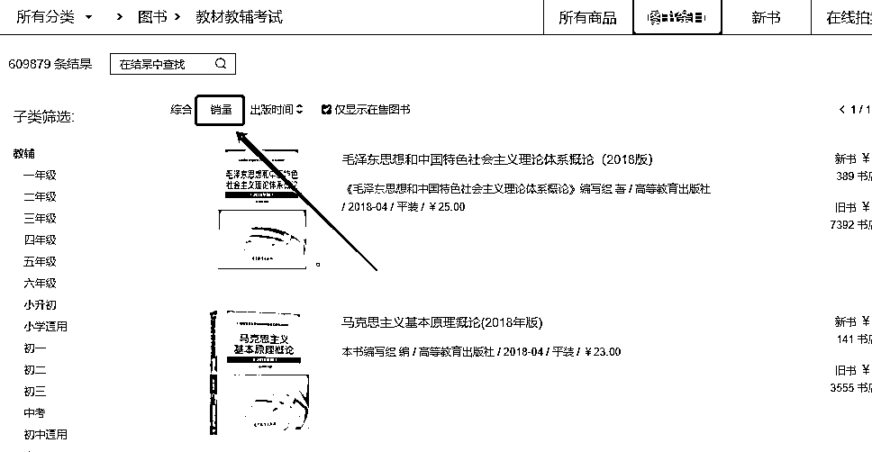

# 3.1.1 根据孔夫子的二手书畅销排行榜选品 @老瞿 Qu

这里选用教材为例，也是需求最大的市场。打开孔夫子网页： [`www.kongfz.com/`](https://www.kongfz.com/)

点击教材这块，进去后点击销量，我是按这个方法依次上书的。如果想在选品上有一定的差异化，可以考虑不选前几页，比如从第 10 页开始上书，这样效果有时候也挺好。

一页五十本，单教材这块就有一百页，一年都上不完。

目前大部分二手书货源，基本上都是孔夫子旧书网买的，很少一部分在淘宝，利润率在 30-50%，因为上架图书的时候就是按照这个利润率控制价格去上架的，有时候因为这本书孔夫子卖完了，或者采购价格太高，闲鱼就直接劝退，不卖这本。