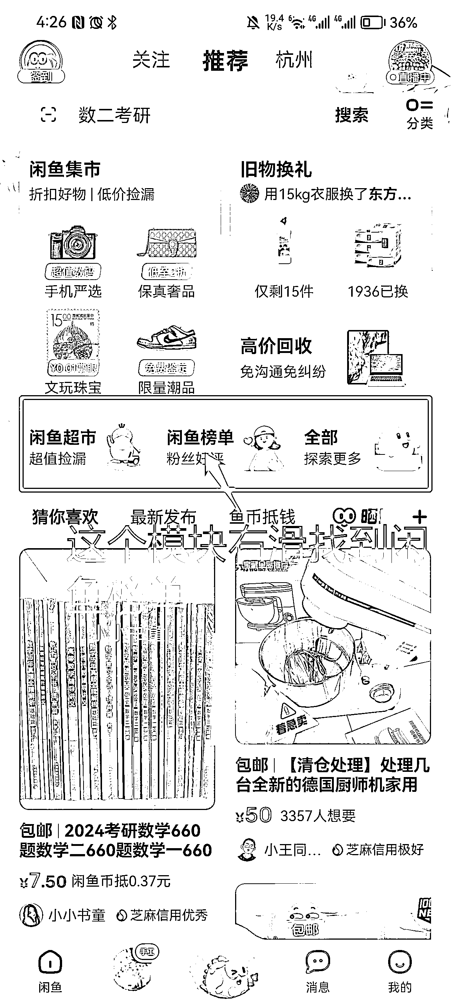
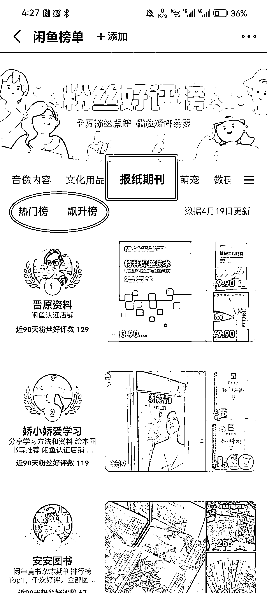

# 3.1.3 直接对标闲鱼卖的好的店铺进行选品 @一游 @老瞿 Qu

找到一家优质同行，参考其所有的相关商品上架即可。这样的好处是：这些品已经经过同行筛选，同时能避免违规。

具体方法：

•第一步：找排行榜，在闲鱼 APP 首页有个二手车那边，往后滑动，会看到一个「闲鱼榜单」。

•第二步：点进「闲鱼榜单」，选择「报纸期刊」的分类，就可以在排行榜找一个对标的店铺进行参考。

内容来源：《深耕行业 2 年后，分享咸鱼二手书无货源、绝版二手书等 5 种项目玩法》

