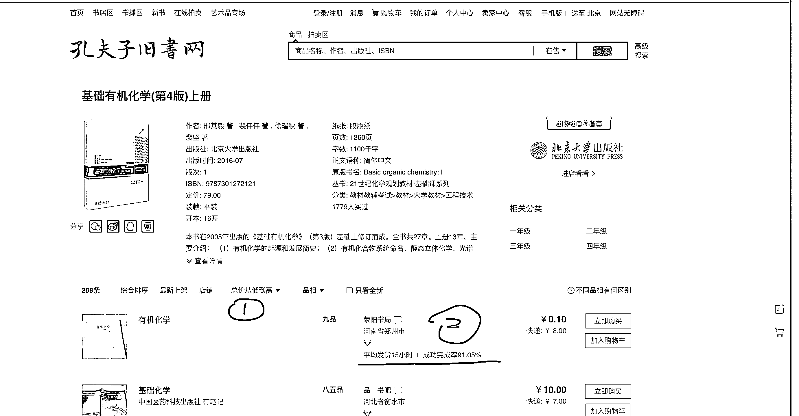
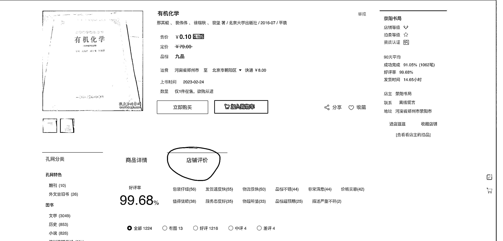
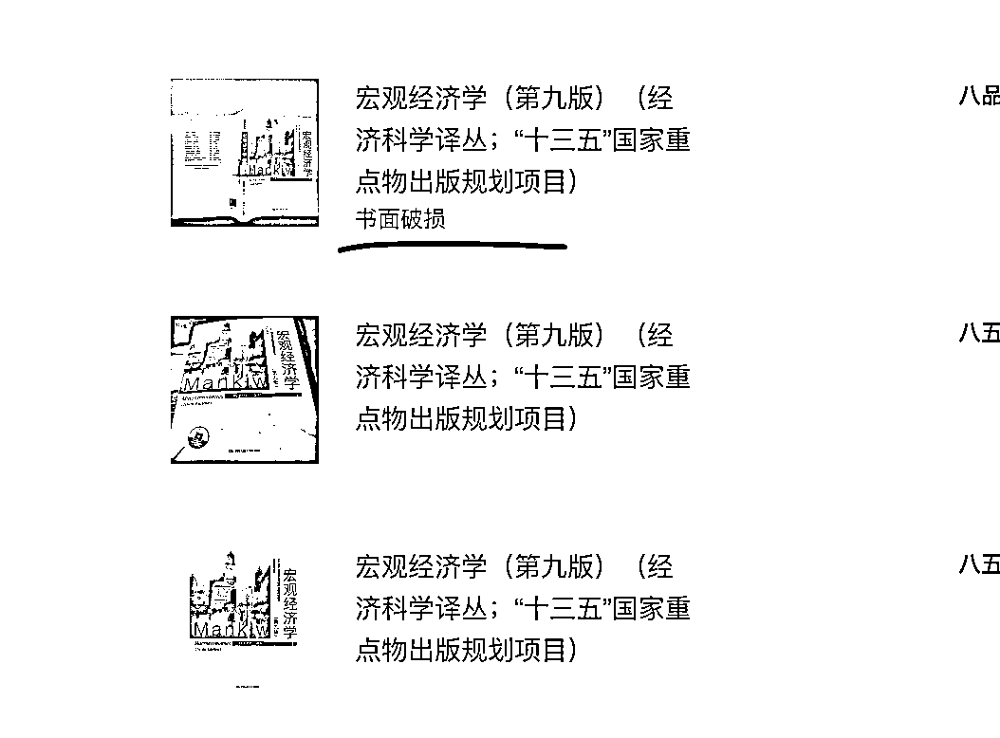

# 3.2 如何找到优质货源 @老瞿 Qu

不同的店里，二手书的品相可能有所不同，所以如何找到一个更好品相的二手书，降低出现售后问题的可能呢？这里主要给以孔夫子网来举例说明，其他平台也可以参考相关的数据来判断。

先按照「总价从低到高」排序，查看对应店铺的发货时间、成功完成交易率。时间越短越好，交易率越高越好。

点进某一个产品的详情页，找到「店铺评价」，好评率越高越好，建议也看几条具体评价内容，辅助判断。

注意点：如果商家标注的有缺页什么的，说明是残次品，不建议下单购买。

