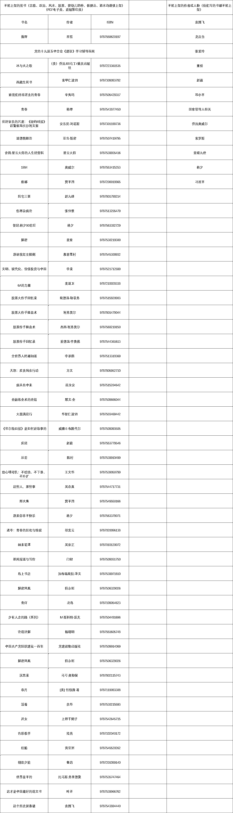

# 3.3 选品注意事项：不卖违禁书籍 @老瞿 Qu

说完了选品思路，外加 3 个选品方法，似乎很多人已经磨刀霍霍准备开始实操了。而在具体实操之前，需要提前和大家说明在做这个项目时的相关注意点，避免因一部分原因，导致正式实操的时候出现账号违禁封号的情况。

不能上架的图书主要有这几类：宗教、政治、风水、股票、婴幼儿奶粉、保健品、酒水，这些均谨慎上架，另外 PDF 电子类、盗版影印类也要注意。详见参考以下的表格截图。

