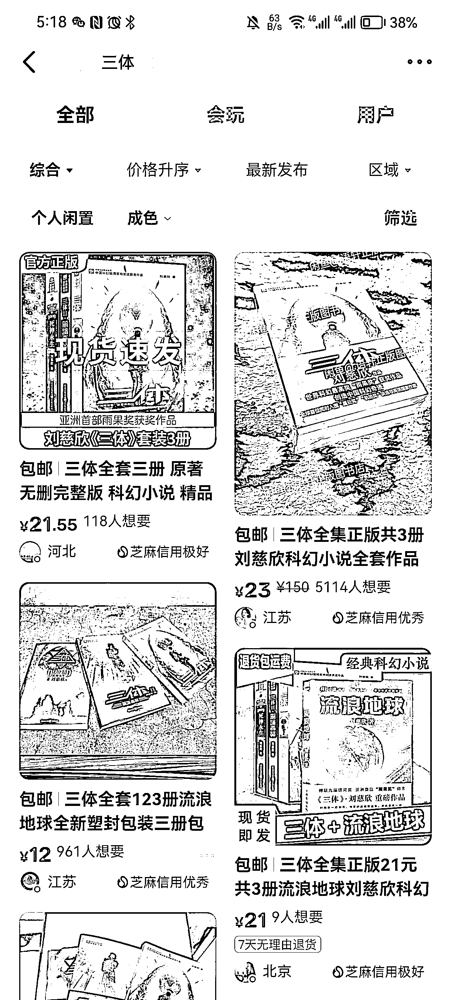

# 4.1.1 一个好的主图怎么制作

一个好的主图，一定能在第一眼就直接抓住闲鱼客户眼球，这类主图的特点：

•清晰

•干净

•体现产品特点，能直接告诉用户你卖的是什么

好的主图长什么样？

以《三体》为例，可以看到排名靠前的，想要人数多的产品主图样式，一般都是产品处于主图正中央，且为实拍。至于详情页内的其他照片，可以参考动态出售好的，其他图片进行即可。

好的主图图片在孔夫子网找到合适的实拍图采用即可。