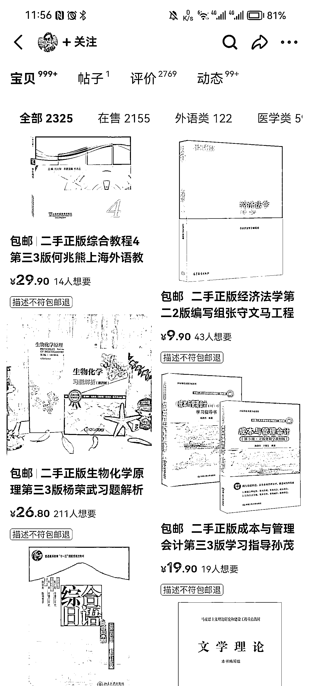

# 4.1.2 一个好的标题怎么制作

好的标题长什么样

一个能获取较多流量的标题，通常可以通过堆积产品关键词的方法，让用户不论搜索产品任意名称，都尽可能出现，自家店铺产品。

满足基本的 SEO 就行，比如书名 - 作者 - 出版社 ISBN 编码，把字数用满

标题参考：二手正版三体 3 死神永生三 刘慈欣 重庆出版社 9787229030933

如何快速制作优质标题

参考闲鱼同类产品销量好的标题，外加淘宝同类产品销量好的标题，一般销量偏好的，标题都是经过优化过的，这里就可以参考借鉴，简单修改，变成自家产品标题即可。

如下图，当我们找到销量好的产品标题后，保留顺序以及二手书、正版、推荐等词语，把其中的书名，出版信息，作者，编号等等都替换为自己的书籍信息即可。

