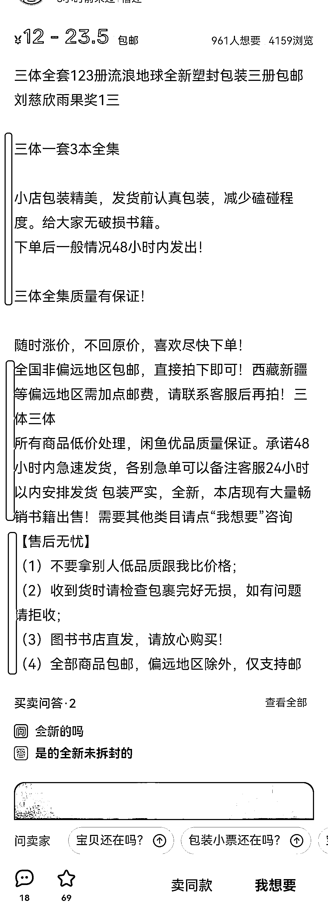

# 4.1.3 一个好的产品介绍怎么制作

图片内容上面有说，参考闲鱼市场动态出售好的其他图片进行即可。这里主要讲解的是关于我们的产品文字版本介绍该怎么写。

我们的产品介绍，有一个万能公式：

•第一段：告知为什么出售这个产品，外加产品的一些特点

•第二段：规格和出售价格各自多少

•第三段：发货时间，发货快递，及其一些售后安排

产品介绍足够详细，用户想知道的都已经看到，减少客服工作，降低我们的时间成本。

另外，如下图二的产品介绍简单明了，用户一眼就看到自己想要获得的信息，降低用户的决策成本，也可以提交我们产品的转化率。

