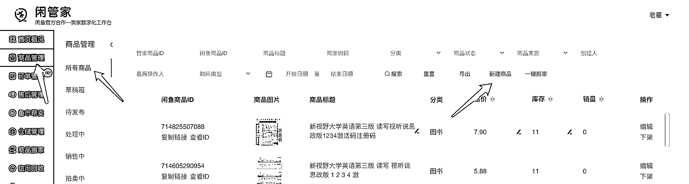
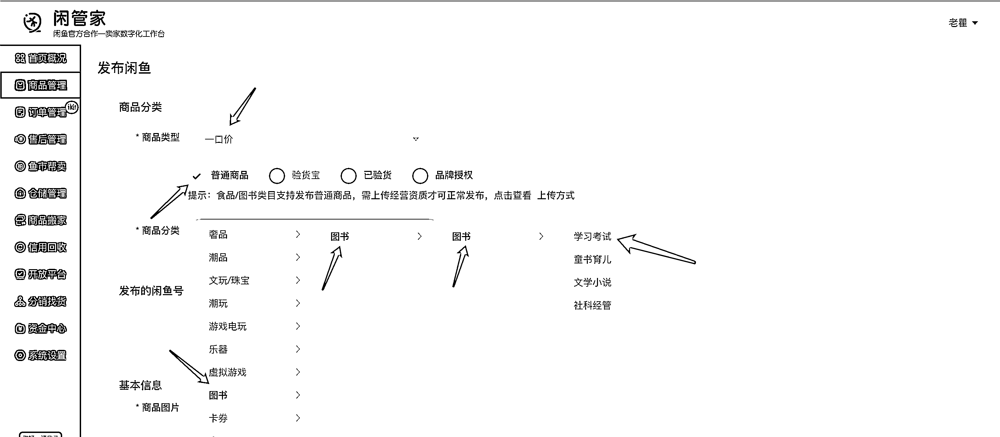
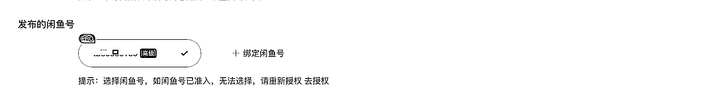
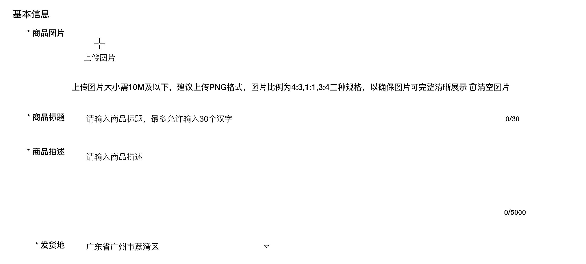
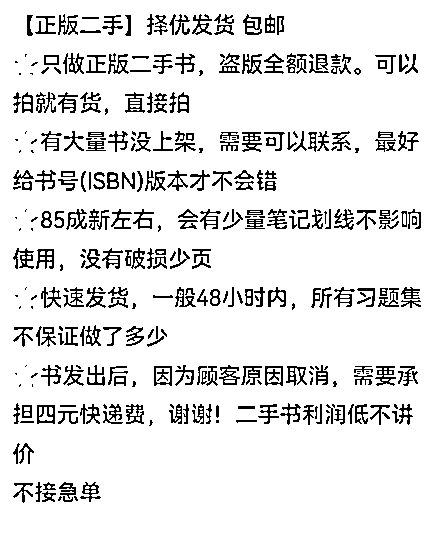
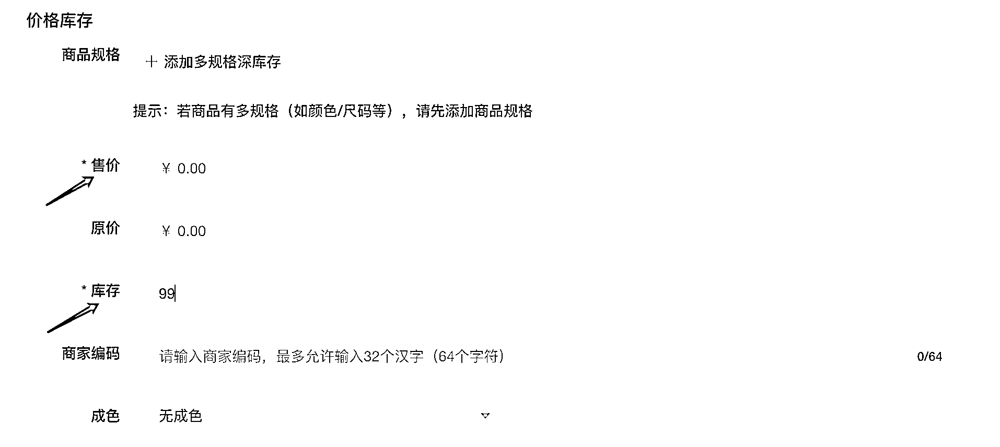
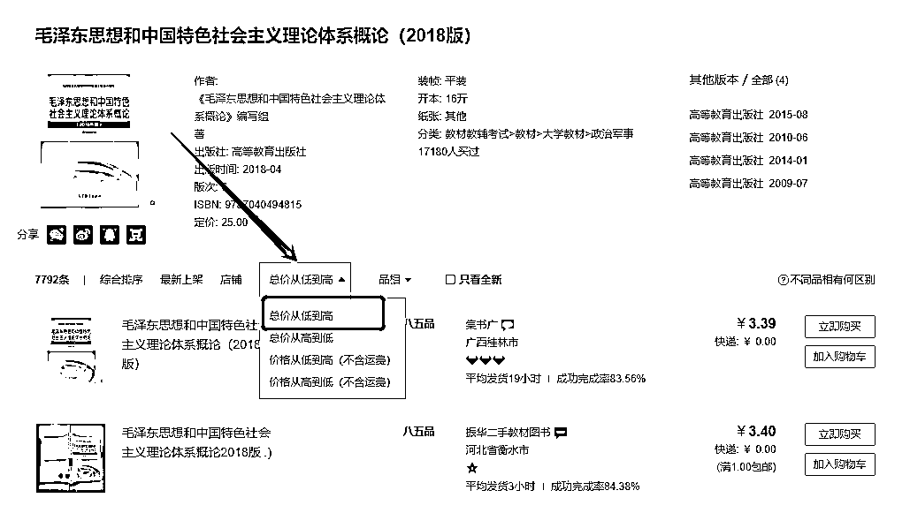
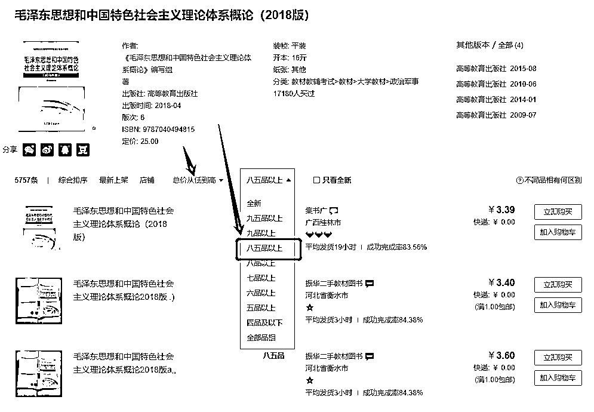
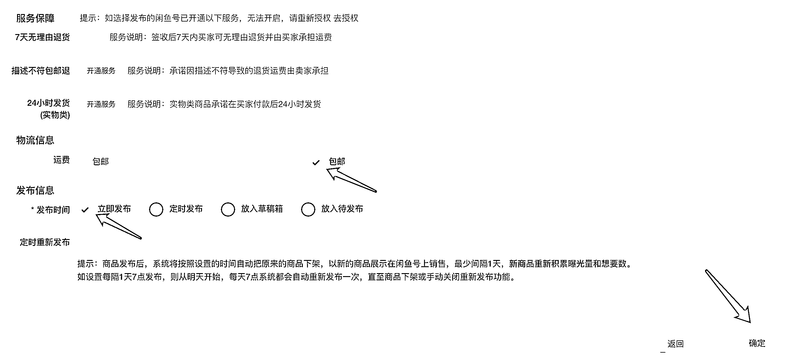

# 4.1.4 在闲鱼上书的流程 @老瞿 Qu

使用电脑上架书籍，需要使用闲管家（闲鱼官方的后台管理工具）：[`www.goofish.pro/product/all`](https://www.goofish.pro/product/all)。

手机也可以上架但是需要扫 ISBN 编码，电脑网页端上架效率更高。

前期店铺或者商品链接的流量没有起来之前，建议把加价范围控制在 10 - 20% ，等有了订单慢慢涨价，这样前期更容易把流量做起来。

等流量起来后日常上架，在孔夫子或者淘宝的基础上加价 30% - 50% 即可。

具体步骤：

【第一步】登录闲鱼账号后，点击商品管理，新建商品。

【第二步】设置商品类型为一口价；商品分类为图书（这里以教材为例，选择学习考试）。

【第三步】在「发布的闲鱼号」处，选择你要发布的账号。

【第四步】完整的填写基本信息

其中：

•「商品图片」可以在孔夫子找或者淘宝上找没水印的实拍图。

•「商品标题」举例：正版二手 / 二手正版 + 书名 + 作者 + 出版社（尽量标题写满）

•「商品描述」可以在闲鱼上找同行借鉴一下模板，建议一号一个模板，避免同质化。类似下图这种，注意要自己修改调整下。

【第五步】在「价格库存」这里，只需填写价格，修改下库存就可以。其中价格可以按孔夫子商家的售价（书本价格+运费）加上 40%定，确保利润在 30%以上。

以毛泽东思想和中国特色社会主义理论体系概论（2018 版）为例：点击价格排序，选择总价从低到高，品相选择八五品以上，以商家的售价做为参考加上 40%。

以上填写好后，点击「立即发布」，点击「确定」，这个书就上好了。

这一流程熟练后，一小时上 20 个链接很轻松。

内容来源：《深耕行业 2 年后，分享咸鱼二手书无货源、绝版二手书等 5 种项目玩法》

