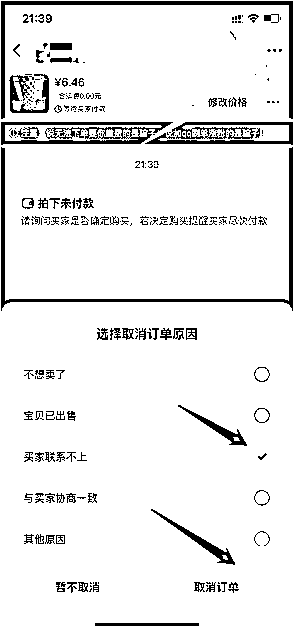

# 5.2.1.1 售前相关问答话术回复 @老瞿 Qu

欢迎语设置：欢迎欢迎亲！小店专营各类正版书籍。直接下单即可哦。

客户：[书是全新或者正版吗]

回复：亲，书籍是从学生处回收并消毒翻新。书籍七-八-九成新，无破损、明显污渍、无法使用的情况，会有些许笔记，不影响使用。择优发货。

客户：[在吗？/你好/还有吗？]

回复：在的/你好/还有 能拍就是有货，拍下最迟 x 小时内发走，喜欢直接拍下就可以

客户：[多久发货发什么快递]

回复：一般下午 x 点前下单当天可发，快递根据库存随机，最迟最迟不超过 x 小时。

客户：[可以拍照吗]

回复：您好，仓库较远无法实现每本书都拍照哈，我们发货的时候会择优发货的，请您放心购买！

客户：[有货吗品相如何]

回复：能拍就说明有货，成色 7-9 成新，无破损、明显污渍、无法使用的情况，会有些许笔记，不影响使用。择优发货。

另外，如果出现修改价格，一直迟迟没有付款的，点击右上角 三个点“···”选择“关闭订单”最后按照下方选择，关闭即可。

