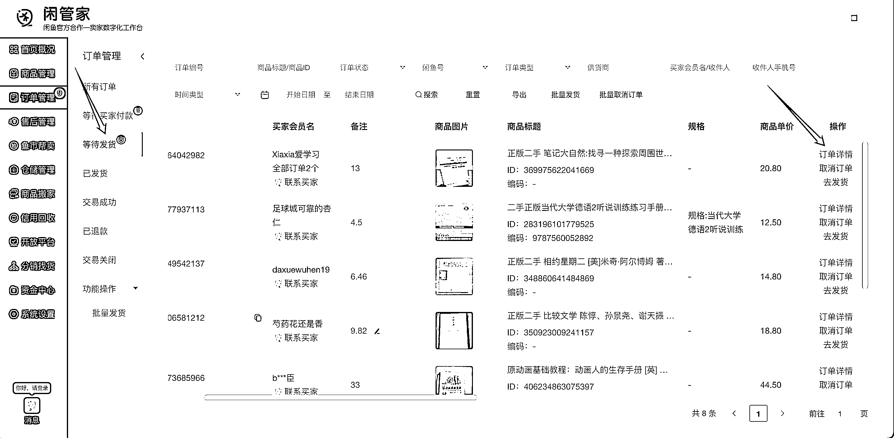
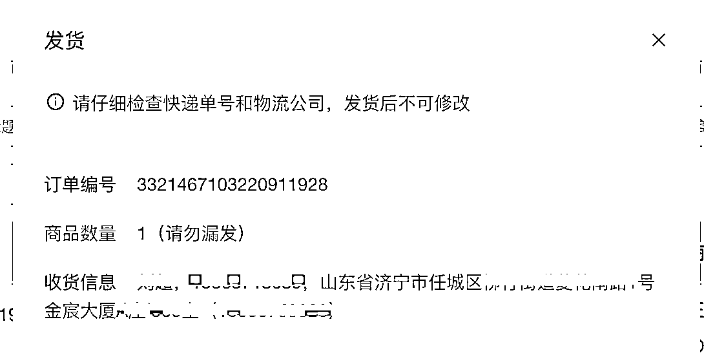

# 5.2.2 出单拍单发货流程 @老瞿 Qu @小嵩

当有了订单以后，我们需要去孔夫子或者淘宝下单，等发货了以后再把单号填写到闲鱼进行发货即可。

在电脑端使用网页「闲管家」发货。

顾客下单后，我们在等待发货这里查看顾客地址，点击订单详情。

复制地址，然后找上家（孔夫子网、淘宝对应店家）下单即可，上家发货后，我们再把快递单号复制过来发就可以了 。

内容来源：《深耕行业 2 年后，分享咸鱼二手书无货源、绝版二手书等 5 种项目玩法》、《加入生财有术一年，终于实现副业月入过万》

