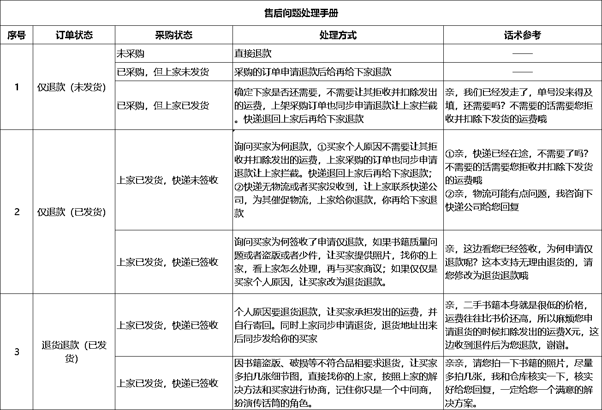

# 5.2.3 售后处理流程 @老瞿 Qu

记住一句话即可：我们是个中间人

所以没有必要去闲鱼和用户纠缠，出现售后，让用户及时提供快递盒面单和坏了产品在一块的照片。（确保产品是自家出售的，其次找商家也有证据）

然后将提供的照片给商家即可，商家需要怎么处理，我们反馈给用户，用户回复的消息，咱们再转发给商家即可，比较简单。

其次平台一般买东西，都会有运费险，而闲鱼的用户买了东西，是自己的原因而要退货的话，运费是由他们自己承担的，换个方向想，我们反而最后还赚了运费险。如果质量问题，按照上方转述消息给商家处理即可。

个人建议：多一事不如少一事，利润范围内协商处理，直接赔偿之类，将更多时间精力放到增加利润上。

附售后问题处理参考：

